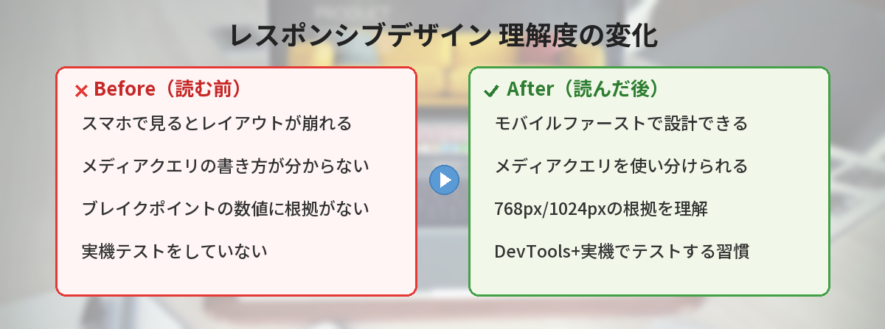
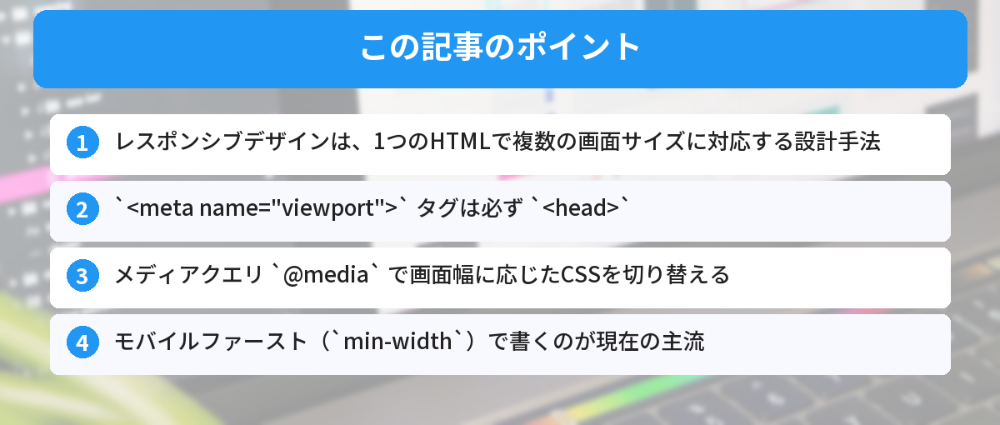

## この記事で分かること


スマホで見たらレイアウト崩れてる…。レスポンシブってどうやるの？



メディアクエリっていう仕組みを使うんだ。画面幅に応じてCSSを切り替えられるよ。基本パターンを覚えれば意外とシンプル。




「PCで見たら普通なのに、スマホで見るとレイアウトが崩れる…」

Webサイトを作っていると、画面サイズの違いに悩まされます。この問題を解決するのが「レスポンシブデザイン」です。この記事では、メディアクエリの書き方を中心に、スマホ対応の基本を一歩ずつ解説します。

HTMLの基本がまだ不安な方は、先に[HTMLの基本構造を理解しよう](/posts/html-basic-structure/)を読んでおくとスムーズです。



## レスポンシブデザインとは

レスポンシブデザインとは、**画面サイズに応じてレイアウトを自動で切り替える設計手法**のことです。

1つのHTMLファイルで、PC・タブレット・スマホのすべてに対応します。デバイスごとに別々のページを作る必要はありません。

```
PC（1200px）         タブレット（768px）    スマホ（375px）
┌──┬──┬──┐          ┌──┬──┐              ┌──┐
│  │  │  │          │  │  │              │  │
│  │  │  │          ├──┴──┤              ├──┤
│  │  │  │          │     │              │  │
└──┴──┴──┘          └─────┘              ├──┤
  3カラム              2カラム             │  │
                                         └──┘
                                          1カラム
```

Googleは2019年から「モバイルファーストインデックス」を採用しています。スマホ版のページを基準に検索順位を決めるため、レスポンシブ対応はSEOの面でも重要です。

## viewportメタタグ ― 最初に必ず書く1行

レスポンシブデザインを機能させるには、HTMLの `<head>` 内に以下の1行が必要です。

```html
<meta name="viewport" content="width=device-width, initial-scale=1.0">
```

### なぜ必要なのか

この記述がないと、スマホのブラウザは「このページはPC用だ」と判断します。結果として、PC向けの幅（通常980px）で表示してから画面に収まるよう縮小するため、文字が極端に小さくなります。

```
viewportなし：                viewportあり：
┌─────────────────┐          ┌──────────┐
│ とても小さい文字で│          │ 読みやすい │
│ 全体が縮小表示   │          │ サイズで   │
│ される          │          │ 表示される │
└─────────────────┘          └──────────┘
```

### 各パラメータの意味

| パラメータ | 意味 |
|---|---|
| `width=device-width` | 表示幅をデバイスの画面幅に合わせる |
| `initial-scale=1.0` | 初期表示の拡大率を100%にする |

[HTMLの基本構造](/posts/html-basic-structure/)のテンプレートにはすでにこの記述が含まれています。自分で一から書く場合は忘れずに追加してください。

## メディアクエリの基本 ― CSSで画面幅を判定する

メディアクエリは、**画面幅などの条件に応じてCSSを切り替える仕組み**です。`@media` というルールを使います。

### 基本の書き方

```css
/* 画面幅が768px以下のとき適用される */
@media (max-width: 768px) {
  .container {
    flex-direction: column;
  }
}
```

`@media (条件) { ... }` の中に書いたCSSは、条件を満たしたときだけ適用されます。

### max-width と min-width の違い

```css
/* max-width: ○○px以下のとき */
@media (max-width: 768px) {
  /* タブレット以下で適用 */
}

/* min-width: ○○px以上のとき */
@media (min-width: 769px) {
  /* タブレット以上で適用 */
}
```

| 書き方 | 意味 | 使う場面 |
|---|---|---|
| `max-width` | 指定した幅**以下**で適用 | PC基準で書いてスマホ用に上書き |
| `min-width` | 指定した幅**以上**で適用 | スマホ基準で書いてPC用に上書き |

## モバイルファーストという考え方

レスポンシブデザインには「デスクトップファースト」と「モバイルファースト」の2つのアプローチがあります。

### デスクトップファースト（max-width）

PC向けのCSSを先に書き、`max-width` で小さい画面用に上書きします。

```css
/* PC用（デフォルト） */
.nav {
  display: flex;
  gap: 24px;
}

/* タブレット以下で上書き */
@media (max-width: 768px) {
  .nav {
    flex-direction: column;
    gap: 8px;
  }
}
```

### モバイルファースト（min-width）★推奨

スマホ向けのCSSを先に書き、`min-width` で大きい画面用に拡張します。

```css
/* スマホ用（デフォルト） */
.nav {
  display: flex;
  flex-direction: column;
  gap: 8px;
}

/* タブレット以上で拡張 */
@media (min-width: 769px) {
  .nav {
    flex-direction: row;
    gap: 24px;
  }
}
```

モバイルファーストが推奨される理由は3つあります。

1. **スマホのCSSはシンプルになりやすい**（1カラム、縦並びが基本）
2. **Googleがモバイル版を優先的に評価する**
3. **小さい画面から大きい画面へ「足していく」方が設計しやすい**

要素の並べ方にはFlexboxが便利です。横並びや折り返しの基本パターンは[Flexboxの基本パターン5つ](/posts/css-flexbox-beginner/)で解説しています。

## よく使うブレイクポイント

ブレイクポイントとは、レイアウトを切り替える画面幅の境界値のことです。

### 定番のブレイクポイント

```css
/* スマホ（デフォルト） */
/* 〜 767px */

/* タブレット */
@media (min-width: 768px) { ... }

/* デスクトップ */
@media (min-width: 1024px) { ... }

/* 大画面 */
@media (min-width: 1280px) { ... }
```

### なぜこの数値なのか

| ブレイクポイント | 根拠 |
|---|---|
| 768px | iPadの縦向き幅（768px）を基準 |
| 1024px | iPadの横向き幅・小型ノートPC |
| 1280px | 一般的なデスクトップモニター |

ただし、これはあくまで目安です。自分のサイトのデザインが崩れるポイントに合わせて調整するのが理想です。

## 実践例1：ナビゲーションメニューのレスポンシブ対応

PCでは横並び、スマホでは縦並びに切り替えるナビゲーションを作ります。

### HTML

```html
<nav class="nav">
  <a href="/" class="nav-logo">MySite</a>
  <ul class="nav-links">
    <li><a href="/about">About</a></li>
    <li><a href="/blog">Blog</a></li>
    <li><a href="/contact">Contact</a></li>
  </ul>
</nav>
```

### CSS（モバイルファースト）

```css
/* スマホ用（デフォルト） */
.nav {
  display: flex;
  flex-direction: column;
  padding: 16px;
}

.nav-links {
  display: flex;
  flex-direction: column;
  gap: 8px;
  list-style: none;
  padding: 0;
}

/* タブレット以上 */
@media (min-width: 768px) {
  .nav {
    flex-direction: row;
    justify-content: space-between;
    align-items: center;
  }

  .nav-links {
    flex-direction: row;
    gap: 24px;
  }
}
```

```
スマホ表示：              PC表示：
┌──────────┐            ┌──────────────────────────┐
│ MySite   │            │ MySite    About Blog Contact │
│ About    │            └──────────────────────────┘
│ Blog     │
│ Contact  │
└──────────┘
```

要素を中央に寄せたい場合は、[HTML/CSSで「中央寄せ」する方法まとめ](/posts/html-css-center/)も参考にしてみてください。

## 実践例2：カードレイアウトのレスポンシブ対応

ブログの記事一覧やポートフォリオでよく使うカード型レイアウトです。

### HTML

```html
<div class="card-grid">
  <div class="card">
    <h3>記事タイトル1</h3>
    <p>記事の概要テキストが入ります。</p>
  </div>
  <div class="card">
    <h3>記事タイトル2</h3>
    <p>記事の概要テキストが入ります。</p>
  </div>
  <div class="card">
    <h3>記事タイトル3</h3>
    <p>記事の概要テキストが入ります。</p>
  </div>
</div>
```

### CSS（モバイルファースト）

```css
/* スマホ用（デフォルト）：1カラム */
.card-grid {
  display: grid;
  gap: 16px;
  padding: 16px;
}

.card {
  background: #f9f9f9;
  border-radius: 8px;
  padding: 24px;
}

/* タブレット：2カラム */
@media (min-width: 768px) {
  .card-grid {
    grid-template-columns: repeat(2, 1fr);
    gap: 24px;
  }
}

/* デスクトップ：3カラム */
@media (min-width: 1024px) {
  .card-grid {
    grid-template-columns: repeat(3, 1fr);
  }
}
```

```
スマホ：        タブレット：       デスクトップ：
┌──────┐      ┌──────┬──────┐   ┌────┬────┬────┐
│  1   │      │  1   │  2   │   │ 1  │ 2  │ 3  │
├──────┤      ├──────┴──────┤   └────┴────┴────┘
│  2   │      │      3      │
├──────┤      └─────────────┘
│  3   │
└──────┘
```

この例では `grid-template-columns` を使っています。CSS Gridの基本については[CSS Gridの基本を図解で解説した記事](/posts/css-grid-beginner/)で詳しく紹介しています。

## レスポンシブ対応でよくある注意点

### 画像がはみ出す

画像にデフォルトの幅制限がないため、大きな画像がコンテナからはみ出すことがあります。以下のCSSをグローバルに指定しておくと安心です。

```css
img {
  max-width: 100%;
  height: auto;
}
```

### フォントサイズが小さすぎる・大きすぎる

画面幅に応じてフォントサイズを調整するには `clamp()` が便利です。

```css
h1 {
  /* 最小16px、推奨4vw、最大32px */
  font-size: clamp(16px, 4vw, 32px);
}
```

`clamp(最小値, 推奨値, 最大値)` を使うと、メディアクエリを書かなくても滑らかにサイズが変化します。

### ブレイクポイントを増やしすぎる

ブレイクポイントが多すぎると、CSSの管理が複雑になります。まずは2〜3個（768px、1024px）から始めて、必要に応じて追加するのがおすすめです。

### テスト不足

Chrome DevToolsの「デバイスツールバー」を使えば、さまざまな画面サイズでの表示を確認できます。

```
Chrome DevToolsの開き方：
1. ページ上で右クリック → 「検証」
2. 左上のデバイスアイコンをクリック
3. 画面上部でデバイスを選択（iPhone, iPad など）
```

実際のスマホでも確認することを忘れないでください。エミュレータと実機では表示が異なることがあります。

## 筆者がハマったポイント

レスポンシブ対応は「知ってしまえば簡単」ですが、最初は本当に苦労しました。

### ハマり1: viewportメタタグを書き忘れて半日悩んだ

初めてレスポンシブ対応をしたとき、メディアクエリを正しく書いているのにスマホで全く効かない。Chrome DevToolsでは問題なく動くのに、実機で見ると文字が豆粒サイズ。半日悩んだ末に気づいたのが、`<meta name="viewport">` の書き忘れでした。

**気づき:** メディアクエリを書く前に、まずviewportメタタグが入っているか確認する。これがないと全てが無駄になる。

### ハマり2: max-widthとmin-widthを混在させてカオスに

デスクトップファーストで書き始めたのに、途中からモバイルファーストの書き方を混ぜてしまい、スタイルが上書きし合って意図しない表示に。どのブレイクポイントでどのスタイルが効いているのか分からなくなり、結局CSSを全部書き直しました。所要時間3時間。

**改善:** それ以降、プロジェクトの最初に「モバイルファーストで統一する」と決めてから書き始めるようにしています。途中で方針を変えると確実に破綻します。

### ハマり3: 実機テストをサボった結果

DevToolsのエミュレータだけで確認してOKを出したら、実際のiPhoneで見るとボタンが小さすぎてタップできない。タッチターゲットのサイズ（最低44×44px）を意識していなかったのが原因でした。

**改善:** 今は必ず実機（iPhone + Android）で最終確認しています。エミュレータはあくまで「だいたいの確認」用。


viewportの書き忘れ、私もやりそう…。最初にチェックするようにする！



HTMLのテンプレートに最初から入れておくのがベストだよ。毎回手動で書くと忘れるからね。


## よくある質問（FAQ）



### Q: メディアクエリはCSSファイルのどこに書けばいいですか？
A: 対象のスタイルの近くに書くのが管理しやすいです。モバイルファーストの場合、各セクションのスマホ用CSSの直後にメディアクエリを書きます。ファイル末尾にまとめて書く方法もありますが、スタイルが増えると対応関係が分かりにくくなるため、コンポーネントごとにまとめる方法をおすすめします。

### Q: `px` と `em` のどちらでブレイクポイントを指定すべきですか？
A: どちらでも動作しますが、`px` の方が直感的で分かりやすいです。`em` を使うとユーザーのフォントサイズ設定に応じてブレイクポイントが変わるメリットがありますが、初心者のうちは `px` で統一して問題ありません。

### Q: レスポンシブ対応とアダプティブデザインの違いは何ですか？
A: レスポンシブデザインは1つのHTMLで画面幅に応じてCSSを切り替えます。アダプティブデザインはデバイスごとに異なるHTMLやテンプレートを用意する手法です。現在はレスポンシブデザインが主流で、Googleも推奨しています。

### Q: CSSフレームワーク（Bootstrapなど）を使えばメディアクエリは書かなくていいですか？
A: フレームワークには既にレスポンシブ用のクラスが用意されているため、基本的なレイアウトはメディアクエリなしで対応できます。ただし、細かいカスタマイズにはメディアクエリの知識が必要です。仕組みを理解した上でフレームワークを使うと、トラブル時に自分で対処できるようになります。

### Q: 完成したレスポンシブサイトを公開するにはどうすればいいですか？
A: 静的サイトであれば、GitHub Pagesを使って無料で公開できます。手順は[GitHub Pagesでサイトを公開する方法](/posts/github-pages-deploy/)で解説しています。


meta viewportの設定忘れてただけだった…！基本が大事なんだね。



あるあるだよ。viewportの設定とメディアクエリの2つを押さえれば、大体のサイトはレスポンシブにできる。


## まとめ

- レスポンシブデザインは、1つのHTMLで複数の画面サイズに対応する設計手法
- `<meta name="viewport">` タグは必ず `<head>` 内に書く
- メディアクエリ `@media` で画面幅に応じたCSSを切り替える
- モバイルファースト（`min-width`）で書くのが現在の主流
- ブレイクポイントは768px・1024pxの2つから始めるのがおすすめ
- Chrome DevToolsと実機の両方でテストする

---

### あわせて読みたい
- [CSS Flexboxの基本パターン5つ](/posts/css-flexbox-beginner/)
- [CSS Gridの基本を図解で解説](/posts/css-grid-beginner/)

