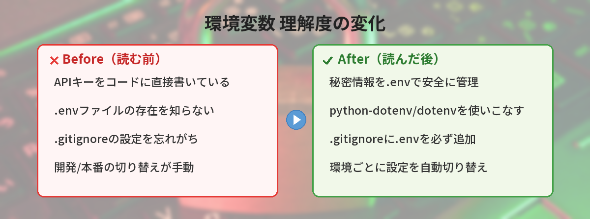

## この記事で分かること


APIキーをコードに直接書いたらダメって言われた…。環境変数ってどうやって使うの？



秘密情報をコードから分離する仕組みだよ。.envファイルに書いておけば、GitHubに公開しても安全なんだ。




「環境変数って何？」「.envファイルって何のためにあるの？」

プログラミングを始めると必ず出会う「環境変数」を、ゼロから解説します。

## 環境変数とは

環境変数は、PCやアプリに「設定値」を渡すための仕組みです。

たとえば：
- APIキー（外部サービスにアクセスするための鍵）
- データベースの接続先
- 開発モードか本番モードかの切り替え

これらをコードに直接書くと、GitHubに上げたときに全世界に公開されてしまいます。環境変数を使えば、コードと設定値を分離できます。

[GitHubの基本的な使い方](/posts/github-what-is-it/)を学ぶと、なぜコードと設定値を分離する必要があるのかがより実感できます。

## なぜ環境変数が必要なのか

### NG：コードに直接書く

```python
api_key = "sk-abc123xyz456"  # これがGitHubに公開される！
```

### OK：環境変数から読み込む

```python
import os
api_key = os.environ.get("API_KEY")  # コードにキーが含まれない
```

## .envファイルの使い方


### ステップ1：.envファイルを作る

プロジェクトのルートフォルダに `.env` というファイルを作ります。

```
API_KEY=sk-abc123xyz456
DATABASE_URL=postgresql://localhost:5432/mydb
DEBUG=true
```

ルールは簡単です。`変数名=値` の形で1行ずつ書くだけ。

### ステップ2：.envファイルを読み込む

Pythonの場合、`python-dotenv` というライブラリを使います。

```bash
pip install python-dotenv
```

`pip install` でエラーが出た場合は、[pip installのエラー対処法まとめ](/posts/python-pip-install-error/)を参考にしてください。

```python
from dotenv import load_dotenv
import os

load_dotenv()  # .envファイルを読み込む

api_key = os.environ.get("API_KEY")
print(api_key)  # sk-abc123xyz456
```

Node.jsの場合は `dotenv` パッケージを使います。

```bash
npm install dotenv
```

Node.jsのパッケージ管理については[npmとyarnの基本解説](/posts/npm-yarn-beginner/)で詳しく紹介しています。

```javascript
require('dotenv').config();

const apiKey = process.env.API_KEY;
console.log(apiKey);  // sk-abc123xyz456
```



### ステップ3：.gitignoreに追加する（超重要）

`.env` ファイルをGitHubに上げないように、`.gitignore` に追加します。

```
.env
```

これを忘れると、APIキーが全世界に公開されます。

## よくある間違い

### .envファイルにスペースを入れる

```
# NG
API_KEY = sk-abc123xyz456

# OK
API_KEY=sk-abc123xyz456
```

`=` の前後にスペースを入れるとエラーになることがあります。

### .envファイルをクォートで囲む

```
# 基本的にクォートは不要
API_KEY=sk-abc123xyz456

# クォートが必要なケース（値にスペースが含まれる場合）
MESSAGE="Hello World"
```

### .gitignoreに追加し忘れる

一度GitHubに上げてしまったら、履歴に残ります。`.env` を削除しても、過去のコミットから見られてしまいます。

もし間違えて上げてしまったら、すぐにAPIキーを再発行してください。

## 環境変数の活用シーン

環境変数は、開発が進むにつれてさまざまな場面で使います。

### API連携

外部サービスの[APIを呼び出す](/posts/api-what-is-it/)ときに、APIキーを環境変数で管理するのが一般的です。たとえばOpenAIのAPIキーや、天気予報サービスのキーなどです。

### 開発環境と本番環境の切り替え

`DEBUG=true` のような環境変数を使って、開発中はエラーの詳細を表示し、本番では非表示にする、といった切り替えができます。

### Dockerとの組み合わせ

[Dockerで環境を構築する](/posts/docker-beginner/)ときにも、環境変数は頻繁に使います。`docker-compose.yml` の中で `.env` ファイルを読み込む設定ができるので、コンテナごとに異なる設定値を渡せます。

## 筆者がハマったポイント

環境変数は概念自体はシンプルですが、実際に使い始めると地味なトラップが多いです。

### ハマり1: APIキーをGitHubに上げてしまった

初めてOpenAIのAPIを使ったとき、テスト用だからと `.env` を作らずにコードに直接キーを書きました。そのままgit pushしたら、10分後にOpenAIから「あなたのキーが公開されています」というメールが届きました。即座にキーを無効化して再発行しましたが、冷や汗ものでした。

**気づき:** 「テスト用だから」は言い訳にならない。最初から `.env` + `.gitignore` をセットで作る癖をつけるべき。

### ハマり2: .envファイルの変数名を間違えて1時間デバッグ

`.env` に `OPENAI_API_KEY=sk-xxx` と書いたのに、コード側で `os.environ.get("OPEN_AI_KEY")` と微妙に違う名前で読み込んでいました。エラーメッセージは「APIキーが無効です」としか出ないので、キーが間違っているのかと思い何度も再発行。結局、変数名のタイポだと気づくまで1時間かかりました。

**改善:** `.env.example` を先に作り、そこに書いた変数名をコピペしてコードに使うようにしています。手打ちは絶対にミスる。

### ハマり3: .envを読み込む前にAPIを呼んでいた

Pythonで `load_dotenv()` を書いたのに環境変数が読めない。原因は、`import` の順番で `load_dotenv()` より先にAPIクライアントが初期化されていたこと。ファイルの先頭で `load_dotenv()` を呼ぶのが鉄則です。

```python
# NG: load_dotenvより先にAPIクライアントが初期化される
from openai import OpenAI
from dotenv import load_dotenv
load_dotenv()
client = OpenAI()  # この時点ではまだ環境変数が読めていない

# OK: 最初にload_dotenvを呼ぶ
from dotenv import load_dotenv
load_dotenv()  # ここで.envを読み込む
from openai import OpenAI
client = OpenAI()  # 環境変数が読める
```


APIキー公開しちゃったの怖すぎる…。最初から.gitignoreに入れるようにする！



プロジェクトを作ったら最初にやることリストに「.envを.gitignoreに追加」を入れておくといいよ。


## よくある質問（FAQ）

### Q: .envファイルはプロジェクトごとに作るのですか？
A: はい、プロジェクトのルートフォルダにそれぞれ作ります。プロジェクトごとに使うAPIキーやデータベースの接続先が異なるため、個別に管理するのが基本です。

### Q: .envファイルの中身をチームメンバーに共有するにはどうすればいいですか？
A: `.env.example` というファイルを作り、値を空にした状態でGitHubに上げるのが一般的です。たとえば `API_KEY=` のように項目名だけ書いておき、実際の値はSlackやパスワードマネージャーで共有します。

### Q: 環境変数はターミナルからも設定できますか？
A: はい、できます。Windowsなら `set API_KEY=xxx`、Mac/Linuxなら `export API_KEY=xxx` で一時的に設定できます。ただし、ターミナルを閉じると消えてしまうので、永続的に使いたい場合は `.env` ファイルに書くのがおすすめです。

### Q: .envファイルに書ける値の種類に制限はありますか？
A: 基本的に文字列として扱われます。数値や `true`/`false` を書いても、プログラム側では文字列として読み込まれるので、必要に応じて型変換してください。たとえばPythonなら `int(os.environ.get("PORT"))` のように変換します。

### Q: 本番環境でも.envファイルを使いますか？
A: 本番環境では、ホスティングサービス（Heroku、AWS、Vercelなど）の管理画面から環境変数を設定するのが一般的です。`.env` ファイルは主にローカル開発用と考えてください。


.envファイルを.gitignoreに入れるの忘れそう…。気をつけなきゃ。



最初に.gitignoreに追加する癖をつけておくといいよ。一度GitHubに上げちゃうと取り消しが大変だからね。



---

## 実際に.envファイルの管理でやらかした！（筆者の失敗談）

筆者が.envファイルで最もやらかしたのは、`.gitignore`に`.env`を追加し忘れてGitHubにAPIキーをpushしてしまったことです。

GitHubのBot（GitGuardian）から「APIキーが公開されています」とメールが来て気づきました。すぐにキーを無効化して再発行しましたが、冷や汗ものでした。

**教訓**: プロジェクト作成時に`.gitignore`を最初に設定する。`.env`、`.env.local`、`.env.production`は全て除外リストに入れる。

## まとめ

- 環境変数は「コードと設定値を分離する」仕組み
- `.env` ファイルに `変数名=値` で書く
- `.gitignore` に `.env` を追加するのを絶対に忘れない
- APIキーやパスワードは絶対にコードに直接書かない

---
### あわせて読みたい
- [pip installでエラーが出たときの対処法まとめ](/posts/python-pip-install-error/)
- [GitHubアカウントを作ったけど何すればいい？最初の使い方ガイド](/posts/github-what-is-it/)

