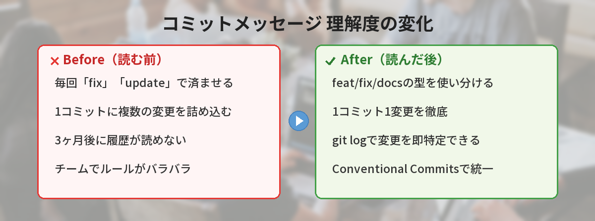
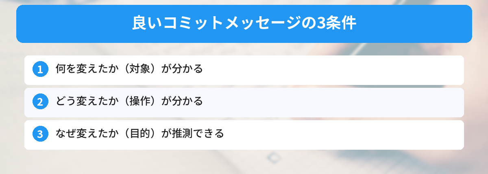

## この記事で分かること


コミットメッセージ、毎回「fix」とか「update」って書いちゃう…。ちゃんとした書き方ってあるの？



あるよ。良いコミットメッセージは「3ヶ月後の自分が読んで分かる」のが基準。型を覚えれば迷わなくなるんだ。




「コミットメッセージ、何を書けばいいか分からない…」

Gitでコミットするたびに求められるメッセージ。適当に書いていると、あとから履歴を見たときに何をしたのか分からなくなります。この記事では、チーム開発でも困らないコミットメッセージのルールを、良い例・悪い例の比較で解説します。

Gitの基本操作にまだ不安がある方は、先に[ブランチの基本操作を図解で解説した記事](/posts/git-branch-beginner/)を読んでおくとスムーズです。



## なぜコミットメッセージが重要なのか

コミットメッセージは「未来の自分やチームメンバーへの伝言」です。

3ヶ月後に「このコードなぜ変えたんだっけ？」と思ったとき、頼りになるのはコミットメッセージだけです。

### 悪いメッセージの末路

```bash
git log --oneline
# a1b2c3d 修正
# d4e5f6g 更新
# h7i8j9k fix
# l0m1n2o あ
```

これでは何が起きたのかまったく分かりません。バグの原因を探すときに、すべてのコミットの中身を1つずつ確認する羽目になります。

### 良いメッセージがある場合

```bash
git log --oneline
# a1b2c3d feat: ユーザー登録フォームにバリデーション追加
# d4e5f6g fix: ログインページのパスワード表示切替が動かない問題を修正
# h7i8j9k docs: READMEにセットアップ手順を追記
# l0m1n2o style: ヘッダーの余白を調整
```

何をしたのか一目で分かります。バグが混入したコミットも特定しやすくなります。

## 悪い例と良い例の比較

### ありがちな悪い例

| 悪い例 | 問題点 |
|---|---|
| `修正` | 何を修正したのか分からない |
| `更新` | 何を更新したのか分からない |
| `fix` | 英語でも具体性がない |
| `あ` / `test` | 意味がない |
| `色々変えた` | 範囲が広すぎる |
| `バグ直した` | どのバグか分からない |

### 良い例

| 良い例 | ポイント |
|---|---|
| `ログインフォームのバリデーションを追加` | 何を・どうしたかが明確 |
| `ヘッダーのロゴ画像が表示されない問題を修正` | 具体的な症状が分かる |
| `READMEにインストール手順を追記` | 変更対象と内容が明確 |
| `不要なconsole.logを削除` | 小さな変更でも具体的 |

### 良いメッセージの3つの条件



1. **何を変えたか**が分かる（対象）
2. **どう変えたか**が分かる（操作）
3. **なぜ変えたか**が推測できる（目的）

ターミナルでのGit操作に慣れていない方は、[コマンドラインが怖い人へ ― 最初に覚える10コマンド](/posts/command-line-scary/)も参考にしてみてください。

## Conventional Commits ― 世界標準のフォーマット

チーム開発でよく使われるのが「Conventional Commits」というフォーマットです。コミットメッセージの先頭に「型（type）」を付けるルールです。

### 基本の書き方

```
型: 変更内容の要約

（空行）

詳細な説明（任意）
```

### よく使う型（type）一覧

| 型 | 用途 | 例 |
|---|---|---|
| `feat` | 新機能の追加 | `feat: ユーザー検索機能を追加` |
| `fix` | バグ修正 | `fix: 日付表示が1日ずれる問題を修正` |
| `docs` | ドキュメントの変更 | `docs: APIの使い方をREADMEに追記` |
| `style` | 見た目の変更（機能に影響なし） | `style: ボタンの色を変更` |
| `refactor` | リファクタリング | `refactor: ユーザー認証の処理を関数に分離` |
| `test` | テストの追加・修正 | `test: ログイン機能のテストを追加` |
| `chore` | 雑務（ビルド設定、依存関係など） | `chore: ESLintの設定を更新` |

### スコープを付ける（任意）

変更の対象範囲を `()` で示すこともできます。

```bash
feat(auth): ソーシャルログインに対応
fix(header): スクロール時にメニューが消える問題を修正
docs(api): エンドポイント一覧を更新
```

スコープがあると、どの機能・画面に関する変更かがさらに明確になります。

## 日本語コミットメッセージの書き方

### 日本語で書いてもいいのか

結論から言うと、**チームのルールに従えばどちらでもOK**です。

| 言語 | メリット | デメリット |
|---|---|---|
| 英語 | OSS・グローバルチームで通じる | 英語が苦手だと書くのに時間がかかる |
| 日本語 | 意図が正確に伝わる | 英語圏のメンバーが読めない |

日本語チームであれば、日本語で書く方が情報量が多くなり、結果的にメッセージの質が上がることが多いです。

### 日本語で書くときのルール

```bash
# 型は英語、説明は日本語（ハイブリッド型）★おすすめ
feat: ユーザープロフィール画像のアップロード機能を追加
fix: カート内の商品数が0になるとエラーが出る問題を修正

# すべて日本語
機能追加: ユーザープロフィール画像のアップロード
バグ修正: カート内の商品数が0になるとエラーが出る問題
```

型を英語にしておくと、`git log --grep="feat"` で新機能だけを絞り込めるので便利です。

### 文末のスタイル

```bash
# 体言止め（おすすめ）
feat: ユーザー検索機能の追加

# 動詞終わり
feat: ユーザー検索機能を追加する

# 過去形
feat: ユーザー検索機能を追加した
```

どれでも構いませんが、チーム内で統一することが大切です。迷ったら体言止めが短くて読みやすいです。

## 実践テンプレート集

すぐに使えるテンプレートを用途別にまとめました。

### 新機能を追加したとき

```bash
feat: ○○機能を追加

# 例
feat: 記事のブックマーク機能を追加
feat(search): キーワードのサジェスト表示に対応
```

### バグを修正したとき

```bash
fix: ○○が△△になる問題を修正

# 例
fix: ログアウト後にセッションが残る問題を修正
fix(cart): 商品削除時に合計金額が更新されない問題を修正
```

### ドキュメントを更新したとき

```bash
docs: ○○を追記 / 更新

# 例
docs: 環境構築手順をREADMEに追記
docs(api): レスポンスのサンプルを更新
```

### リファクタリングしたとき

```bash
refactor: ○○の処理を△△に変更

# 例
refactor: API呼び出しをカスタムフックに分離
refactor(auth): トークン管理をContextからZustandに移行
```

GitHubにプッシュする際にエラーが出ることがあります。その場合は[git pushでrejectedエラーが出たときの対処法](/posts/git-first-push-error/)を確認してみてください。

## git log でコミット履歴を読む

良いコミットメッセージを書いたら、読み方も覚えておきましょう。

### 基本の表示

```bash
# 1行ずつ表示（最もよく使う）
git log --oneline
```

```
a1b2c3d feat: ユーザー検索機能を追加
d4e5f6g fix: ログインエラーのハンドリングを修正
h7i8j9k docs: READMEを更新
```

### 便利なオプション

```bash
# 直近5件だけ表示
git log --oneline -5

# 特定のファイルの変更履歴
git log --oneline -- src/components/Header.tsx

# 特定の型だけ絞り込み
git log --oneline --grep="fix"

# 変更内容も一緒に表示
git log -p -1
```

### グラフ表示でブランチの流れを確認

```bash
git log --oneline --graph --all
```

```
* a1b2c3d (HEAD -> main) Merge branch 'feature-login'
|\
| * d4e5f6g feat: ログインフォームを実装
| * h7i8j9k feat: 認証APIとの接続処理を追加
|/
* l0m1n2o chore: プロジェクトの初期設定
```

ブランチの分岐とマージの流れが視覚的に分かります。GitHubの仕組みについては[GitHubとは？アカウント作成から最初の使い方まで](/posts/github-what-is-it/)で解説しています。

## コミットメッセージで避けるべきこと

### 1つのコミットに複数の変更を詰め込む

```bash
# ❌ 悪い例
git commit -m "ログイン機能追加とヘッダーのCSS修正とREADME更新"

# ✅ 良い例（3つのコミットに分ける）
git commit -m "feat: ログイン機能を追加"
git commit -m "style: ヘッダーの余白を調整"
git commit -m "docs: READMEにログイン機能の説明を追記"
```

コミットは「1つの変更につき1つ」が原則です。あとから特定の変更だけを取り消したいとき（`git revert`）に、分けておくと助かります。

### コミットメッセージが長すぎる

```bash
# ❌ 1行目が長すぎる
git commit -m "ユーザーがログインフォームでメールアドレスを入力してパスワードを入力して送信ボタンを押したときにバリデーションが動作しない問題があったのでバリデーション処理を追加して修正した"

# ✅ 1行目は50文字以内、詳細は本文に
git commit -m "fix: ログインフォームのバリデーションが動作しない問題を修正

メールアドレスの形式チェックとパスワードの文字数チェックを
送信時に実行するように変更。"
```

1行目（タイトル）は50文字以内が目安です。詳しい説明が必要な場合は、空行を挟んで本文に書きます。

VS Codeを使っている場合は、ソース管理パネルからコミットメッセージを入力できます。エディタの便利な使い方は[VS Codeのショートカット10選](/posts/vscode-shortcuts-beginner/)でまとめています。

## 筆者がハマったポイント

コミットメッセージの重要性は、痛い目を見て初めて実感しました。

### ハマり1: 「fix」だけのメッセージで3ヶ月後に詰んだ

個人開発で「どうせ自分しか見ないし」と思い、コミットメッセージを全部「fix」「update」で済ませていました。3ヶ月後にバグが見つかり、「いつからこのバグがあったのか」を調べようとしたら、`git log` が「fix」「fix」「fix」の羅列。結局、全コミットのdiffを1つずつ確認する羽目になり、2時間かかりました。

**気づき:** 個人開発でもメッセージは具体的に書く。「未来の自分」は他人と同じ。

### ハマり2: 1コミットに5つの変更を詰め込んだ

「まとめてコミットした方が効率的」と思い、新機能追加・バグ修正・CSS調整・README更新を1コミットに。その後、CSS調整だけ取り消したくなったが、`git revert` すると他の変更も全部戻ってしまう。手動で該当箇所だけ修正し直すことに。

**改善:** 以降は「1コミット1変更」を徹底。`git add -p` で変更を部分的にステージングする技も覚えました。

### ハマり3: チームでフォーマットを決めずに混乱

4人チームで開発を始めたとき、コミットメッセージのルールを決めなかった結果、日本語・英語・絵文字・体言止め・動詞終わりが混在。`git log` が読めたものではなくなり、途中からConventional Commitsを導入。過去の履歴は諦めました。

**改善:** プロジェクト開始時に「コミットメッセージのルール」をREADMEに書くようにしています。5分で決められることなのに、後回しにすると取り返しがつかない。


「fix」だけのログ、私もやってる…。今日から具体的に書くようにする！



最初は面倒に感じるけど、1週間続ければ習慣になるよ。「何を変えたか」を一言添えるだけで全然違う。


## よくある質問（FAQ）

### Q: コミットメッセージを後から修正できますか？
A: 直前のコミットであれば `git commit --amend -m "新しいメッセージ"` で修正できます。ただし、すでにリモートにプッシュ済みのコミットを修正すると、他のメンバーに影響が出るため注意が必要です。プッシュ前のコミットだけを修正するようにしましょう。

### Q: 英語と日本語、どちらで書くべきですか？
A: チームのルールに合わせるのが最優先です。ルールがない場合は、日本語チームなら「型は英語＋説明は日本語」のハイブリッド型がおすすめです。型を英語にしておくと `git log --grep` での絞り込みが楽になります。

### Q: Conventional Commitsは必ず使わないといけませんか？
A: 必須ではありません。個人開発であれば自由な形式で構いません。ただし、チーム開発ではフォーマットを統一しておくと履歴が読みやすくなります。Conventional Commitsは広く使われているため、迷ったらこのフォーマットを採用するのが無難です。

### Q: コミットの粒度（どこで区切るか）が分かりません。
A: 「この変更を一言で説明できるか」を基準にしてください。一言で説明できないなら、複数の変更が混ざっている可能性があります。目安として、1つの機能追加、1つのバグ修正、1つのリファクタリングをそれぞれ1コミットにするのが基本です。

### Q: `git commit` のときにエディタが開いて困ります。
A: `-m` オプションを付ければエディタを開かずにメッセージを指定できます。`git commit -m "メッセージ"` の形式で実行してください。複数行のメッセージを書きたい場合は、`-m "1行目" -m "2行目"` のように `-m` を複数回指定する方法もあります。


prefix付けるだけでこんなに見やすくなるんだ…！feat、fix、docsから始めてみる。



それだけで十分。完璧を目指さなくていいから、「何を変えたか」が伝わればOKだよ。


## まとめ

- コミットメッセージは「未来の自分への伝言」。具体的に書く
- 「何を・どう変えたか」が1行で分かるメッセージが理想
- Conventional Commits（`feat:` `fix:` など）を使うと履歴が整理される
- 日本語チームでは「型は英語＋説明は日本語」のハイブリッド型がおすすめ
- 1コミット1変更の原則を守る
- `git log --oneline` で履歴を確認する習慣をつける

---

### あわせて読みたい
- [Gitブランチの基本操作を図解で解説](/posts/git-branch-beginner/)
- [GitHubとは？アカウント作成から最初の使い方まで](/posts/github-what-is-it/)

