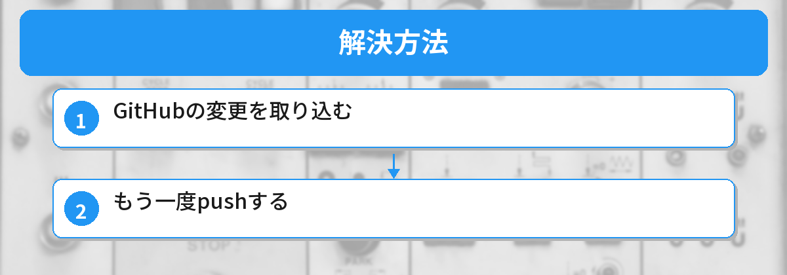
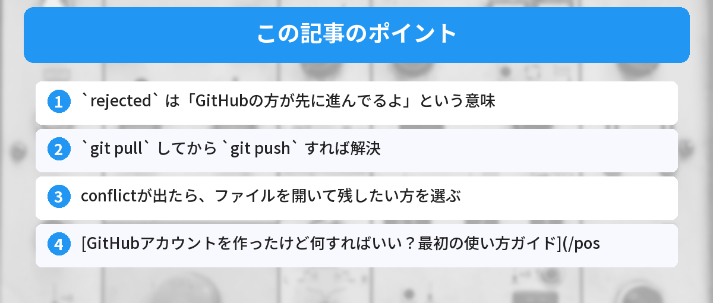

## この記事で分かること


git pushしたらエラーになった…。rejected って何？どうすればいいの？



初めてのpushでよく出るエラーだね。リモートとローカルの履歴がずれてるのが原因。解決方法は簡単だよ。



ターミナルで `git push` したら、こんなエラーが出た。

```
! [rejected]        main -> main (fetch first)
error: failed to push some refs to 'https://github.com/...'
```

「rejected」って何？ 壊した？ と焦るかもしれませんが、大丈夫です。よくあることで、手順通りに対処すれば解決します。ターミナル操作に慣れていない方は、先に[コマンドラインが怖い人へ ― 最初に覚える10コマンド](/posts/command-line-scary/)を読んでおくとスムーズです。




## なぜこのエラーが出るのか

GitHub上のコードと、あなたのPC上のコードが「ズレている」のが原因です。

たとえばこんな状況：
- GitHubの画面で直接ファイルを編集した
- 別のPCからpushした
- リポジトリを作るときにREADMEを自動生成した

GitHubの方が「先に進んでいる」ので、Gitが「まずそっちの変更を取り込んでからpushしてね」と言っています。GitHubの基本的な使い方については[GitHubとは？アカウント作成から最初の使い方ガイド](/posts/github-what-is-it/)で解説しています。

## 解決方法



### ステップ1: GitHubの変更を取り込む

```bash
git pull origin main
```

これでGitHub上の変更をあなたのPCに取り込みます。

`pull` は「引っ張ってくる」という意味で、GitHubからコードをダウンロードする操作です。

### ステップ2: もう一度pushする

```bash
git push origin main
```

これで通るはずです。

## pullしたら「conflict」と言われた場合

まれに、同じファイルの同じ場所を両方で編集していると「conflict（競合）」が起きます。

```
CONFLICT (content): Merge conflict in ファイル名
```

この場合は、該当ファイルを開くとこんな表示があります：

```
<<<<<<< HEAD
あなたのPCの内容
=======
GitHubの内容
>>>>>>> origin/main
```

残したい方を選んで、`<<<<<<<` `=======` `>>>>>>>` の行を削除してから：

```bash
git add .
git commit -m "conflictを解決"
git push origin main
```

コンフリクトの解決方法やブランチの使い方については、[Gitブランチが分からない人へ ― 図解で理解する基本操作](/posts/git-branch-beginner/)でも詳しく解説しています。

## よくあるエラーのバリエーション

### `non-fast-forward` エラー

```
! [rejected]        main -> main (non-fast-forward)
```

これも `rejected` と同じ原因です。`git pull origin main` してから `git push` すれば解決します。

### `Permission denied` エラー

```
remote: Permission to ユーザー名/リポジトリ.git denied
```

これはpushの権限がない場合に出ます。リポジトリのオーナーか、コラボレーターとして招待されているか確認してください。自分のリポジトリなのに出る場合は、GitHubの認証設定（SSH鍵やPersonal Access Token）を見直しましょう。

### `fatal: remote origin already exists`

リモートの設定が重複している場合に出ます。以下で一度削除してから再設定します。

```bash
git remote remove origin
git remote add origin https://github.com/ユーザー名/リポジトリ名.git
```

GitHub Pagesでサイトを公開する場合など、pushは頻繁に使う操作です。[GitHub Pagesで無料でサイトを公開する方法](/posts/github-pages-deploy/)も参考にしてみてください。

## よくある質問（FAQ）



### Q: `git pull` したらファイルの中身がぐちゃぐちゃになりました。元に戻せますか？

A: `git merge --abort` を実行すると、pull（マージ）前の状態に戻せます。落ち着いてやり直しましょう。

### Q: `git push -f`（強制push）で解決してもいいですか？

A: 個人開発で自分しか使っていないリポジトリなら問題ありませんが、チーム開発では他の人の変更を上書きしてしまうため、基本的に使わないでください。まずは `git pull` で解決するのが安全です。

### Q: 毎回 `origin main` を指定するのが面倒です。省略できますか？

A: `git push -u origin main` を一度実行すると、次回から `git push` だけで同じブランチにpushできます。`-u` はupstream（追跡ブランチ）を設定するオプションです。

### Q: pullしたら「Already up to date.」と表示されるのにpushできません。

A: ブランチ名が合っているか確認してください。ローカルが `main` でリモートが `master`（またはその逆）になっているケースがあります。`git branch -a` でブランチ名を確認しましょう。


git pull --rebase してからpushしたら通った！焦ったけど大したことなかった。



最初は焦るよね。このエラーは「データが消える」系じゃないから安心して。


## まとめと次のステップ

- `rejected` は「GitHubの方が先に進んでるよ」という意味
- `git pull` してから `git push` すれば解決
- conflictが出たら、ファイルを開いて残したい方を選ぶ

Gitに慣れないうちはこのエラーに何度も出会います。でも毎回やることは同じなので、すぐ慣れます。

---
### あわせて読みたい
- [GitHubアカウントを作ったけど何すればいい？最初の使い方ガイド](/posts/github-what-is-it/)
- [コマンドラインが怖い人へ ― 覚えるコマンド5つだけ](/posts/command-line-scary/)


