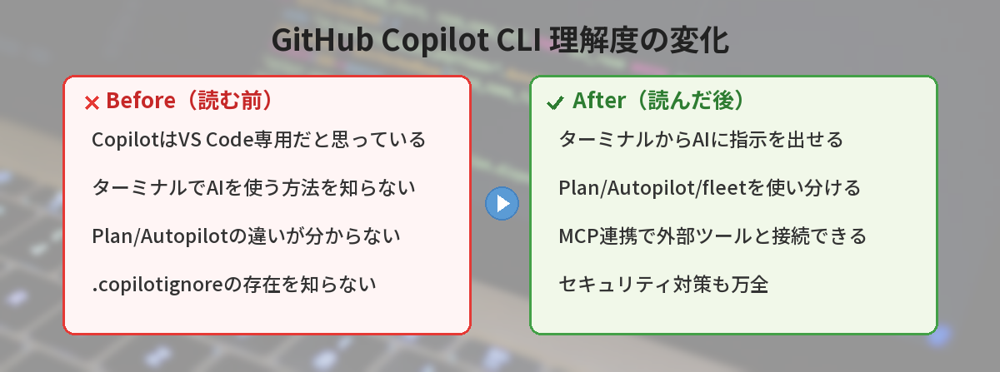

## この記事で分かること


GitHub CopilotってVS Code以外でも使えるの？ターミナルでも動くって聞いたんだけど…



Copilot CLIっていうのがあって、ターミナルでコマンドを提案してくれるんだ。「このコマンド何だっけ」がなくなるよ。




「GitHub Copilotってエディタの中だけのツールじゃないの？」

実は2026年2月、ターミナルで直接動くAIエージェントが正式リリースされました。GitHub Copilot CLIを使えば、VS Codeを開かなくてもコマンドラインからAIにコーディングを任せられます。

この記事では、インストールから実践的な使い方まで順を追って解説していきます。



## GitHub Copilot CLIとは

GitHub Copilot CLIは、ターミナル上で動作するAIコーディングエージェントです。チャットで指示を出すと、ファイルの読み書き・コマンド実行・Git操作などを自律的に行ってくれます。

VS Codeの拡張機能として使うCopilotとは異なり、ターミナルネイティブで動作します。SSHでリモートサーバーに接続しているときや、軽量なエディタで作業しているときでも利用できるのが大きな特徴です。

[ターミナル操作に不安がある方](/posts/command-line-scary/)は、基本的なコマンドを先に押さえておくとスムーズに使い始められます。

### 開発の経緯

GitHub Copilot CLIは以下のスケジュールで公開されました。

| 時期 | ステータス |
|---|---|
| 2025年9月 | パブリックプレビュー開始 |
| 2025年12月 | ベータ版（主要機能が安定） |
| 2026年2月 | GA（一般提供）開始 |

GA以降はAPIの破壊的変更がなくなり、本番ワークフローに組み込めるようになりました。

## インストール方法


### 前提条件

- Node.js 18以上がインストールされていること
- GitHub Copilotのサブスクリプション（Pro/Business/Enterprise）があること
- GitHubアカウントでCLI認証が済んでいること

### npmでインストール

グローバルにインストールします。

```bash
# GitHub Copilot CLIをインストール
npm install -g @github/copilot
```

インストール後、バージョンを確認します。

```bash
# バージョン確認
copilot --version
```

### GitHub認証

初回起動時にGitHubアカウントとの連携が必要です。

```bash
# GitHub認証を開始
copilot auth login
```

ブラウザが開き、デバイスコードの入力を求められます。表示されたコードを入力すれば認証完了です。

npmの使い方やインストールでつまずいた場合は、[npmとyarnの基本](/posts/npm-yarn-beginner/)を確認してみてください。

## 基本的な使い方

### 起動方法

プロジェクトのルートディレクトリで`copilot`コマンドを実行します。

```bash
# プロジェクトフォルダに移動して起動
cd my-project
copilot
```

対話型のプロンプトが表示され、自然言語で指示を出せます。

### 基本的な対話

起動後は、チャット形式でやりとりします。

```bash
# 起動後の対話例
> このプロジェクトの構造を教えて

# Copilotがディレクトリを走査して回答してくれる
```

終了するときは`exit`または`Ctrl+C`で抜けられます。

### ファイル操作の許可

Copilot CLIはファイルの読み書きやコマンド実行の前に確認を求めます。

```bash
# ファイル書き込みの確認例
Copilot: src/utils.ts を編集します。許可しますか？ [y/n]
```

安全のため、デフォルトでは毎回確認が入ります。信頼できるプロジェクトでは`--trust`フラグで省略も可能です。

## 主要機能

GitHub Copilot CLIには4つの主要な動作モードがあります。

### Plan Mode（計画モード）

Plan Modeは、実装前に計画を立ててからコードを書くモードです。

```bash
# Plan Modeで起動
copilot --plan
```

指示を出すと、まず「何をどの順番で行うか」の計画を提示します。計画を確認してから実装に進めるため、意図しない変更を防げます。

```bash
> ユーザー認証機能を追加して

# Copilotが計画を提示
Plan:
1. src/auth/login.ts を作成
2. src/middleware/auth.ts を作成
3. src/routes/index.ts にルートを追加
4. テストファイルを作成

この計画で進めますか？ [y/n/修正]
```

大きな変更を依頼するときはPlan Modeが安心です。

### Autopilot Mode（自律実行モード）

Autopilot Modeは、計画から実装・テスト実行まで一気に行うモードです。

```bash
# Autopilot Modeで起動
copilot --autopilot
```

ファイルの作成・編集・削除、依存パッケージのインストール、テストの実行まで自動で進めます。途中でエラーが出た場合は自分で修正を試みます。

```bash
> READMEに書かれた仕様どおりにAPIを実装して

# Copilotが自律的に実装を進める
# ファイル作成 → コード記述 → テスト実行 → エラー修正
```

小〜中規模のタスクで特に威力を発揮します。

### /fleet（並列実行）

`/fleet`コマンドは、複数のタスクを並列で実行する機能です。

```bash
# 複数タスクを並列実行
> /fleet "テストを書いて" "ドキュメントを更新して" "リントエラーを修正して"
```

それぞれのタスクが独立したワーカーとして同時に動きます。CI的な使い方や、大きなリファクタリングを分割して処理するときに便利です。

### MCP連携

MCP（Model Context Protocol）を使うと、外部ツールやサービスとCopilot CLIを接続できます。

```bash
# MCP設定ファイルの例（.copilot/mcp.json）
```

```json
{
  "servers": {
    "database": {
      "command": "npx",
      "args": ["@modelcontextprotocol/server-postgres"],
      "env": {
        "DATABASE_URL": "postgresql://localhost:5432/mydb"
      }
    }
  }
}
```

MCP連携を設定すると、Copilot CLIからデータベースの内容を参照したり、外部APIを呼び出したりできます。

```bash
> usersテーブルの構造を確認して、それに合ったCRUD APIを作って
# MCPサーバー経由でDBスキーマを取得し、コードを生成
```

## VS Code Agent Modeとの違い

VS Codeにも「Agent Mode」というAIエージェント機能があります。どちらもGitHub Copilotの技術を使っていますが、用途が異なります。

| 比較項目 | Copilot CLI | VS Code Agent Mode |
|---|---|---|
| 動作環境 | ターミナル | VS Code内 |
| GUI | なし（テキストのみ） | エディタUI統合 |
| リモート利用 | SSH越しに使える | ローカルまたはRemote SSH |
| 並列実行 | /fleetで対応 | 非対応 |
| ファイル差分表示 | テキストdiff | エディタ内diff |
| 向いている作業 | CI連携・スクリプト・一括処理 | 対話的なコーディング |

使い分けの目安としては以下のとおりです。

- **VS Code Agent Mode**: コードを見ながら対話的に開発したいとき
- **Copilot CLI**: ターミナル作業の延長で使いたいとき、CI/CDに組み込みたいとき

[GitHub Copilotの無料プランの使い方](/posts/github-copilot-free/)を知っている方は、その延長線上にCLI版があると考えると分かりやすいです。

## 具体的な使用例

### プロジェクトの構造を理解する

新しいプロジェクトに参加したとき、全体像を把握するのに使えます。

```bash
> このプロジェクトのアーキテクチャを説明して。
> 主要なエントリーポイントはどこ？

# Copilotがファイルを走査して構造を説明
# ディレクトリ構成、主要ファイル、依存関係を整理してくれる
```

```bash
> src/services/ 以下のファイルの依存関係を図にして

# Mermaid記法などで依存関係を可視化
```

### バグ修正を依頼する

エラーメッセージを貼り付けて修正を依頼できます。

```bash
> 以下のエラーを修正して:
> TypeError: Cannot read properties of undefined (reading 'map')
> at UserList (src/components/UserList.tsx:12:34)

# Copilotが該当ファイルを読み、原因を特定し、修正を提案
```

Plan Modeと組み合わせると、修正方針を確認してから適用できます。

```bash
copilot --plan
> このエラーの原因を調べて修正案を出して。実装はまだしないで。
```

### PRを作成する

Git操作もCopilot CLIから行えます。

```bash
> 今の変更内容でPRを作成して。タイトルと説明文も考えて。

# Copilotがgit diffを確認し、適切なPR文面を生成
# gh pr create を実行してPRを作成
```

ブランチの作成からコミット、プッシュ、PR作成まで一連の流れを任せることもできます。

```bash
> feature/add-auth ブランチを作って、
> 今の変更をコミットして、PRを出して

# git checkout -b → git add → git commit → git push → gh pr create
```

## 料金プラン

GitHub Copilot CLIは、既存のGitHub Copilotサブスクリプションに含まれています。追加料金は不要です。

| プラン | 月額 | CLI利用 |
|---|---|---|
| Copilot Free | 無料 | 制限あり（月50回） |
| Copilot Pro | $10/月 | 無制限 |
| Copilot Business | $19/ユーザー/月 | 無制限 |
| Copilot Enterprise | $39/ユーザー/月 | 無制限 + 管理機能 |

Freeプランでも月50回まで利用できますが、Autopilot Modeや/fleetは回数を消費しやすいため、本格的に使うならProプラン以上がおすすめです。

[ターミナルをもっと効率的に使いたい方](/posts/terminal-alias-beginner/)は、エイリアス設定と組み合わせるとさらに快適になります。

## 注意点とベストプラクティス

### 信頼できるフォルダでのみ実行する

Copilot CLIはファイルの読み書きやコマンド実行を行います。信頼できないリポジトリで実行すると、悪意のある設定ファイルを読み込むリスクがあります。

```bash
# 信頼済みフォルダを明示的に指定
copilot --trust-folder ~/projects/my-app
```

知らないリポジトリをクローンした直後に`--autopilot`で実行するのは避けましょう。

### .copilotignore を活用する

読み込ませたくないファイルがある場合は`.copilotignore`で除外できます。

```bash
# .copilotignore の例
.env
secrets/
node_modules/
*.log
```

`.gitignore`と同じ書式で記述できます。

### 実行ログを確認する

Copilot CLIが行った操作はログに記録されます。

```bash
# 直前のセッションのログを確認
copilot log --last
```

Autopilot Modeで大きな変更を行った後は、ログを確認してから`git add`する習慣をつけると安全です。

### ネットワーク接続が必要

Copilot CLIはクラウド上のモデルと通信するため、オフラインでは動作しません。ネットワークが不安定な環境では、Plan Modeで計画だけ先に作っておくと効率的です。

## 筆者がハマったポイント

Copilot CLIは便利ですが、最初は使い方のコツが分からず遠回りしました。

### ハマり1: Autopilotモードで意図しないファイルを大量に変更された

「テストを追加して」と指示したら、テストファイルだけでなく本体のコードまでリファクタリングされてしまいました。`git diff` で確認したら50ファイル以上が変更されていて、どこが意図した変更でどこが余計な変更か判別できない状態に。結局 `git checkout .` で全部戻してやり直しました。

**気づき:** 大きなタスクはAutopilotではなくPlan Modeで計画を確認してから実行する。指示は「テストを追加して」ではなく「src/services/auth.ts のテストだけを追加して」のように具体的に。

### ハマり2: .envファイルの中身をCopilotに読まれた

プロジェクトで `copilot` を起動したら、コンテキスト収集の過程で `.env` ファイルの中身を読み込んでいました。APIキーがクラウドに送信された可能性があり、即座にキーを再発行。

**改善:** `.copilotignore` に `.env` と `secrets/` を必ず追加するようにしています。[環境変数の管理方法](/posts/env-variables-beginner/)と組み合わせて、秘密情報の漏洩を防ぐのが鉄則。

### ハマり3: ネットワーク不安定な場所で使って中途半端な状態に

カフェのWi-Fiで作業中にCopilot CLIを使ったら、ファイル書き込みの途中で接続が切れて、ファイルが中途半端な状態に。幸いGitで管理していたので `git checkout` で復元できましたが、ヒヤッとしました。

**改善:** 不安定なネットワークではPlan Modeで計画だけ作り、実装は安定した環境で行うようにしています。


.envを読まれちゃうの怖い…。.copilotignoreは最初に設定しておくべきだね。



そう、.gitignoreと同じ感覚で.copilotignoreも最初に作っておくのがベストプラクティスだよ。


## よくある質問（FAQ）

### Q. GitHub Copilot CLIは無料で使えますか？

Copilot Freeプランで月50回まで利用できます。ただし、Autopilot Modeや/fleetを多用すると回数をすぐ消費します。本格利用にはCopilot Pro（月$10）以上が必要です。

### Q. WindowsのコマンドプロンプトやPowerShellでも動きますか？

はい、動作します。Windows・macOS・Linuxのいずれでも利用可能です。ターミナルエミュレータの種類は問いません。Windows Terminalでの動作も確認されています。

### Q. VS CodeのCopilotと同時に使えますか？

同時に使えます。同じGitHubアカウントで認証していれば、VS Code内のCopilotとCLI版を併用できます。エディタで書きながら、別のターミナルタブでCLI版に別のタスクを任せるといった使い方が可能です。

### Q. プライベートリポジトリのコードが学習に使われますか？

GitHubの公式ポリシーでは、Copilot BusinessおよびEnterpriseプランではコードがモデルの学習に使用されないと明記されています。Proプランでも設定でオプトアウトできます。

### Q. どのプログラミング言語に対応していますか？

VS Code版のCopilotと同じモデルを使用しているため、対応言語も同じです。Python、JavaScript/TypeScript、Go、Rust、Java、C#など主要な言語はすべてサポートされています。

## あわせて読みたい

- [GitHub Copilot無料プランでAIにコードを書いてもらう方法](/posts/github-copilot-free/)
- [コマンドラインが怖い人へ ― 覚えるコマンド5つだけ](/posts/command-line-scary/)
