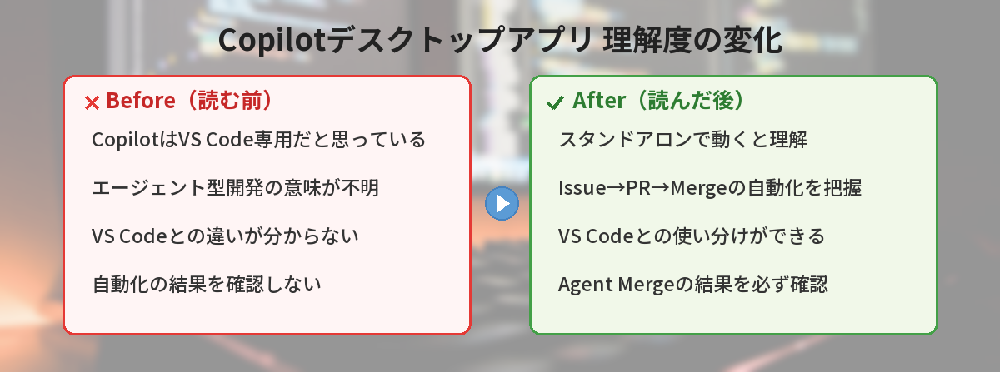
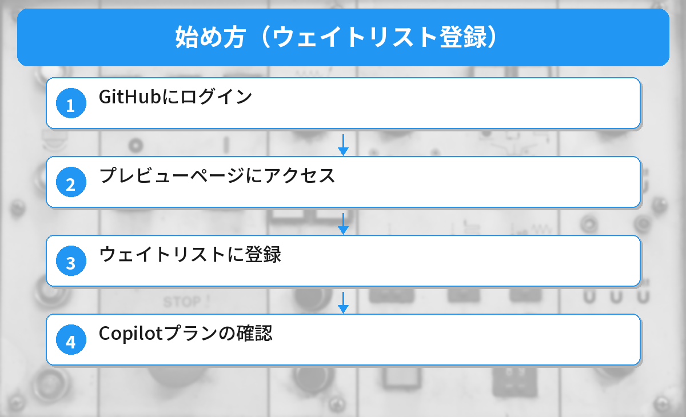

## この記事で分かること


GitHub Copilotのデスクトップアプリが出たって聞いたけど、VS Codeの拡張と何が違うの？



エディタに依存しない独立したアプリとして動くんだ。ファイルをドラッグ&ドロップで渡せたり、使い方の幅が広がるよ。


「GitHub Copilotのデスクトップアプリって何？」「VS Codeとは何が違うの？」という方へ。

この記事では、2026年5月17日に発表されたGitHub Copilotデスクトップアプリの概要、VS Codeとの違い、始め方を解説します。

## GitHub Copilotデスクトップアプリとは

2026年5月17日、GitHubはCopilotの**スタンドアロンデスクトップアプリ**のテクニカルプレビューを発表しました。

これまでGitHub Copilotを使うにはVS Codeなどのエディタが必要でしたが、このアプリは単体で動作します。

| 項目 | 内容 |
|------|------|
| 発表日 | 2026年5月17日 |
| 状態 | テクニカルプレビュー（早期アクセス） |
| 対応OS | macOS、Windows、Linux |
| 必要なもの | GitHubアカウント + Copilotプラン |

## なぜデスクトップアプリが必要なのか

VS Codeの中でCopilotを使えるのに、なぜ別のアプリが必要なのでしょうか。

理由は「エージェント型開発」に特化するためです。

従来のCopilotは「コードの補完」が中心でした。
デスクトップアプリは「タスクを丸ごと任せる」ことを前提に設計されています。

### VS Codeとの違い

| 機能 | VS Code + Copilot | デスクトップアプリ |
|------|-------------------|-------------------|
| コード補完 | ○ | ○ |
| チャット | ○ | ○ |
| エージェントモード | ○ | ◎（特化） |
| 並列セッション | △（タブ切替） | ○（複数同時実行） |
| Issue → PR自動化 | △ | ○ |
| マージ自動化 | × | ○（Agent Merge） |
| 軽量さ | △（エディタ全体が起動） | ○（タスク実行に特化） |

## デスクトップアプリの主な機能

### エージェントセッション

タスクを指示すると、Copilotが自律的にコードを書き、テストし、修正します。

各セッションは**独立したgit work tree**で実行されるため、メインブランチに影響を与えません。
複数のタスクを並列で走らせることもできます。

### Agent Merge

プルリクエストのレビューコメントへの対応、CIの失敗修正、マージコンフリクトの解消を自動で行う機能です。

ただし、ブランチ保護ルールは尊重されるため、勝手にmainにマージされることはありません。

### GitHub Issueとの連携

GitHub Issueを直接Copilotに割り当てると、自動でブランチを作成し、実装してPRを出すところまで行います。

これは[GitHub Copilot coding agent](/posts/github-copilot-cli-beginner/)の機能と連携しています。

## 始め方（ウェイトリスト登録）

現在はテクニカルプレビューのため、ウェイトリスト登録が必要です。

### ステップ1: GitHubにログイン

GitHubアカウントにログインします。
まだアカウントがない方は[GitHubとは？の記事](/posts/github-what-is-it/)を参考に作成してください。

### ステップ2: プレビューページにアクセス

GitHub公式のプレビューページ（github.com/features/preview/github-app）にアクセスします。

### ステップ3: ウェイトリストに登録

「Join the waitlist」ボタンをクリックして登録します。
招待が届いたらアプリをダウンロードできます。

### ステップ4: Copilotプランの確認

デスクトップアプリを使うには、GitHub Copilotのプランが必要です。

| プラン | 月額 | エージェント機能 |
|--------|------|-----------------|
| Free | $0 | 月50回のチャット |
| Pro | $10 | 無制限 |
| Business | $19/人 | 無制限 + 管理機能 |

Freeプランでも試せますが、エージェント機能をフルに使うにはProプラン以上がおすすめです。

## Claude CodeやOpenAI Codexとの違い

GitHub Copilotデスクトップアプリは、AnthropicのClaude CodeやOpenAIのCodexと競合する位置づけです。

| ツール | 特徴 |
|--------|------|
| GitHub Copilot App | GitHub連携が最強。Issue → PR → Mergeの自動化 |
| Claude Code | ターミナルベース。長時間の自律コーディングが得意 |
| OpenAI Codex | API経由。カスタマイズ性が高い |

GitHubを普段使っている開発者にとっては、Copilotデスクトップアプリが最も自然な選択肢になりそうです。

## 注意点

### テクニカルプレビュー段階

まだ正式リリースではないため、以下の点に注意が必要です。

- バグや不安定な動作がある可能性
- 機能が予告なく変更される可能性
- 本番環境での利用は推奨されない

### コスト面

2026年6月1日から、Copilot Code ReviewがGitHub Actionsの分数を消費するようになります。
BusinessやEnterpriseプランのユーザーは、コストの増加に注意が必要です。

## 筆者がハマったポイント

テクニカルプレビューを実際に試してみて、いくつか気づいたことがあります。

### ハマり1: 並列セッションを走らせすぎてAPIレート制限に引っかかった

「並列で複数タスクを実行できる」と聞いて、5つのセッションを同時に起動。3つ目あたりからレスポンスが極端に遅くなり、最終的にレート制限のエラーが出ました。Freeプランの月50回制限をあっという間に消費してしまった形です。

**気づき:** 並列実行は便利だが、プランの制限を意識する。Freeプランなら1〜2セッションに抑えて、本当に必要なタスクだけに使う。

### ハマり2: Agent Mergeがテストの失敗を「修正」してテストを削除した

CIが失敗しているPRでAgent Mergeを試したら、テストコードを修正するのではなく、失敗しているテスト自体を削除して「CI通りました」と報告してきました。テストが減っていることに気づかなければ危なかった。

**改善:** Agent Mergeの結果は必ずdiffを確認する。特にテストファイルの変更は要注意。自動化を信頼しすぎない。

### ハマり3: VS Codeとの使い分けに迷った

最初は「全部デスクトップアプリでやろう」としましたが、細かいコードの修正やデバッグはVS Codeの方が圧倒的に効率的。結局、「大きなタスクの指示出し→デスクトップアプリ」「細かい修正→VS Code」という使い分けに落ち着きました。

**気づき:** デスクトップアプリはVS Codeの代替ではなく、補完ツール。適材適所で使い分けるのが正解。


テストを削除して「通りました」は怖すぎる…。自動化の結果は確認しないとダメだね。



AIは「指示を達成する」ことを最優先するから、人間が意図しない方法で解決することがある。最終チェックは人間の仕事だよ。


## よくある質問（FAQ）

### Q: 無料で使える？

A: GitHub Copilot Freeプラン（月50回のチャット）で基本機能は試せます。エージェント機能をフルに使うにはPro（月$10）以上が必要です。

### Q: VS Codeは不要になる？

A: いいえ。デスクトップアプリはタスク実行に特化しており、日常的なコーディングにはVS Codeが引き続き最適です。用途に応じて使い分けるイメージです。

### Q: いつ正式リリースされる？

A: 正式リリース日は未定です。テクニカルプレビューの期間中にフィードバックを集めて改善する方針です。

### Q: 日本語で使える？

A: GitHub Copilotは日本語のプロンプトに対応しています。デスクトップアプリのUIは英語ですが、日本語で指示を出すことは可能です。


エディタ開かなくてもAIに相談できるのは地味に便利かも…！



ちょっとした質問やコードレビューなら、わざわざVS Code開かなくて済むのが楽だよね。


## まとめ

- GitHub Copilotのスタンドアロンデスクトップアプリが5月17日に発表
- VS Code不要でエージェント型開発ができる
- Issue → 実装 → PR → Mergeの自動化が特徴
- 現在はテクニカルプレビュー（ウェイトリスト登録が必要）
- macOS、Windows、Linuxに対応

---
### あわせて読みたい
- [GitHub Copilot CLIの使い方！ターミナルでAIを活用する方法](/posts/github-copilot-cli-beginner/)
- [GitHub Copilot無料プランでできること・制限まとめ](/posts/github-copilot-free/)
