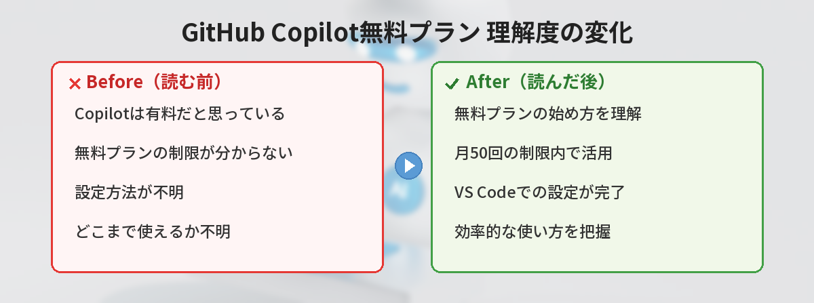

## この記事で分かること


GitHub Copilotって有料だと思ってたけど、無料で使えるようになったの？



そうなんだ。制限付きだけど無料プランが登場したよ。月の補完回数に上限はあるけど、個人の学習用途なら十分使える。





「GitHub Copilotって聞いたことあるけど、無料で使えるの？」

GitHub Copilotは、コードを書いているとAIが自動で続きを提案してくれるツールです。無料プランがあるので、誰でも試せます。



## GitHub Copilotとは

VS Codeなどのエディタに入れる拡張機能で、コードを書き始めるとAIが「こう書きたいんじゃない？」と続きを提案してくれます。

例えば、こう書き始めると：

```python
# ファイルを読み込んで行数を数える
```

AIが自動でこう提案してくれます：

```python
def count_lines(filename):
    with open(filename, 'r') as f:
        return len(f.readlines())
```

Tabキーを押すだけで提案を採用できます。コーディングの効率を上げるには、[VS Code最初に覚えるべき設定とショートカット10選](/posts/vscode-shortcuts-beginner/)もあわせて確認しておくと効果的です。

## 無料プランでできること

| | 無料プラン | 有料プラン（月10ドル） |
|---|---|---|
| コード補完 | 月2,000回まで | 無制限 |
| チャット | 月50回まで | 無制限 |
| 対応エディタ | VS Code等 | VS Code等 |

月2,000回のコード補完は、個人の学習や小さなプロジェクトには十分な量です。

## 始め方


### ステップ1: GitHubアカウントを用意する

GitHubのアカウントが必要です。まだ持っていない方は：

👉 [GitHubのアカウント作成方法はこちら](/posts/github-what-is-it/)

### ステップ2: VS Codeに拡張機能をインストール

1. VS Codeを開く
2. `Ctrl + Shift + X` で拡張機能を開く
3. 「GitHub Copilot」と検索
4. 「GitHub Copilot」をインストール
5. GitHubアカウントでサインインを求められるので、許可する

### ステップ3: 使ってみる

新しいファイルを作って、コメントを書いてみてください。

```python
# 1から10までの合計を計算する
```

数秒待つと、灰色の文字で提案が表示されます。`Tab` キーを押すと採用、`Esc` キーを押すとスキップです。Pythonの基本的な書き方については[Pythonリスト内包表記が分からない人へ](/posts/python-list-comprehension/)なども参考になります。

## 便利な使い方

### コメントから関数を生成

日本語のコメントでやりたいことを書くと、関数を丸ごと提案してくれます。

```python
# リストの中から重複を削除して、昇順に並べ替える関数
```

### テストコードの自動生成

関数を書いた後に「テスト」とコメントすると、テストコードを提案してくれます。

```python
def add(a, b):
    return a + b

# addのテスト
```

### エラーの修正

コードにエラーがあるとき、Copilot Chatに聞けます。

1. `Ctrl + I` でCopilot Chatを開く
2. 「このコードのエラーを修正して」と入力

Copilotが生成したコードで[TypeScript](/posts/typescript-beginner/)の型エラーが出ることもあります。提案内容は必ず確認してから採用しましょう。

## 注意点

- Copilotの提案は必ず正しいとは限りません。内容を確認してから採用してください
- 機密情報（APIキーやパスワード）をコードに書くと、Copilotが学習データとして使う可能性があります
- 無料プランの回数制限は月初にリセットされます
- APIキーなどの機密情報は[環境変数](/posts/env-variables-beginner/)で管理するのが安全です

---

## 実際にCopilot無料プランを2ヶ月使ってみた！

筆者が実際にCopilot無料プランを2ヶ月間使ってみた感想をお伝えします。

### 劇的に効率が上がった場面

- **定型的なコード**（forループ、if文の分岐、API呼び出し）はほぼCopilotに書いてもらえる
- **テスト関数**を書くとき。関数名を「test_」で始めるだけで、適切なテストケースを提案してくれる
- **ボイラープレートコード**（React/Express等の初期設定）は10秒で終わる

### 期待ほどではなかった場面

- **複雑なビジネスロジック**は的外れな提案が多い。自分で書いた方が早い
- **既存コードの文脈を100%理解してくれるわけではない**。大きなファイルの途中だと見当違いの補完が来ることも
- **日本語コメントからのコード生成**は英語より精度が落ちる印象

### 月2000回の制限は足りる？

正直、学習用途なら**余裕で足ります**。筆者は毎日1〜2時間コードを書いていますが、月1,200〜1,500回程度の使用量。2,000回は超えませんでした。

ただし、仕事でがっつり使うなら**3日で上限に達する可能性がある**ので、有料プラン（月10ドル）を検討した方がいいです。

---

## Copilotを上手に使うコツ

### コツ1: コメントは具体的に書く

```python
# NG: データを処理する
# OK: CSVファイルを読み込み、price列が1000以上の行だけフィルタする
```

コメントが具体的なほど、Copilotの提案精度が上がります。

### コツ2: 関数名で意図を伝える

```python
# NG
def process(data):

# OK
def filter_expensive_products(products, min_price=1000):
```

良い関数名をつけるだけで、Copilotが中身を正確に推測してくれます。

### コツ3: 最初の数行を自分で書く

関数の最初の2〜3行を自分で書くと、Copilotが「この方向性で合ってるんだな」と理解して、残りの精度が上がります。ゼロから全部任せるより、「きっかけ」を与えてあげると良い結果が出やすいです。

---

## Copilot vs ChatGPT：コーディングでの使い分け

| 比較項目 | GitHub Copilot | ChatGPT |
|---------|---------------|---------|
| 場所 | エディタ内（VS Code等） | ブラウザ or API |
| タイミング | コードを書きながらリアルタイム | 別タブで質問 |
| 得意なこと | 1行〜数十行の補完 | 設計相談・エラー解説・長いコード生成 |
| 精度 | ファイルの文脈を見て補完 | 質問の書き方次第 |
| 料金 | 無料（月2000回）/ 月10ドル | 無料 / 月20ドル |

**使い分けのコツ**: Copilotは「手を動かしながら使う」、ChatGPTは「考えるときに使う」。両方併用するのがベストです。

## よくある質問（FAQ）


### Q: GitHub Copilotは日本語のコメントに対応していますか？

A: はい、日本語のコメントからもコードを生成できます。ただし、英語のコメントの方が精度が高い傾向があります。まずは日本語で試して、うまくいかない場合は英語に切り替えてみてください。

### Q: 無料プランの回数を使い切ったらどうなりますか？

A: コード補完やチャットが使えなくなりますが、月初にリセットされます。それまでは通常のコーディングで対応しましょう。頻繁に使う場合は有料プラン（月10ドル）への切り替えも検討してみてください。

### Q: Copilotが提案したコードに著作権の問題はありますか？

A: Copilotは公開コードを学習データとして使っているため、まれに既存のコードと類似した提案が出ることがあります。商用プロジェクトで使う場合は、提案内容を確認してから採用するのが安全です。

### Q: Copilotが何も提案してくれません。どうすればいいですか？

A: まず、GitHubアカウントでサインインできているか確認してください。VS Codeの右下にCopilotのアイコンが表示されていればOKです。それでも動かない場合は、拡張機能を一度無効にして再度有効にしてみてください。

### Q: CopilotとChatGPTの違いは何ですか？

A: Copilotはエディタ内でコードを書きながらリアルタイムに補完してくれるツールです。ChatGPTはブラウザ上で質問に答えてくれるチャットツールです。コーディング中の補完にはCopilot、設計や調査にはChatGPTと使い分けるのが効果的です。


無料でここまで使えるなら試さない理由がないね…！さっそく設定してみる。



VS Codeの拡張を入れてGitHubアカウントでログインするだけだから、5分で始められるよ。


---

## 無料プランから有料プランに切り替えるべきタイミング

以下のサインが出たら、有料プラン（月10ドル）を検討するタイミングです。

- **月の途中で回数上限に達する**ことが2ヶ月連続で起きた
- **コーディング時間が1日3時間以上**に増えた
- **仕事でCopilotを使い始めた**（趣味→仕事に移行したとき）
- **チャット機能をもっと使いたい**（月50回では足りないと感じる）
- **複数のプロジェクトを並行で開発している**（使用量が分散して気づかないうちに上限に達する）

逆に、週末だけコードを書く・学習目的で使うだけなら、無料プランで全く問題ありません。

### 有料プランのコスパは良い？

月10ドル（約1,500円）で無制限にコード補完が使えます。筆者の感覚では「1日30分以上の時短効果がある」ので、時給換算すると余裕で元が取れます。プログラミングの生産性向上ツールとしては破格のコスパです。学生割引もあるので、学生の方は公式サイトで確認してみてください。

## まとめ

- GitHub Copilotは無料プランで月2,000回のコード補完が使える
- VS Codeに拡張機能を入れるだけで始められる
- コメントを書くだけでAIがコードを提案してくれる
- 提案は必ず確認してから採用する
- 学習用途なら月2,000回で十分。仕事用なら有料プランを検討
- コメントを具体的に書くと提案精度が上がる
- ChatGPTとの併用がベスト（Copilot=手を動かす時、ChatGPT=考える時）

---
### あわせて読みたい
- [VS Code最初に覚えるべき設定とショートカット10選](/posts/vscode-shortcuts-beginner/)
- [GitHubアカウントを作ったけど何すればいい？最初の使い方ガイド](/posts/github-what-is-it/)
- [GitHub Copilot CLIの使い方 ― ターミナルでもAIが使える](/posts/github-copilot-cli-beginner/)

