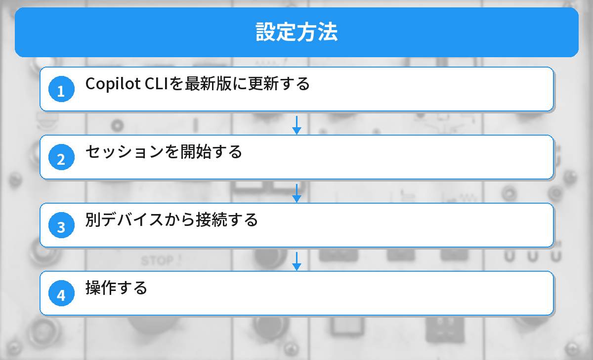

## この記事で分かること


CopilotをリモートのCodespacesとかSSH先でも使いたいんだけど、設定って必要？



リモート環境でもCopilotは使えるよ。ただ、接続方法によって設定が少し違うんだ。パターン別に説明するね。


「Copilotが作業中にPCから離れたい」「スマホからコーディングの進捗を確認したい」という方へ。

2026年5月18日、GitHub Copilotの「Remote Control」機能が正式リリースされました。PCで動いているCopilot CLIのセッションを、スマホやブラウザから操作できる機能です。この記事では設定方法と活用シーンを解説します。



## GitHub Copilot Remote Controlとは

Copilot Remote Controlは、PCで実行中のCopilot CLIセッションに別のデバイスからアクセスできる機能です。

例えば、PCでCopilotに「このバグを修正して」と指示した後、外出先のスマホから進捗を確認したり、追加の指示を出したりできます。

| 項目 | 内容 |
|------|------|
| 正式リリース日 | 2026年5月18日 |
| 対応デバイス | ブラウザ（github.com）、GitHub Mobile、VS Code |
| 対象プラン | Pro / Pro+ / Business / Enterprise |
| 前提条件 | Copilot CLIがインストール済みであること |

## なぜRemote Controlが必要なのか

Copilot CLIは、ターミナルからAIに開発タスクを任せられるツールです（[Copilot CLIの使い方](/posts/github-copilot-cli-beginner/)で解説しています）。

しかし、AIが長時間のタスクを実行している間、PCの前に座り続ける必要がありました。

- 「テスト全部通るまでリファクタリングして」→ 数十分かかることも
- 途中で「この方針で合ってる？」とCopilotが確認を求めてくる
- PCから離れると応答できず、作業が止まる

Remote Controlはこの問題を解決します。PCから離れても、スマホから応答できるようになりました。

## 設定方法



### ステップ1: Copilot CLIを最新版に更新する

```bash
# GitHub CLIを更新
gh extension upgrade gh-copilot

# バージョン確認
gh copilot --version
```

GitHub CLIの基本的な使い方は[GitHub入門記事](/posts/github-what-is-it/)で解説しています。

### ステップ2: セッションを開始する

```bash
# Copilot CLIセッションを開始
gh copilot

# セッション内でリモートアクセスを有効化
/remote on
```

`/remote on` を実行すると、セッションIDが表示されます。

### ステップ3: 別デバイスから接続する

以下のいずれかの方法で接続できます。

**方法A: ブラウザから**
1. github.com にログイン
2. 右上のCopilotアイコンをクリック
3. 「Remote Sessions」タブを選択
4. アクティブなセッションが表示されるのでクリック

**方法B: GitHub Mobileから**
1. GitHub Mobileアプリを開く
2. Copilotタブを選択
3. 「Remote Sessions」をタップ
4. 接続したいセッションを選択

### ステップ4: 操作する

接続すると、セッションの出力がリアルタイムで表示されます。テキスト入力欄から追加の指示を送ることもできます。

## できること

### セッション出力の確認

Copilotが何をしているか、リアルタイムで確認できます。ファイルの変更内容やコマンドの実行結果が表示されます。

### 権限リクエストへの応答

Copilotが「このファイルを変更してもいいですか？」と確認を求めてきたとき、スマホから「OK」と応答できます。

### 追加の指示

「やっぱりこの方針に変えて」「このファイルも対象に含めて」など、途中で方針を変更する指示を送れます。

### セッションの停止

問題が起きた場合、リモートからセッションを停止することもできます。

## 活用シーン

### シーン1: 長時間のリファクタリング

PCでCopilotに大規模なリファクタリングを任せて、昼食に出かける。スマホで進捗を確認しながら、必要に応じて方針を修正する。

### シーン2: CI/CDの待ち時間

テストが通るまでCopilotに修正を繰り返させている間、別の作業をする。テストが通ったらスマホに通知が来る。

### シーン3: ペアプログラミング

チームメンバーのCopilotセッションに接続して、リアルタイムで進捗を確認しながらアドバイスを送る。

GitHub Copilotの料金体系については[Copilot課金変更の記事](/posts/github-copilot-usage-billing/)で詳しく解説しています。

## セキュリティについて

### 認証

Remote Controlは、GitHubアカウントの認証を通過したデバイスからのみ接続できます。第三者がセッションに接続することはできません。

### 暗号化

セッションデータはエンドツーエンドで暗号化されています。GitHub側でもセッション内容を閲覧することはできません。

### セッションの有効期限

リモートアクセスを有効にしたセッションは、24時間後に自動的にリモート接続が無効化されます。

### ブランチ保護との連携

リポジトリにブランチ保護ルールが設定されている場合、Copilotもそのルールに従います。保護されたブランチへの直接プッシュはリモートからも実行できません。

## 注意点

- **Free プランでは利用できません**。Pro以上のプランが必要です
- セッションのリモート接続は明示的に `/remote on` で有効化する必要があります（デフォルトはオフ）
- ネットワーク接続が不安定な場合、リアルタイム表示に遅延が発生することがあります
- 同時に接続できるデバイスは1台のみです

## GitHub Copilotデスクトップアプリとの違い

先日発表された[Copilotデスクトップアプリ](/posts/github-copilot-desktop-app/)は、VS Code不要のスタンドアロン開発環境です。

Remote Controlは「既存のCLIセッションを別デバイスから操作する」機能なので、用途が異なります。

| 機能 | 用途 |
|------|------|
| Copilotデスクトップアプリ | PCでの開発作業全般 |
| Remote Control | 実行中セッションの遠隔操作 |

## よくある質問（FAQ）

### Q: スマホからコードを書くことはできる？

A: テキスト入力で指示を送ることはできますが、エディタとしてコードを直接編集する機能はありません。あくまで「Copilotへの指示」を送る形です。

### Q: Wi-Fiがない場所でも使える？

A: モバイルデータ通信でも利用可能です。ただし、セッション出力のリアルタイム表示にはある程度の通信速度が必要です。

### Q: 複数人で同じセッションに接続できる？

A: 現時点では1セッションにつき1デバイスのみ接続可能です。チーム向けの共有機能は今後のアップデートで検討されています。

### Q: Copilot CLIを使ったことがないけど大丈夫？

A: まずは[Copilot CLIの入門記事](/posts/github-copilot-cli-beginner/)で基本を押さえてから、Remote Controlを試すのがおすすめです。

### Q: 6月からの課金変更で追加料金はかかる？

A: Remote Control自体に追加料金はありません。ただし、Copilotの利用量としてカウントされるため、使用量ベース課金の対象にはなります。詳しくは[課金変更の記事](/posts/github-copilot-usage-billing/)を参照してください。


SSH先でも普通に動くんだ…！設定さえすれば場所を選ばないのがいいね。



Codespacesなら設定不要で動くし、SSH先もextensions.jsonに追加するだけ。リモートワークの味方だよ。


## まとめ

- GitHub Copilot Remote Controlが2026年5月18日に正式リリースされた
- PCで実行中のCopilot CLIセッションをスマホやブラウザから操作できる
- セッション出力の確認、権限リクエストへの応答、追加指示が可能
- `/remote on` コマンドで有効化する（デフォルトはオフ）
- Pro以上のプランで利用可能
- エンドツーエンド暗号化でセキュリティも確保されている

---
### あわせて読みたい
- [GitHub Copilot CLIの使い方！ターミナルでAIを活用する方法](/posts/github-copilot-cli-beginner/)
- [GitHub Copilotデスクトップアプリが登場！](/posts/github-copilot-desktop-app/)

