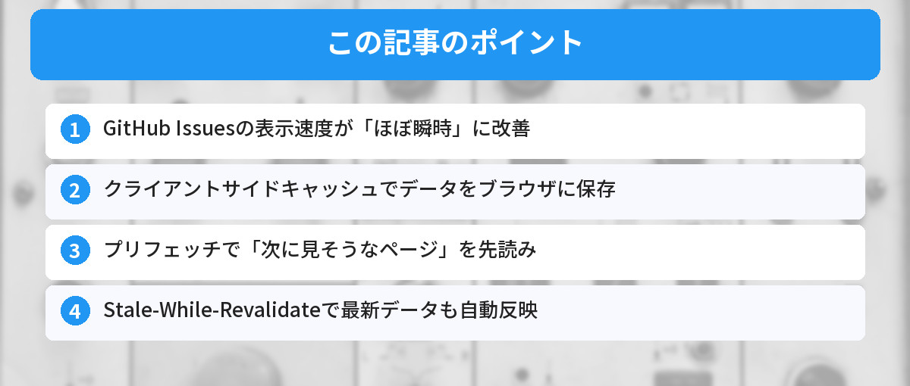

## この記事で分かること


GitHub Issuesって使ってるけど、もっと効率よく管理する方法ないの？



ラベル・マイルストーン・テンプレートを活用すると、チームの生産性がかなり上がるよ。実践的なTipsを紹介するね。


「GitHub Issuesのページ遷移が遅い」「Issueを開くたびに読み込みが入って作業が中断される」

2026年5月、GitHubがIssuesの表示速度を大幅に改善するアップデートを実施しました。クライアントサイドキャッシュとプリフェッチ技術により、ほぼ瞬時にページ遷移できるようになっています。

この記事では、何が変わったのか、どう活用すればいいのかを解説します。



## 何が変わったのか

GitHub Issuesのページ遷移が、体感で「ほぼ瞬時」になりました。

### 従来の動作

1. Issue一覧でIssueをクリック
2. サーバーにリクエストが飛ぶ
3. サーバーがHTMLを生成して返す
4. ブラウザがページを描画する

この間、数百ミリ秒〜数秒の待ち時間が発生していました。

### 新しい動作

1. Issue一覧を表示した時点で、各Issueのデータを先読み（プリフェッチ）
2. Issueをクリックすると、キャッシュ済みのデータを即座に表示
3. バックグラウンドで最新データを取得して差分を更新

ユーザーから見ると「クリックした瞬間に表示される」感覚です。

## 技術的な仕組み

### クライアントサイドキャッシュ

ブラウザ側（クライアント側）にデータを一時保存する仕組みです。一度読み込んだIssueのデータをブラウザが記憶しておき、次にアクセスしたときはサーバーに問い合わせずに表示します。

[APIとは何か](/posts/api-what-is-it/)で解説したように、通常はサーバーにリクエストを送ってデータを取得しますが、キャッシュがあればその手順をスキップできます。

### プリフェッチ（先読み）

ユーザーがクリックする前に、「次に見そうなページ」のデータを先に読み込んでおく技術です。

Issue一覧を表示した時点で、各Issueの詳細データをバックグラウンドで取得しておきます。ユーザーがクリックしたときには、すでにデータが手元にある状態です。

### Stale-While-Revalidate

キャッシュしたデータを即座に表示しつつ、バックグラウンドで最新データを取得する戦略です。

1. まずキャッシュのデータを表示（高速）
2. 裏で最新データをサーバーから取得
3. 差分があれば画面を更新

ユーザーは待ち時間なしで作業を始められ、最新の情報も自動的に反映されます。

## 実際の体感速度

GitHubの発表によると、Issue間のナビゲーションが「ほぼ瞬時（near-instant）」になったとのことです。

### 効果が大きい場面

- Issue一覧から個別Issueへの遷移
- Issue間の行き来（前のIssueに戻る → 次のIssueを開く）
- フィルタリング後の一覧表示

### 効果が限定的な場面

- 初回アクセス（キャッシュがまだない状態）
- 大量のコメントがあるIssue（データ量が多い）
- ネットワーク接続が不安定な環境

## 開発者として知っておくべきこと

### 自分のプロジェクトにも応用できる

GitHubが使っている技術は、自分のWebアプリにも応用できます。

```javascript
// プリフェッチの基本的な実装例
// リンクにマウスが乗ったら先読みする
document.querySelectorAll('a').forEach(link => {
  link.addEventListener('mouseenter', () => {
    const prefetchLink = document.createElement('link');
    prefetchLink.rel = 'prefetch';
    prefetchLink.href = link.href;
    document.head.appendChild(prefetchLink);
  });
});
```

[JavaScriptのFetch APIの使い方](/posts/javascript-fetch-api/)を理解していれば、キャッシュ戦略の実装もスムーズです。

### Service Workerとの組み合わせ

より高度なキャッシュ戦略を実装したい場合は、Service Workerを使う方法もあります。

```javascript
// Service Workerでのキャッシュ戦略（概念）
self.addEventListener('fetch', event => {
  event.respondWith(
    caches.match(event.request).then(cached => {
      // キャッシュがあれば即座に返す
      const fetched = fetch(event.request).then(response => {
        // バックグラウンドでキャッシュを更新
        caches.open('v1').then(cache => cache.put(event.request, response.clone()));
        return response;
      });
      return cached || fetched;
    })
  );
});
```

## GitHub Issuesを効率的に使うコツ

速度改善を活かして、Issuesをもっと効率的に使いましょう。

### ラベルを活用する

ラベルでIssueを分類しておくと、フィルタリングが高速になります。キャッシュとの相性も良く、フィルタ結果が瞬時に表示されます。

### テンプレートを用意する

Issue作成時のテンプレートを用意しておくと、情報が整理されて読みやすくなります。

[GitHubとは何か](/posts/github-what-is-it/)の記事でも基本的な使い方を紹介しているので、まだGitHubに慣れていない方は参考にしてみてください。

### キーボードショートカット

GitHubにはIssue操作用のキーボードショートカットがあります。

| ショートカット | 動作 |
|--------------|------|
| `j` / `k` | Issue一覧で上下移動 |
| `o` または `Enter` | Issueを開く |
| `u` | Issue一覧に戻る |
| `l` | ラベルを付ける |
| `a` | アサインする |

ページ遷移が高速になったことで、ショートカットでの操作がさらに快適になります。

## 他のGitHub機能への展開

今回のキャッシュ技術は、今後GitHub内の他の機能にも展開される可能性があります。

- Pull Requestの一覧・詳細
- Projectsボード
- Code検索結果

[GitHub Copilotの料金プラン変更](/posts/github-copilot-usage-billing/)と合わせて、GitHubは2026年に大きく進化しています。

## よくある質問（FAQ）



### Q: 自分で何か設定する必要がある？

A: いいえ。GitHubが自動的に適用しているので、ユーザー側の設定は不要です。ブラウザでGitHubを開くだけで恩恵を受けられます。

### Q: 古いブラウザでも動く？

A: 基本的にはモダンブラウザ（Chrome、Firefox、Safari、Edge）であれば動作します。極端に古いブラウザでは従来通りの動作になる可能性があります。

### Q: キャッシュのせいで古い情報が表示されることはない？

A: Stale-While-Revalidate戦略により、キャッシュを表示しつつバックグラウンドで最新データを取得します。数秒以内に最新の状態に更新されます。

### Q: プライベートリポジトリでも有効？

A: はい。パブリック・プライベートに関係なく、GitHub Issuesを使っていれば自動的に適用されます。

### Q: GitHub Mobileアプリでも速くなった？

A: 今回のアップデートは主にWebブラウザ版が対象です。モバイルアプリは別途最適化が行われています。


Issueテンプレート作るだけでこんなに楽になるんだ…！



テンプレートがあると報告の質が揃うから、対応も速くなるんだよね。


## まとめ

- GitHub Issuesの表示速度が「ほぼ瞬時」に改善
- クライアントサイドキャッシュでデータをブラウザに保存
- プリフェッチで「次に見そうなページ」を先読み
- Stale-While-Revalidateで最新データも自動反映
- ユーザー側の設定は不要（自動適用）
- 同じ技術は自分のWebアプリにも応用可能

---

### あわせて読みたい

- [GitHubとは何か？初心者向けに解説](/posts/github-what-is-it/)
- [JavaScriptのFetch APIの使い方](/posts/javascript-fetch-api/)

