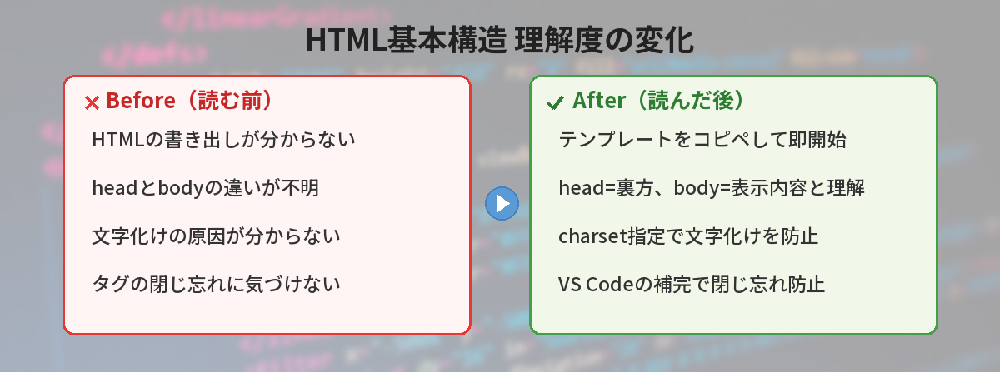
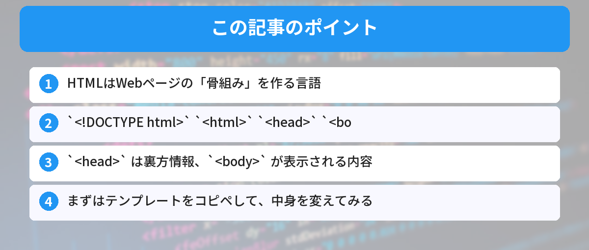

## この記事で分かること


HTMLファイルって最初に何を書けばいいの？<!DOCTYPE html>って何なの？



HTMLの「お決まりの書き出し」だね。意味を理解すると、なぜ必要なのか納得できるよ。基本構造を一緒に見ていこう。




「HTMLを書いてみたいけど、何から始めればいいか分からない」

この記事では、HTMLファイルの最低限の構造と、コピペで使えるテンプレートを紹介します。

## HTMLとは

HTMLは、Webページの「骨組み」を作る言語です。ブラウザで見ているすべてのWebページは、HTMLで書かれています。

HTMLは「プログラミング言語」ではなく「マークアップ言語」です。計算や処理をするのではなく、「ここは見出し」「ここは段落」「ここは画像」と、コンテンツの構造を指定するだけです。

HTMLで作ったページの見た目を整えるにはCSSを使います。レイアウトの基本は[CSS Flexboxの解説記事](/posts/css-flexbox-beginner/)で紹介しています。

## 最低限のHTMLテンプレート

以下をコピペして、`index.html` というファイル名で保存してください。

```html
<!DOCTYPE html>
<html lang="ja">
<head>
  <meta charset="UTF-8">
  <meta name="viewport" content="width=device-width, initial-scale=1.0">
  <title>はじめてのWebページ</title>
</head>
<body>
  <h1>はじめてのWebページ</h1>
  <p>HTMLで作った最初のページです。</p>
</body>
</html>
```

保存したファイルをブラウザにドラッグ＆ドロップすると、Webページとして表示されます。

作ったHTMLファイルをインターネットに公開したい場合は、[GitHub Pagesを使ったデプロイ方法](/posts/github-pages-deploy/)が手軽でおすすめです。

## 各行の意味

### `<!DOCTYPE html>`

「このファイルはHTML5で書かれています」という宣言です。おまじないだと思ってください。必ず1行目に書きます。

### `<html lang="ja">`

HTMLの始まりを示すタグです。`lang="ja"` は「このページは日本語です」という意味。

### `<head>` の中身

ページの「裏方情報」を書く場所です。ブラウザの画面には表示されません。

- `<meta charset="UTF-8">` → 文字化けを防ぐ設定
- `<meta name="viewport" ...>` → スマホで見たときにちゃんと表示される設定
- `<title>` → ブラウザのタブに表示されるタイトル

### `<body>` の中身

ここに書いたものがブラウザに表示されます。

- `<h1>` → 一番大きい見出し
- `<p>` → 段落（普通の文章）



## よく使うタグ一覧

```html
<!-- 見出し（h1が最大、h6が最小） -->
<h1>大見出し</h1>
<h2>中見出し</h2>
<h3>小見出し</h3>

<!-- 段落 -->
<p>これは段落です。</p>

<!-- リンク -->
<a href="https://example.com">リンクテキスト</a>

<!-- 画像 -->


<!-- リスト -->
<ul>
  <li>項目1</li>
  <li>項目2</li>
  <li>項目3</li>
</ul>

<!-- 太字 -->
<strong>太字のテキスト</strong>

<!-- 改行 -->
<br>

<!-- 水平線 -->
<hr>
```

## 実践：自己紹介ページを作ってみよう

以下をコピペして `profile.html` として保存し、ブラウザで開いてみてください。

```html
<!DOCTYPE html>
<html lang="ja">
<head>
  <meta charset="UTF-8">
  <meta name="viewport" content="width=device-width, initial-scale=1.0">
  <title>自己紹介</title>
  <style>
    body {
      font-family: sans-serif;
      max-width: 600px;
      margin: 0 auto;
      padding: 2rem;
      background: #f5f5f5;
    }
    h1 { color: #333; }
    .card {
      background: white;
      padding: 1.5rem;
      border-radius: 10px;
      box-shadow: 0 2px 8px rgba(0,0,0,0.1);
    }
  </style>
</head>
<body>
  <div class="card">
    <h1>自己紹介</h1>
    <p>名前：あなたの名前</p>
    <p>趣味：プログラミング学習</p>
    <h2>好きな技術</h2>
    <ul>
      <li>HTML / CSS</li>
      <li>Python</li>
      <li>JavaScript</li>
    </ul>
    <h2>リンク</h2>
    <a href="https://github.com">GitHub</a>
  </div>
</body>
</html>
```

`<style>` タグの中にCSSを書くと、見た目を変えられます。色やフォントを変えて遊んでみてください。

CSSで要素を中央に配置したいときは、[CSSの中央揃えパターン集](/posts/html-css-center/)が参考になります。また、レイアウトを本格的に組みたくなったら[CSS Gridの基本](/posts/css-grid-beginner/)も確認してみてください。

プログラミングを続けていると、HTMLと一緒にJavaScriptも使うようになります。データのやり取りには[JSON形式](/posts/json-what-is-it/)がよく使われるので、あわせて知っておくと理解が深まります。

## 筆者がハマったポイント

HTMLは「簡単」と言われがちですが、最初は意外なところでつまずきます。

### ハマり1: 文字化けして日本語が全部「???」になった

初めてHTMLファイルを作ったとき、`<meta charset="UTF-8">` を書き忘れました。ブラウザで開いたら日本語が全部文字化けして「???」の羅列に。「HTMLが壊れた」と思って焦りましたが、charset指定を追加するだけで解決しました。

**気づき:** `<meta charset="UTF-8">` は「おまじない」ではなく、日本語を正しく表示するために必須の設定。

### ハマり2: タグの閉じ忘れでレイアウトが崩壊した

`<div>` を開いたのに `</div>` で閉じ忘れて、ページの後半が全部divの中に入ってしまいレイアウトが崩壊。どこが原因か分からず、1つずつタグを確認して30分かかりました。

**改善:** VS Codeの「Auto Close Tag」拡張機能を入れて、開きタグを書いた瞬間に閉じタグが自動生成されるようにしました。また、インデントを揃えて書くことで、対応するタグが視覚的に分かりやすくなります。

### ハマり3: ファイルをダブルクリックしてもブラウザで開けなかった

HTMLファイルを作ったのに、ダブルクリックするとテキストエディタで開いてしまう。拡張子が `.html` ではなく `.html.txt` になっていたのが原因。Windowsの「拡張子を表示する」設定をONにして、正しい拡張子を確認するようにしました。

**改善:** Windowsのエクスプローラーで「表示」→「ファイル名拡張子」にチェックを入れる。これで隠れた `.txt` に気づける。


charset忘れて文字化けするの、絶対やりそう…。テンプレートをコピペするのが安全だね。



そう、毎回手打ちするよりテンプレートをコピペして中身だけ変える方が確実だよ。


## よくある質問（FAQ）



### Q: HTMLファイルはどのエディタで書けばいいですか？
A: VS Code（Visual Studio Code）がおすすめです。HTMLの入力補完やプレビュー機能が充実しています。[VS Codeの便利なショートカット](/posts/vscode-shortcuts-beginner/)を覚えると、さらに効率よく書けます。

### Q: HTMLだけでWebサイトは作れますか？
A: HTMLだけでもWebページは表示できますが、見た目を整えるにはCSSが必要です。さらに動きをつけたい場合はJavaScriptも使います。まずはHTMLの基本構造を理解してから、CSSに進むのがおすすめです。

### Q: `<div>` タグと `<span>` タグの違いは何ですか？
A: `<div>` はブロック要素で、前後に改行が入ります。セクションやグループを作るときに使います。`<span>` はインライン要素で、文中の一部分だけを囲むときに使います。たとえば文章の一部だけ色を変えたいときは `<span>` を使います。

### Q: HTMLのバージョンは気にする必要がありますか？
A: 現在は「HTML5」が標準です。`<!DOCTYPE html>` と書けばHTML5として扱われます。古いバージョンを意識する必要はほとんどありません。

### Q: HTMLファイルの拡張子は `.html` と `.htm` のどちらが正しいですか？
A: どちらでも動作しますが、`.html` を使うのが一般的です。現在のWebでは `.html` が標準的な拡張子として広く使われています。


head とbodyの役割が分かったらスッキリした…！



この基本構造は全てのWebページの土台だから、一度覚えれば一生使えるよ。



---

## 実際にHTMLを初めて書いたときの体験

筆者が初めてHTMLファイルを作ってブラウザで開いたとき、「自分が書いたものが画面に表示される」感動は今でも覚えています。

最初は`<html>`、`<head>`、`<body>`の役割が分からず、全部`<body>`の中に書いていました。それでもブラウザは表示してくれるので「これでいいのか」と思っていましたが、後からSEOやアクセシビリティのために正しい構造が大事だと知りました。

### HTML学習の最短ルート

1. この記事のテンプレートをコピーして`.html`ファイルを作る（5分）
2. `<h1>`と`<p>`で自己紹介ページを作る（15分）
3. VS CodeのLive Serverで表示を確認する（5分）

ここまで25分。これだけで「HTMLが書ける人」です。

## まとめ

- HTMLはWebページの「骨組み」を作る言語
- `<!DOCTYPE html>` `<html>` `<head>` `<body>` が基本構造
- `<head>` は裏方情報、`<body>` が表示される内容
- まずはテンプレートをコピペして、中身を変えてみる

---
### あわせて読みたい
- [CSSで中央揃えができないときの解決パターン集](/posts/html-css-center/)
- [JSONとは？5分で分かるデータ形式の基本](/posts/json-what-is-it/)

