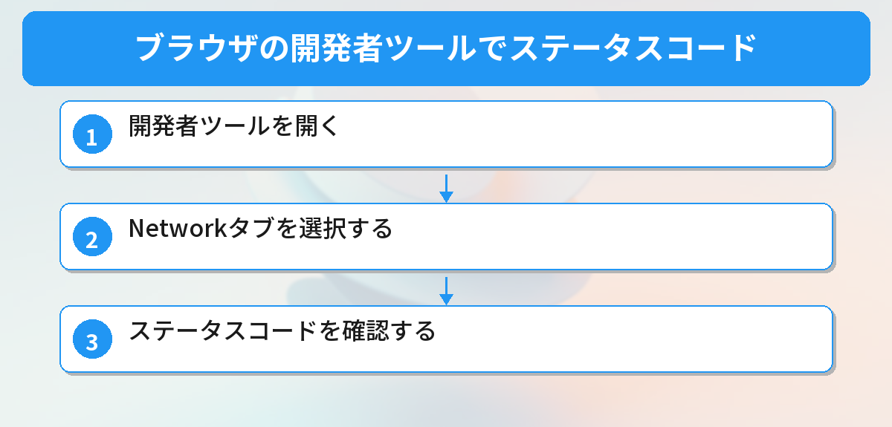
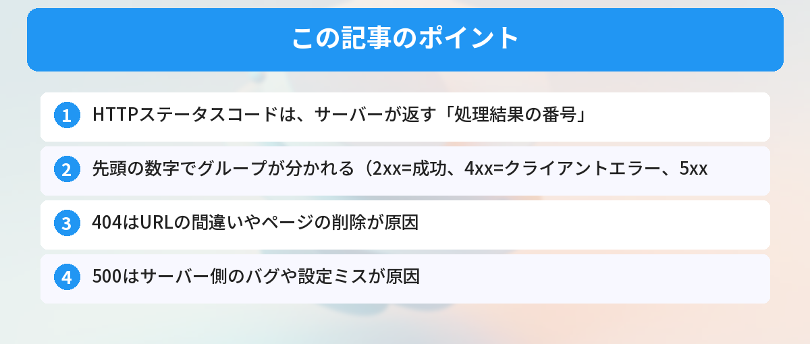

## この記事で分かること


404とか500とか、HTTPのステータスコードって何種類あるの？全部覚えなきゃダメ？



全部覚える必要はないよ。よく出る10個くらいを押さえておけば実務で困らない。番号の法則を知ると覚えやすいんだ。


「404 Not Found って何？」「500エラーが出たけど、自分のせい？サーバーのせい？」

Webサイトを見ているとき、あるいは開発中に、3桁の数字が表示されて困ったことはありませんか。この記事では、HTTPステータスコードの意味と、よく見るコードの原因・対処法を解説します。

## HTTPステータスコードとは

HTTPステータスコードは、ブラウザ（クライアント）がサーバーにリクエストを送ったとき、サーバーが返す「処理結果の番号」です。

たとえば、あなたがブラウザでURLを入力すると、ブラウザはサーバーに「このページをください」とリクエストを送ります。サーバーは「200（OK、ちゃんと返しますよ）」や「404（そのページは見つかりません）」のように、3桁の数字で結果を伝えます。

この仕組みは[APIの基本](/posts/api-what-is-it/)と同じです。リクエストを送り、レスポンスを受け取る。ステータスコードはそのレスポンスに含まれる「結果報告」のようなものです。

## なぜステータスコードを知る必要があるのか

ステータスコードを知っていると、問題の切り分けが速くなります。

- **4xx番台**のエラー → クライアント（自分）側に原因がある
- **5xx番台**のエラー → サーバー側に原因がある

この区別が分かるだけで、「自分のコードを直すべきか」「サーバーの復旧を待つべきか」を判断できます。



## ステータスコードの分類

ステータスコードは、先頭の数字で5つのグループに分かれます。

| 番号帯 | 意味 | 概要 |
|--------|------|------|
| 1xx | 情報 | リクエストを受け付けた（処理中） |
| 2xx | 成功 | リクエストが正常に処理された |
| 3xx | リダイレクト | 別のURLに転送される |
| 4xx | クライアントエラー | リクエスト側に問題がある |
| 5xx | サーバーエラー | サーバー側に問題がある |

## よく見るステータスコード一覧

### 200 OK ― 正常

リクエストが成功し、サーバーが正しいレスポンスを返した状態です。ブラウザでページが普通に表示されているとき、裏側では200が返っています。

[JavaScript fetch API](/posts/javascript-fetch-api/)でデータを取得するとき、レスポンスの `status` が200なら成功です。

```javascript
// fetchでステータスコードを確認する例
const response = await fetch('https://api.example.com/data');
console.log(response.status); // 200
```

### 201 Created ― 作成成功

新しいリソースが作成されたときに返されます。たとえば、フォームからデータを送信して、サーバー側でデータベースに新しいレコードが作られた場合です。

### 301 Moved Permanently ― 恒久的な移転

ページのURLが永久に変わったことを示します。ブラウザは自動的に新しいURLに転送されます。サイトのリニューアルでURLが変わったときや、HTTPからHTTPSに移行したときによく使われます。

### 302 Found ― 一時的な移転

ページが一時的に別のURLに移動していることを示します。ログインしていないユーザーをログインページに転送するときなどに使われます。301との違いは「一時的」か「永久」かです。

### 400 Bad Request ― リクエストが不正

サーバーがリクエストの内容を理解できなかったときに返されます。送信したデータの形式が間違っている、必須パラメータが足りないなどが原因です。

```javascript
// 400エラーが起きる例：JSONの形式が不正
const response = await fetch('https://api.example.com/users', {
  method: 'POST',
  headers: { 'Content-Type': 'application/json' },
  body: '{ name: "太郎" }' // ダブルクォートが必要
});
// → 400 Bad Request
```

### 401 Unauthorized ― 認証が必要

リクエストに認証情報（ログイン情報やAPIキー）が含まれていない、または無効な場合に返されます。APIキーの設定ミスでよく見かけるコードです。

### 403 Forbidden ― アクセス禁止

認証はされているが、そのリソースへのアクセス権限がない場合に返されます。401との違いは、401は「誰か分からない」、403は「誰か分かるけど許可されていない」です。

### 404 Not Found ― ページが見つからない

もっとも有名なステータスコードです。指定されたURLにリソースが存在しない場合に返されます。

よくある原因：
- URLのタイプミス
- ページが削除された
- リンク先のURLが変更された

開発中に404が出る場合は、ルーティングの設定やファイルパスを確認してください。ローカル開発で接続自体ができない場合は、[localhostの接続が拒否されたときの対処法](/posts/localhost-refused/)も参考になります。

### 500 Internal Server Error ― サーバー内部エラー

サーバー側で予期しないエラーが発生した場合に返されます。コードのバグ、データベース接続の失敗、設定ファイルのミスなどが原因です。

開発中に500が出たら、サーバーのログを確認してください。エラーメッセージに原因が書かれていることが多いです。

### 502 Bad Gateway ― ゲートウェイエラー

サーバーが別のサーバー（上流サーバー）から無効なレスポンスを受け取った場合に返されます。リバースプロキシ（Nginxなど）の背後にあるアプリケーションサーバーがダウンしているときによく見かけます。

### 503 Service Unavailable ― サービス利用不可

サーバーが一時的にリクエストを処理できない状態です。メンテナンス中やアクセス集中が原因です。しばらく待ってからアクセスし直すと解決することが多いです。

## ブラウザの開発者ツールでステータスコードを確認する方法



ステータスコードは、ブラウザの開発者ツールで確認できます。

### ステップ1: 開発者ツールを開く

Chromeの場合、`F12` キーを押すか、ページを右クリックして「検証」を選びます。

### ステップ2: Networkタブを選択する

上部のタブから「Network」を選択します。この状態でページを再読み込み（`Ctrl + R`）すると、すべてのリクエストが一覧表示されます。

### ステップ3: ステータスコードを確認する

一覧の「Status」列に、各リクエストのステータスコードが表示されます。赤色で表示されているものがエラーです。リクエストをクリックすると、レスポンスヘッダーやボディの詳細も確認できます。

[CORSエラー](/posts/cors-error-beginner/)のデバッグでも、このNetworkタブが活躍します。

## 実践例：fetchでステータスコードを使い分ける

APIからデータを取得するとき、ステータスコードに応じて処理を分岐させるのが基本です。

```javascript
async function fetchUserData(userId) {
  const response = await fetch(`https://api.example.com/users/${userId}`);

  switch (response.status) {
    case 200:
      const data = await response.json();
      console.log('ユーザーデータ:', data);
      return data;
    case 401:
      console.error('認証エラー: APIキーを確認してください');
      break;
    case 404:
      console.error('ユーザーが見つかりません');
      break;
    case 500:
      console.error('サーバーエラー: しばらく待ってから再試行してください');
      break;
    default:
      console.error(`予期しないエラー: ${response.status}`);
  }
  return null;
}
```

`fetch` の使い方について詳しくは[JavaScript fetch APIの使い方](/posts/javascript-fetch-api/)で解説しています。非同期処理の `async/await` については[async/awaitの使い方](/posts/javascript-async-await/)もあわせてご覧ください。

## よくあるエラーと対処法

### 404が出るときのチェックリスト

1. URLにタイプミスがないか確認する
2. ファイルやページが実際に存在するか確認する
3. サーバーのルーティング設定を確認する
4. 大文字・小文字の違いがないか確認する（Linuxサーバーは区別する）

### 500が出るときのチェックリスト

1. サーバーのエラーログを確認する
2. 最近変更したコードを確認する
3. データベースへの接続が正常か確認する
4. 環境変数が正しく設定されているか確認する

### CORSエラーとステータスコードの関係

ブラウザでAPIを呼び出したとき、CORSエラーが出るとステータスコードが `0` になることがあります。これはブラウザがレスポンスをブロックしているためです。詳しくは[CORSエラーの原因と解決方法](/posts/cors-error-beginner/)で解説しています。

## よくある質問（FAQ）



### Q: 404と410の違いは何ですか？
A: 404は「見つからない」、410は「以前は存在したが、もう完全に削除された」という意味です。SEOの観点では、410を返すとGoogleがそのページをインデックスから早く削除します。ページを意図的に削除した場合は410を返すのが適切です。

### Q: 301と302はどう使い分けますか？
A: 301は「永久に移転した」場合に使います。サイトリニューアルでURLが変わったときなどです。302は「一時的に別の場所にある」場合に使います。メンテナンスページへの転送などです。SEOでは、301を使うと検索エンジンの評価が新しいURLに引き継がれます。

### Q: APIのレスポンスで200以外が返ってきたらエラーですか？
A: 必ずしもエラーではありません。201（作成成功）や204（成功だが返すデータなし）も正常なレスポンスです。4xx・5xx番台がエラーに該当します。APIを使うときは、ドキュメントでどのステータスコードが返されるか確認しておくと安心です。

### Q: ステータスコード418とは何ですか？
A: 「418 I'm a teapot（私はティーポットです）」は、1998年のエイプリルフールに作られたジョークのステータスコードです。実際のWebサービスで使われることはほぼありませんが、開発者の間では有名なコードです。

### Q: 開発中に500エラーが出たとき、最初に何を確認すべきですか？
A: まずサーバーのエラーログを確認してください。500エラーはサーバー内部の問題なので、ブラウザの画面だけでは原因が分かりません。Node.jsならターミナルの出力、Pythonならトレースバックを確認します。最近変更したコードがあれば、その部分を重点的にチェックしてください。


2xxが成功、4xxがクライアントエラー、5xxがサーバーエラーって法則があったんだ…！



その法則だけ覚えておけば、知らないコードが出ても大体の意味が推測できるよ。


## まとめ

- HTTPステータスコードは、サーバーが返す「処理結果の番号」
- 先頭の数字でグループが分かれる（2xx=成功、4xx=クライアントエラー、5xx=サーバーエラー）
- 404はURLの間違いやページの削除が原因
- 500はサーバー側のバグや設定ミスが原因
- ブラウザの開発者ツール（Networkタブ）で確認できる
- APIを使うときはステータスコードに応じた処理分岐を書く

---
### あわせて読みたい
- [APIとは？レストランの注文に例えて解説](/posts/api-what-is-it/)
- [CORSエラーの原因と解決方法](/posts/cors-error-beginner/)

