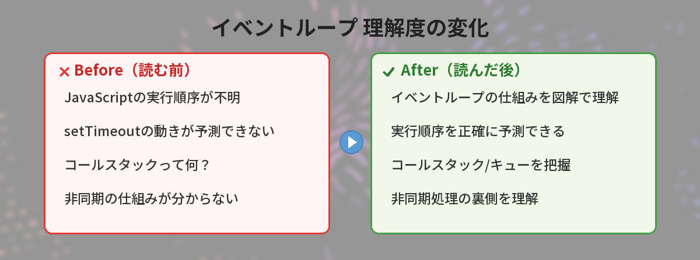
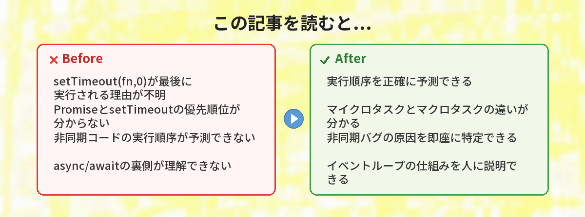
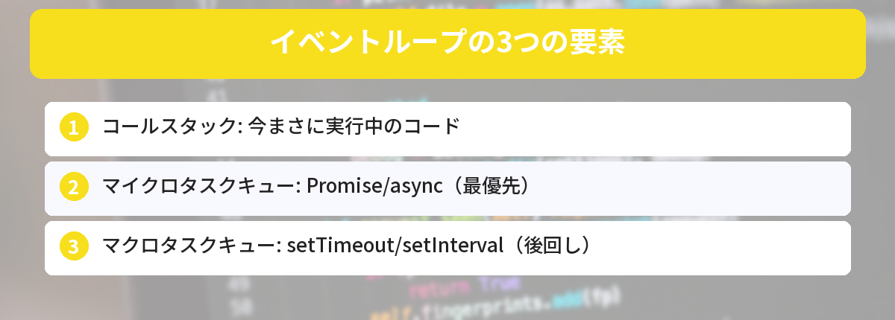
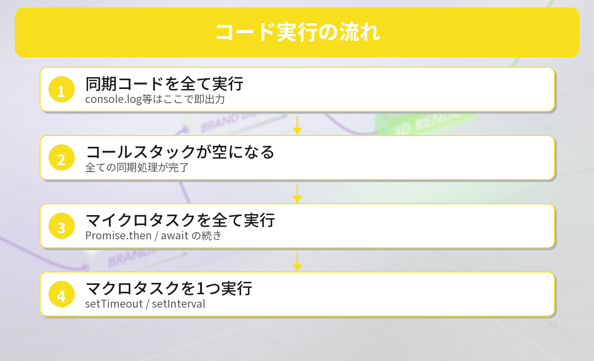

## この記事で分かること


setTimeoutを0秒にしたのに、console.logより後に実行されるの意味分からない…。JavaScriptって壊れてない？



壊れてないよ。「イベントループ」っていう仕組みが裏で動いてるんだ。これを理解すると、非同期処理の実行順序が全部説明できるようになるよ。







## こんな場面で困っていませんか？

以下のコードの実行結果、予想できますか？

```javascript
console.log("1");

setTimeout(() => {
  console.log("2");
}, 0);

Promise.resolve().then(() => {
  console.log("3");
});

console.log("4");
```

答えは `1 → 4 → 3 → 2` です。

「え、setTimeoutは0秒なのに最後？Promiseの方が先？」と思った方、この記事を読めばその理由が完全に理解できます。



## 一言で説明すると

イベントループは**「JavaScriptが1つずつ仕事を処理する仕組み」**です。

JavaScriptはシングルスレッド（1度に1つの処理しかできない）なので、「今やる仕事」「後でやる仕事」「もっと後でやる仕事」を整理して順番に処理する必要があります。その交通整理をしているのがイベントループです。

## なぜそうなるのか（仕組み）

イベントループを理解するには、3つの場所を覚えればOKです。



### 1. コールスタック（今やる仕事）

「今まさに実行中のコード」が積まれる場所です。上から順に実行されて、終わったら消えます。

```javascript
function hello() {
  console.log("hello");  // ← 今ここを実行中
}
hello();
```

### 2. マイクロタスクキュー（次にやる仕事）

Promiseの`.then()`や`async/await`の続きが入る場所です。コールスタックが空になったら**最優先**で実行されます。

### 3. マクロタスクキュー（その次にやる仕事）

`setTimeout`、`setInterval`、DOMイベントのコールバックが入る場所です。マイクロタスクが全部終わった後に実行されます。

### 実行の優先順位

```
コールスタック（同期コード）
  ↓ 空になったら
マイクロタスクキュー（Promise.then、async/await）
  ↓ 全部終わったら
マクロタスクキュー（setTimeout、setInterval）
```


つまり、Promiseの方がsetTimeoutより優先されるってこと？



その通り。マイクロタスク（Promise）は常にマクロタスク（setTimeout）より先に実行されるんだ。だから0秒のsetTimeoutでもPromiseの後になる。


## 冒頭のコードを図解で追いかける

もう一度、最初のコードを見てみましょう。

```javascript
console.log("1");          // 同期 → コールスタック
setTimeout(() => {
  console.log("2");        // マクロタスクキューへ
}, 0);
Promise.resolve().then(() => {
  console.log("3");        // マイクロタスクキューへ
});
console.log("4");          // 同期 → コールスタック
```

**実行の流れ:**

1. `console.log("1")` → コールスタックで即実行 → **出力: 1**
2. `setTimeout(callback, 0)` → callbackをマクロタスクキューに入れる（まだ実行しない）
3. `Promise.resolve().then(callback)` → callbackをマイクロタスクキューに入れる（まだ実行しない）
4. `console.log("4")` → コールスタックで即実行 → **出力: 4**
5. コールスタックが空になった → マイクロタスクキューを確認 → `console.log("3")` → **出力: 3**
6. マイクロタスクキューが空になった → マクロタスクキューを確認 → `console.log("2")` → **出力: 2**

結果: `1, 4, 3, 2`



## 身近な例えで理解する

イベントループを**「レストランのキッチン」**に例えます。

- **コールスタック** = シェフ（1人しかいない。1品ずつ作る）
- **マイクロタスクキュー** = VIP客の注文（最優先で処理）
- **マクロタスクキュー** = 一般客の注文（VIPが全員終わってから）

シェフは今作っている料理（同期コード）を仕上げたら、まずVIP客の注文（Promise）を全部処理して、その後に一般客の注文（setTimeout）に取りかかります。

だから`setTimeout(fn, 0)`は「0秒後に実行」ではなく、「一般客の列に並ぶ（VIPの後）」という意味なんです。

## async/awaitとイベントループ

[async/await](/posts/javascript-async-await/)を使ったコードも同じルールで動きます。

```javascript
async function example() {
  console.log("A");
  await Promise.resolve();
  console.log("B");  // ← awaitの後はマイクロタスクキューに入る
}

example();
console.log("C");
```

結果: `A, C, B`

`await`の後のコードは、Promiseの`.then()`と同じ扱い（マイクロタスクキュー）になります。だから同期コードの`console.log("C")`が先に実行されます。

## やってはいけないこと

### NG: setTimeoutで正確なタイミングを期待する

```javascript
// NG: 「100ms後に必ず実行される」と思い込む
setTimeout(() => {
  // 実際は100ms + マイクロタスクの処理時間 + 他のマクロタスクの処理時間
}, 100);
```

setTimeoutの時間は「最低でもこれだけ待つ」という意味であり、正確なタイミングは保証されません。

### NG: 無限ループでマイクロタスクを詰まらせる

```javascript
// NG: ブラウザがフリーズする
function loop() {
  Promise.resolve().then(loop);
}
loop();
```

マイクロタスクが永遠に終わらないと、マクロタスク（画面描画を含む）が実行されず、ブラウザがフリーズします。

## 筆者がイベントループで30分ハマった話

APIからデータを取得して画面に表示するコードを書いたとき、「データ取得→表示」の順番で書いたのに、表示が先に実行されて空のデータが表示される問題に遭遇しました。

```javascript
let data = null;

fetch("/api/users").then(res => res.json()).then(d => {
  data = d;
});

// ここでdataを使おうとしたが、まだnull
renderUsers(data);  // ← 空のデータで表示されてしまう
```

原因は、[fetch](/posts/javascript-fetch-api/)が非同期だから。`renderUsers(data)`は同期コードなので、fetchの結果が返ってくる前に実行されてしまう。

**解決策:** async/awaitで順番を保証する。

```javascript
async function loadUsers() {
  const res = await fetch("/api/users");
  const data = await res.json();
  renderUsers(data);  // ← データが確実に入ってから表示
}
loadUsers();
```

イベントループを理解していれば、「なぜ空のデータが表示されるのか」が即座に分かります。

## よくある質問（FAQ）

### Q: setTimeoutの0秒は「即座に実行」ではないのですか？
A: いいえ。`setTimeout(fn, 0)`は「マクロタスクキューに入れる」という意味です。コールスタックが空になり、マイクロタスクが全て処理された後に実行されます。最低でも4msの遅延が発生します（ブラウザの仕様）。

### Q: Promiseとasync/awaitの実行タイミングは同じですか？
A: はい、どちらもマイクロタスクキューに入ります。`await`の後のコードは、`.then()`のコールバックと同じタイミングで実行されます。

### Q: イベントループはNode.jsでも同じ仕組みですか？
A: 基本的な概念（コールスタック、マイクロタスク、マクロタスク）は同じです。ただしNode.jsには追加のフェーズ（I/Oコールバック、setImmediate等）があり、ブラウザより複雑です。

### Q: 画面の描画（レンダリング）はいつ行われますか？
A: マイクロタスクが全て処理された後、次のマクロタスクの前に行われます。つまり、マイクロタスクを大量に積むと画面が固まる原因になります。

### Q: requestAnimationFrameはどこに入りますか？
A: requestAnimationFrameは画面描画の直前に実行される特別なキューに入ります。マイクロタスクの後、マクロタスクの前、描画の直前です。アニメーションに使う場合はsetTimeoutよりrequestAnimationFrameが適切です。


レストランの例え分かりやすかった…！VIP客（Promise）が先で、一般客（setTimeout）が後なんだね。



そう。この優先順位さえ覚えておけば、非同期コードの実行順序で迷うことはなくなるよ。実際にコードを書いて試してみてね。


## まとめ

- イベントループは「JavaScriptが仕事を順番に処理する仕組み」
- 3つの場所: コールスタック → マイクロタスクキュー → マクロタスクキュー
- Promise/async/awaitはマイクロタスク（優先）
- setTimeout/setIntervalはマクロタスク（後回し）
- `setTimeout(fn, 0)`は「即座に実行」ではない

---
### あわせて読みたい
- [async/awaitが分からない人へ ― Promiseとの違いを図解で解説](/posts/javascript-async-await/)
- [JavaScript fetch APIの使い方 ― 外部データを取得する基本](/posts/javascript-fetch-api/)
