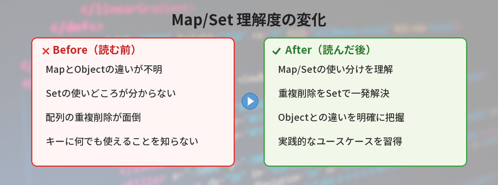

## この記事で分かること


JavaScriptのMapとSetって何？配列やオブジェクトと何が違うの…？



MapとSetは「特定の用途に特化したデータ構造」だよ。配列やオブジェクトでもできることが多いけど、MapやSetを使った方がコードがシンプルになったり、処理が速くなったりする場面があるんだ。





「配列の重複を削除したい」「キーに文字列以外を使いたい」「データの存在確認を高速にしたい」——こんな場面でMapとSetが活躍します。

この記事では、MapとSetの基本的な使い方、配列・オブジェクトとの違い、実践的な活用パターンを解説します。



## Setとは — 重複のないデータの集まり

Setは「重複する値を持たないコレクション」です。同じ値を追加しても、1つしか保持されません。

### 基本的な使い方

```javascript
// Setの作成
const fruits = new Set();

// 値を追加する
fruits.add('りんご');
fruits.add('バナナ');
fruits.add('みかん');
fruits.add('りんご'); // 重複は無視される

console.log(fruits.size); // 3（りんごは1つだけ）
console.log(fruits); // Set(3) { 'りんご', 'バナナ', 'みかん' }
```

### 配列からSetを作る

```javascript
// 重複のある配列
const numbers = [1, 2, 3, 2, 4, 3, 5];

// Setに変換すると重複が消える
const uniqueNumbers = new Set(numbers);
console.log(uniqueNumbers); // Set(5) { 1, 2, 3, 4, 5 }

// 配列に戻す
const result = [...uniqueNumbers];
console.log(result); // [1, 2, 3, 4, 5]
```

### Setの主要メソッド

```javascript
const tags = new Set(['JavaScript', 'Python', 'Go']);

// 値の追加
tags.add('Rust');

// 値の存在確認（高速）
console.log(tags.has('Python')); // true
console.log(tags.has('Java'));   // false

// 値の削除
tags.delete('Go');

// 全件削除
tags.clear();

// サイズの確認
console.log(tags.size); // 0
```


配列の`includes()`と`Set`の`has()`って何が違うの？



結果は同じだけど、速度が違うんだ。配列の`includes()`は先頭から順番に探すから、データが多いと遅くなる。Setの`has()`はハッシュテーブルを使うから、データ量に関係なく高速だよ。


## Mapとは — 何でもキーにできる辞書

Mapは「キーと値のペア」を管理するデータ構造です。オブジェクト（`{}`）と似ていますが、キーに文字列以外も使えるのが大きな違いです。

### 基本的な使い方

```javascript
// Mapの作成
const userScores = new Map();

// キーと値のペアを追加
userScores.set('田中', 85);
userScores.set('佐藤', 92);
userScores.set('鈴木', 78);

// 値の取得
console.log(userScores.get('佐藤')); // 92

// 存在確認
console.log(userScores.has('田中')); // true

// サイズ
console.log(userScores.size); // 3
```

### オブジェクトをキーにする

```javascript
// オブジェクトをキーにできる（通常のオブジェクトではできない）
const user1 = { id: 1, name: '田中' };
const user2 = { id: 2, name: '佐藤' };

const loginHistory = new Map();
loginHistory.set(user1, '2026-05-25 09:00');
loginHistory.set(user2, '2026-05-25 10:30');

console.log(loginHistory.get(user1)); // '2026-05-25 09:00'
```

### Mapの主要メソッド

```javascript
const config = new Map([
  ['theme', 'dark'],
  ['language', 'ja'],
  ['fontSize', 14]
]);

// 値の取得
console.log(config.get('theme')); // 'dark'

// 値の更新
config.set('theme', 'light');

// 削除
config.delete('fontSize');

// 全件ループ
config.forEach((value, key) => {
  console.log(`${key}: ${value}`);
});

// for...ofでもループ可能
for (const [key, value] of config) {
  console.log(`${key}: ${value}`);
}
```

## 配列・オブジェクトとの比較

### Setと配列の比較

| 特徴 | 配列（Array） | Set |
|------|--------------|-----|
| 重複 | 許可する | 許可しない |
| 順序 | インデックスでアクセス | 挿入順を保持（インデックスなし） |
| 存在確認 | `includes()` — O(n) | `has()` — O(1) |
| 用途 | 順序付きリスト | ユニークな値の管理 |

### Mapとオブジェクトの比較

| 特徴 | オブジェクト（{}） | Map |
|------|-------------------|-----|
| キーの型 | 文字列/Symbolのみ | 何でもOK |
| 順序 | 保証なし（実装依存） | 挿入順を保証 |
| サイズ取得 | `Object.keys(obj).length` | `map.size` |
| ループ | `Object.entries()` | `for...of`で直接 |
| パフォーマンス | 頻繁な追加/削除に弱い | 頻繁な追加/削除に強い |
| プロトタイプ汚染 | あり得る | なし |

[配列メソッドの基本](/posts/javascript-array-methods/)を理解していると、MapやSetとの使い分けがより明確になります。

## 実践的な活用パターン

### パターン1: 配列の重複削除

```javascript
// 最もシンプルな重複削除
function removeDuplicates(array) {
  return [...new Set(array)];
}

const emails = [
  'a@example.com',
  'b@example.com',
  'a@example.com',
  'c@example.com'
];

console.log(removeDuplicates(emails));
// ['a@example.com', 'b@example.com', 'c@example.com']
```

### パターン2: 出現回数のカウント

```javascript
// 文字列内の各文字の出現回数をカウント
function countChars(str) {
  const counts = new Map();
  for (const char of str) {
    counts.set(char, (counts.get(char) || 0) + 1);
  }
  return counts;
}

const result = countChars('hello world');
console.log(result.get('l')); // 3
console.log(result.get('o')); // 2
```

### パターン3: キャッシュの実装

```javascript
// 計算結果をキャッシュする
const cache = new Map();

function expensiveCalculation(input) {
  // キャッシュにあればそれを返す
  if (cache.has(input)) {
    console.log('キャッシュから取得');
    return cache.get(input);
  }

  // 重い計算（例）
  const result = input * input * Math.random();
  cache.set(input, result);
  console.log('計算して保存');
  return result;
}

expensiveCalculation(5); // '計算して保存'
expensiveCalculation(5); // 'キャッシュから取得'
```

### パターン4: タグ管理

```javascript
// 記事のタグ管理
const articleTags = new Set();

// タグを追加（重複は自動で無視される）
articleTags.add('JavaScript');
articleTags.add('初心者');
articleTags.add('JavaScript'); // 重複なので追加されない

// タグの一覧を配列として取得
const tagList = [...articleTags];
console.log(tagList); // ['JavaScript', '初心者']
```

### パターン5: 2つの配列の共通要素を見つける

```javascript
function intersection(arr1, arr2) {
  const set2 = new Set(arr2);
  return arr1.filter(item => set2.has(item));
}

const frontend = ['React', 'Vue', 'Angular', 'Svelte'];
const popular = ['React', 'Python', 'Go', 'Vue'];

console.log(intersection(frontend, popular));
// ['React', 'Vue']
```


重複削除がこんなに簡単にできるんだ…！配列で頑張ってfilterしてたのが馬鹿みたい。



`[...new Set(array)]` は覚えておくと便利だよ。1行で重複削除できるから、実務でもよく使うパターンなんだ。


### パターン6: イベントリスナーの管理

```javascript
// 同じリスナーの重複登録を防ぐ
const listeners = new Set();

function addEventListener(callback) {
  if (listeners.has(callback)) {
    console.log('既に登録済みです');
    return;
  }
  listeners.add(callback);
  console.log('リスナーを登録しました');
}

const handleClick = () => console.log('clicked');
addEventListener(handleClick); // 'リスナーを登録しました'
addEventListener(handleClick); // '既に登録済みです'
```

## WeakMapとWeakSet

MapとSetには「Weak」バージョンがあります。

### WeakMapの特徴

```javascript
// WeakMapはキーがガベージコレクションの対象になる
const metadata = new WeakMap();

let element = document.querySelector('#button');
metadata.set(element, { clicks: 0 });

// elementが削除されると、WeakMapのエントリも自動で消える
element = null; // ガベージコレクションの対象に
```

### いつ使うか

- **Map/Set** — データを明示的に管理したいとき（ほとんどの場合こちら）
- **WeakMap/WeakSet** — メモリリークを防ぎたいとき（DOM要素の付加情報管理など）

初心者のうちはMap/Setだけ覚えておけば十分です。

## よくあるエラーと注意点

### 注意1: Setのオブジェクト比較

```javascript
const set = new Set();

// オブジェクトは参照で比較される
set.add({ name: '田中' });
set.add({ name: '田中' }); // 別のオブジェクトなので追加される

console.log(set.size); // 2（同じ内容でも別オブジェクト）
```

オブジェクトの重複を防ぎたい場合は、IDなどのプリミティブ値をSetに入れるか、JSON文字列に変換して比較する工夫が必要です。

### 注意2: Mapのキー比較

```javascript
const map = new Map();

// NaN同士は等しいと判定される（===とは異なる）
map.set(NaN, 'not a number');
console.log(map.get(NaN)); // 'not a number'

// -0と+0は等しいと判定される
map.set(-0, 'minus zero');
console.log(map.get(0)); // 'minus zero'
```

### 注意3: JSONシリアライズ

```javascript
const map = new Map([['key', 'value']]);

// MapはそのままJSON.stringifyできない
console.log(JSON.stringify(map)); // '{}'（空になる）

// 変換が必要
const obj = Object.fromEntries(map);
console.log(JSON.stringify(obj)); // '{"key":"value"}'
```

[JSONの基本](/posts/json-what-is-it/)を理解していると、この変換の意味がより分かりやすくなります。

## 使い分けの判断フロー

迷ったときは以下のフローで判断してください。

1. **重複のない値の集合が欲しい** → Set
2. **キーと値のペアを管理したい** → 以下で判断
   - キーが文字列だけ＆JSONにしたい → オブジェクト
   - キーに文字列以外を使いたい → Map
   - 頻繁に追加/削除する → Map
   - サイズを頻繁に確認する → Map
3. **順序付きリストが欲しい** → 配列
4. **存在確認を高速にしたい** → Set

## よくある質問（FAQ）

### Q: MapとSetはIE11で使えますか？

A: IE11はサポート終了しているため、気にする必要はありません。全てのモダンブラウザ（Chrome、Firefox、Safari、Edge）とNode.jsで問題なく使えます。

### Q: 配列の方が慣れているので、Setを使う必要はありますか？

A: 小規模なデータなら配列でも問題ありません。ただし、重複チェックや存在確認を頻繁に行う場合、データ量が増えるとSetの方が圧倒的に速くなります。コードの意図も明確になります。

### Q: Mapのサイズ上限はありますか？

A: 仕様上の上限は2^24（約1,677万）エントリです。実用上はメモリが許す限り使えます。

### Q: ReactやVueでMapやSetは使えますか？

A: 使えますが、リアクティビティ（状態変更の検知）との相性に注意が必要です。Reactでは`useState`でMapやSetを使う場合、新しいインスタンスを作成して更新する必要があります。

### Q: TypeScriptでの型指定はどうしますか？

A: ジェネリクスで型を指定できます。

```typescript
const scores: Map<string, number> = new Map();
const tags: Set<string> = new Set();
```

[TypeScript入門](/posts/typescript-beginner/)で基本的な型指定を学べます。


MapとSet、思ったより使いどころが多いんだね。まずは重複削除から使ってみる！



`[...new Set(array)]` から始めるのがおすすめ。慣れてきたらMapも使ってみて。コードがスッキリするのを実感できるはずだよ。


## まとめ

- **Set** — 重複のない値の集合。重複削除や高速な存在確認に便利
- **Map** — キーと値のペア。キーに何でも使え、挿入順を保証
- 配列の重複削除は `[...new Set(array)]` が最もシンプル
- 存在確認は配列の`includes()`よりSetの`has()`が高速
- オブジェクトのキーは文字列のみだが、Mapは何でもキーにできる
- 迷ったら「重複不要→Set」「キーバリュー→Map」で判断

---
### あわせて読みたい
- [JavaScript配列メソッド完全ガイド](/posts/javascript-array-methods/)
- [async/awaitの使い方入門](/posts/javascript-async-await/)
