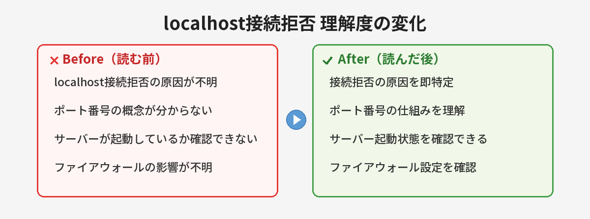
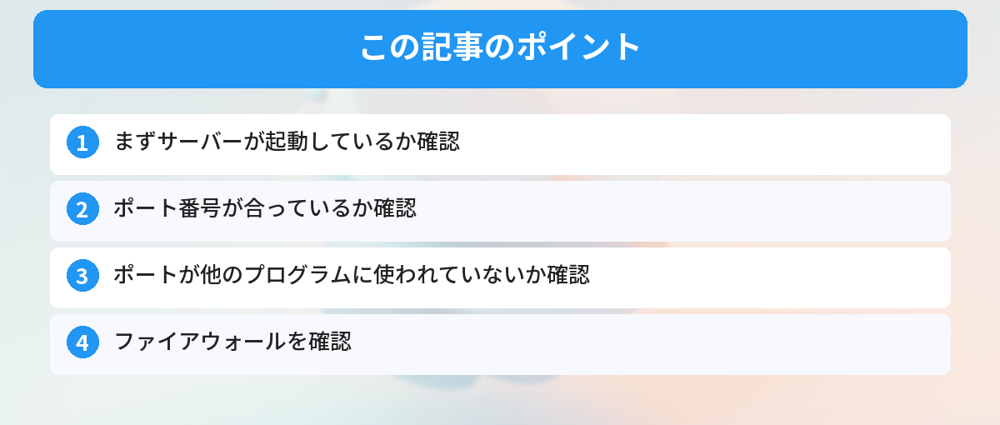

## この記事で分かること


localhost:3000にアクセスしたら「接続が拒否されました」って出る…。何が起きてるの？



サーバーが起動してないか、ポートが違うかのどっちかだよ。よくある原因と確認手順を教えるね。





ブラウザで `localhost:3000` や `localhost:8080` にアクセスしたら、こんなエラーが出た。

```
このサイトにアクセスできません
localhost で接続が拒否されました
ERR_CONNECTION_REFUSED
```

プログラミングの学習中によく出るエラーです。原因は単純なので、順番に確認すれば解決します。

このエラーは、ブラウザが「指定されたアドレスに接続しようとしたけど、相手が応答しなかった」という意味です。サーバー側の問題であり、ブラウザやPC自体の故障ではありません。

## 原因1：サーバーが起動していない（最も多い）

一番多い原因です。ブラウザでlocalhostにアクセスする前に、サーバーを起動する必要があります。

### 確認方法

ターミナルを見てください。サーバーが起動していれば、こんな表示があるはずです。

```
Server running on http://localhost:3000
```

この表示がなければ、サーバーが起動していません。

### 解決方法

使っているフレームワークに応じて、サーバーを起動してください。

```bash
# Node.js / Express
node app.js

# React
npm start

# Python / Flask
python app.py

# Python / Django
python manage.py runserver
```

Reactの場合は[npmの基本](/posts/npm-yarn-beginner/)を理解しておくと、`npm start` が何をしているのか分かりやすくなります。Pythonの場合は[仮想環境（venv）](/posts/python-venv-beginner/)を有効にし忘れていることもあるので、確認してみてください。

## 原因2：ポート番号が違う

サーバーは起動しているけど、ブラウザでアクセスしているポート番号が違う場合。

### 確認方法

ターミナルの表示を確認してください。

```
Server running on http://localhost:8000
```

この場合、`localhost:3000` ではなく `localhost:8000` にアクセスする必要があります。

## 原因3：ポートが他のプログラムに使われている

同じポート番号を別のプログラムが使っていると、サーバーが起動できません。

### 確認方法（Windows）

```bash
netstat -ano | findstr :3000
```

何か表示されたら、そのポートは使用中です。

### 解決方法

別のポート番号でサーバーを起動するか、使用中のプログラムを終了してください。

ポート番号の指定は[環境変数](/posts/env-variables-beginner/)で管理することもあります。`.env` ファイルに `PORT=3001` のように書いておけば、ポートの衝突を避けやすくなります。

## 原因4：ファイアウォールにブロックされている

会社のPCや、セキュリティソフトが入っているPCで起きることがあります。

### 解決方法

一時的にファイアウォールを無効にして試してみてください。それで接続できたら、ファイアウォールの設定でlocalhostへの接続を許可してください。

## 原因5：CORSエラーと混同している

ブラウザのコンソールに「Access-Control-Allow-Origin」のようなメッセージが出ている場合は、接続拒否ではなく[CORSエラー](/posts/cors-error-beginner/)の可能性があります。CORSエラーはサーバーには接続できているけれど、セキュリティ上の制限でデータが受け取れない状態です。エラーメッセージをよく確認してみてください。

## それでも解決しない場合のチェックリスト

上記の原因をすべて確認しても解決しない場合は、以下も試してみてください。

- ターミナルにエラーメッセージが出ていないか確認する
- `localhost` の代わりに `127.0.0.1` でアクセスしてみる
- ブラウザのキャッシュをクリアしてからアクセスし直す
- PCを再起動してからサーバーを起動し直す
- 使っているフレームワークのバージョンが古くないか確認する

ターミナルの操作に不安がある方は、[コマンドラインの基本操作](/posts/command-line-scary/)を先に確認しておくと安心です。

---

## 実際にlocalhostエラーで30分ハマってみた（筆者の失敗談）

筆者が実際にlocalhostエラーで30分以上悩んだ実例を紹介します。同じミスをしないための参考にしてください。

### 実例1：ターミナルのタブ違い

**状況**: `npm start` でサーバーを起動したはずなのに、`localhost:3000`に接続できない。

**原因**: VS Codeのターミナルでタブが複数開いていて、サーバーを起動したタブとは別のタブを見ていた。サーバーを起動したタブにはエラーが出ていたのに気づかなかった。

**教訓**: サーバーを起動したターミナルのタブを確認する癖をつける。「Server running on...」のメッセージが出ているかチェック。

### 実例2：.envの読み込み失敗

**状況**: Expressで`process.env.PORT`を使ってポートを設定していたが、`.env`ファイルの読み込みに失敗して`undefined`になり、サーバーがundefinedなポートで起動していた。

**原因**: `dotenv`パッケージの`require('dotenv').config()`を書き忘れていた。

**教訓**: 環境変数を使う場合は、コンソールに`PORT: ${process.env.PORT}`をログ出力して確認する。

### 実例3：前回のプロセスが残っている

**状況**: `Ctrl+C`でサーバーを止めたつもりが、プロセスが裏で生き残っていてポートが解放されなかった。

**原因**: ターミナルを閉じてもNode.jsプロセスが残る場合がある。

**教訓**: `netstat -ano | findstr :3000`（Windows）で確認して、残っているプロセスを`taskkill`で終了する。

---

## 対処法まとめ：フローチャート

迷ったらこの順番で確認してください。

1. **ターミナルにエラーが出ていないか？** → 出ていたらエラーメッセージをコピーして検索
2. **「Server running on...」の表示はあるか？** → ない場合はサーバーが起動に失敗している
3. **ポート番号はブラウザのURLと一致しているか？** → 一致していなければURLを修正
4. **同じポートを他のプロセスが使っていないか？** → `netstat`で確認
5. **ファイアウォールにブロックされていないか？** → 一時的に無効にして確認
6. **上記すべてOKなのに接続できない** → PC再起動 → もう一度サーバー起動

## よくある質問（FAQ）



### Q: localhostとは何ですか？
A: localhostは「自分自身のPC」を指すアドレスです。IPアドレスでは `127.0.0.1` に相当します。開発中のWebアプリをブラウザで確認するときに使います。インターネット上のサーバーではなく、自分のPC上で動いているサーバーにアクセスするためのアドレスです。

### Q: ポート番号の「3000」や「8080」は何ですか？
A: ポート番号は、PC上で動いている複数のサービスを区別するための番号です。たとえばReactは3000番、Djangoは8000番をデフォルトで使います。同じPC上で複数のサーバーを同時に動かすときは、それぞれ異なるポート番号を使います。

### Q: サーバーを起動したのに接続できません。なぜですか？
A: サーバーの起動に時間がかかっている可能性があります。ターミナルに「Server running on...」のようなメッセージが表示されるまで待ってからアクセスしてみてください。また、起動中にエラーが出ていないかもターミナルの出力を確認してください。

### Q: 「localhost」と「0.0.0.0」の違いは何ですか？
A: `localhost`（127.0.0.1）は自分のPCからのみアクセスできます。`0.0.0.0` はすべてのネットワークインターフェースでリッスンするため、同じネットワーク内の他のデバイスからもアクセスできます。開発中は通常 `localhost` で十分です。

### Q: Macでポートを使っているプロセスを確認するには？
A: ターミナルで `lsof -i :3000` を実行すると、ポート3000を使用しているプロセスが表示されます。強制終了するには `kill -9 <PID>` を実行してください。

### Q: Windowsでポートを占有しているプロセスを終了するには？
A: `netstat -ano | findstr :3000` でPIDを特定し、`taskkill /PID <PID> /F` で強制終了できます。管理者権限のコマンドプロンプトで実行してください。

### Q: Dockerを使っている場合のlocalhost接続は？
A: Dockerコンテナ内のサーバーにホストからアクセスする場合、ポートマッピング（`-p 3000:3000`）が正しく設定されているか確認してください。コンテナ内で`0.0.0.0`にバインドする必要がある場合もあります。

### Q: WSL2（Windows Subsystem for Linux）でlocalhostが繋がらない場合は？
A: WSL2ではネットワーク構成がWindows本体と異なる場合があります。`localhost`で繋がらない場合は、WSL内で`ip addr`コマンドを実行してIPアドレスを確認し、そのアドレスでアクセスしてみてください。また、Windowsのファイアウォール設定も確認が必要です。


サーバー起動し忘れてただけだった…。恥ずかしい。



あるあるだよ。ターミナルでサーバーが動いてるか確認する癖をつけておくと、このエラーで悩む時間がゼロになるよ。


## まとめ

- まずサーバーが起動しているか確認（最も多い原因）
- ポート番号が合っているか確認
- ポートが他のプログラムに使われていないか確認
- ファイアウォールを確認
- CORSエラーと混同していないか確認
- 上記すべて試してダメならPC再起動

このエラーは原因がシンプルなので、フローチャートの順番で確認すればほぼ確実に解決します。慌てずに一つずつチェックしてみてください。

---
### あわせて読みたい
- [コマンドラインが怖い人へ ― 覚えるコマンド5つだけ](/posts/command-line-scary/)
- [VS Code最初に覚えるべき設定とショートカット10選](/posts/vscode-shortcuts-beginner/)
- [CORSエラーが出たときの対処法 ― 初心者向け解説](/posts/cors-error-beginner/)



