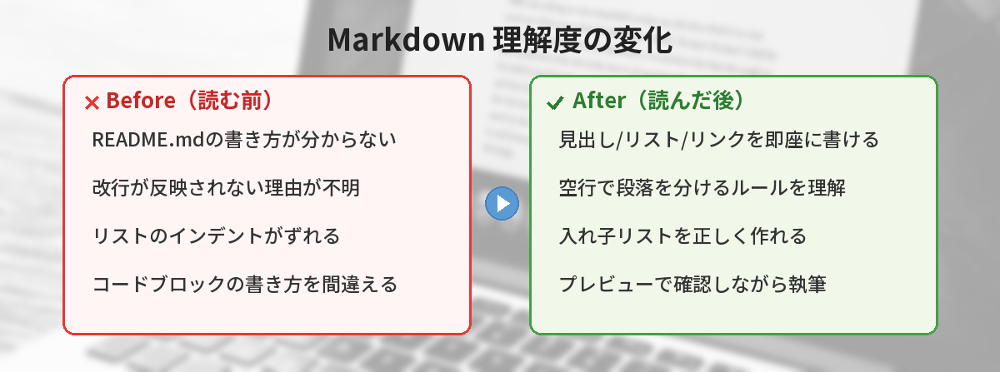
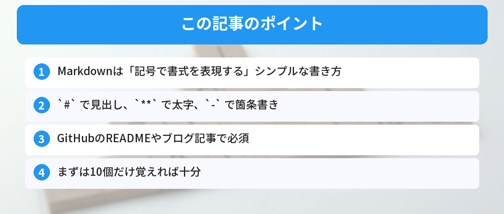

## この記事で分かること


Markdownって何？READMEを書けって言われたけど、書き方が分からない…



テキストに簡単な記号をつけるだけで、見出しやリストが作れる書き方だよ。5分で基本は覚えられるから一緒にやってみよう。




「README.mdって何？」「Markdownってどう書くの？」

GitHubやブログでよく使われるMarkdownの書き方を、よく使うものだけ10個に絞って解説します。

## Markdownとは

Markdownは、テキストに簡単な記号をつけるだけで、見出しや箇条書きなどの書式を表現できる書き方のルールです。

HTMLを書くより圧倒的に簡単で、GitHubのREADME、ブログ記事、ドキュメントなど、あらゆる場所で使われています。[HTMLの基本構造](/posts/html-basic-structure/)を知っていると、Markdownがどれだけ手軽かが実感できます。

## よく使う書き方10選

### 1. 見出し

```markdown
# 大見出し（h1）
## 中見出し（h2）
### 小見出し（h3）
```

`#` の数で見出しのレベルが変わります。

### 2. 太字・斜体

```markdown
**太字**
*斜体*
***太字＋斜体***
```

### 3. 箇条書き

```markdown
- 項目1
- 項目2
- 項目3
```

`-` の代わりに `*` でもOKです。

### 4. 番号付きリスト

```markdown
1. 最初にやること
2. 次にやること
3. 最後にやること
```



### 5. リンク

```markdown
[表示テキスト](https://example.com)
```

例：`[Google](https://google.com)` → [Google](https://google.com)

### 6. 画像

```markdown

```

### 7. コードブロック

````markdown
```python
print("Hello, World!")
```
````

言語名を指定すると、シンタックスハイライト（色分け）がつきます。

GitHubのREADMEでは、コードブロックを使ってインストール手順やコマンドを見やすく表示するのが一般的です。

### 8. インラインコード

```markdown
`変数名` や `関数名` をこのように囲みます。
```

文中でコードを表示するときに使います。

### 9. 引用

```markdown
> これは引用文です。
> 他の人の言葉を引用するときに使います。
```

### 10. 水平線

```markdown
---
```

セクションの区切りに使います。

## どこで練習できる？

- [GitHubでリポジトリを作って](/posts/github-what-is-it/) `README.md` を編集する
- VS Codeでプレビュー付きで書く（`Ctrl + Shift + V`）。[VS Codeのショートカット](/posts/vscode-shortcuts-beginner/)を覚えると効率が上がります
- https://dillinger.io/ でブラウザ上で試す

## Markdownの活用シーン

Markdownは開発のさまざまな場面で使われています。

### GitHubのREADME

リポジトリのトップに表示される `README.md` は、プロジェクトの説明書です。[GitHubの使い方](/posts/github-what-is-it/)を学ぶと、READMEの書き方がより実践的に理解できます。

### プルリクエストやIssue

GitHubの[プルリクエストやIssue](/posts/git-branch-beginner/)でもMarkdownが使えます。コードブロックやチェックリストを使って、分かりやすいレビューコメントが書けます。

### 技術ブログ

多くのブログプラットフォーム（Zenn、Qiita、Hugo、Gatsbyなど）がMarkdownに対応しています。一度書き方を覚えれば、どのプラットフォームでも使えるのが強みです。

### ドキュメント・メモ

Notion、Obsidian、HackMDなどのツールでもMarkdownが使えます。日常的なメモや議事録にも活用できます。

## 筆者がハマったポイント

Markdownはシンプルですが、最初は細かいルールで引っかかります。

### ハマり1: 改行が反映されなくて焦った

Markdownで文章を書いて改行したのに、プレビューでは1行に繋がって表示される。Markdownでは「1回のEnter」は改行にならず、「2回のEnter（空行）」で段落が分かれるルールを知りませんでした。行末にスペース2つで改行する方法もありますが、見えないので分かりにくい。

**気づき:** 段落を分けたいときは空行を入れる。同じ段落内で改行したいときは行末にスペース2つ、または `<br>` を使う。

### ハマり2: リストのインデントがずれて入れ子にならない

箇条書きの中に入れ子のリストを作りたいのに、インデントが足りなくてフラットなリストになってしまう。Markdownのリストは「スペース2つ」または「スペース4つ」でインデントする必要があり、タブ文字だとツールによって挙動が変わります。

**改善:** リストのインデントはスペース2つで統一。VS Codeの設定で「Tab Size: 2」にしておくと楽。

### ハマり3: コードブロックの中でMarkdownが解釈されてしまった

バッククォート3つ（```）でコードブロックを作ったつもりが、閉じのバッククォートを忘れて、以降の文章が全部コードとして表示されてしまいました。プレビューを見ずに書き続けていたので、気づいたときには記事の半分がコードブロックの中に。

**改善:** Markdownを書くときはリアルタイムプレビューを常に表示する。VS Codeなら `Ctrl+Shift+V` でプレビューが開ける。


改行が反映されないの、最初に絶対ハマるやつだ…。空行が必要なんだね。



プレビューを見ながら書く癖をつければ、すぐ気づけるようになるよ。


## よくある質問（FAQ）



### Q: MarkdownとHTMLはどちらを覚えるべきですか？
A: 用途が違うので、両方知っておくと便利です。Markdownはドキュメントやブログ記事を手軽に書くためのもの、[HTMLはWebページの構造を作る](/posts/html-basic-structure/)ためのものです。Markdownの方が覚えることが少ないので、先にMarkdownから始めるのがおすすめです。

### Q: Markdownで表（テーブル）は作れますか？
A: はい、作れます。`|` と `-` を使って表を作ります。たとえば `| 項目 | 値 |` のように書きます。ただし、複雑な表はHTMLで書いた方が見やすい場合もあります。

### Q: Markdownのプレビューがうまく表示されません。なぜですか？
A: 記号の前後にスペースが必要な場合があります。たとえば `#見出し` ではなく `# 見出し` のように、`#` の後にスペースを入れてください。また、箇条書きの `-` の後にもスペースが必要です。

### Q: Markdownファイルの拡張子は `.md` と `.markdown` のどちらですか？
A: どちらでも認識されますが、`.md` が一般的です。GitHubでも `.md` が標準的に使われています。

### Q: Markdownで画像のサイズを指定できますか？
A: 標準のMarkdownでは画像サイズの指定はできません。サイズを変えたい場合は、HTMLの `` タグを直接書くか、使っているプラットフォーム独自の拡張記法を使います。

### Q: Markdownでチェックリスト（TODO）は作れますか？
A: はい、GitHubのMarkdown拡張（GFM）では `- [ ] 未完了` `- [x] 完了` のようにチェックリストが作れます。GitHub IssuesやPull Requestでタスク管理するときに便利です。

### Q: MarkdownをPDFに変換する方法はありますか？
A: VS Codeの拡張機能「Markdown PDF」を使えばワンクリックでPDFに変換できます。また、Pandocというツールを使えばコマンドラインからPDF、Word、HTMLなど様々な形式に変換可能です。レポートや提案書をMarkdownで書いてPDF出力するワークフローは実務でも使われています。

### Q: GitHub上でMarkdownのプレビューが思った通りに表示されません
A: GitHub独自の拡張（GitHub Flavored Markdown = GFM）と、標準Markdownは一部構文が異なります。特にテーブル、タスクリスト、取り消し線（`~~テキスト~~`）はGFM拡張です。ローカルのVS Codeプレビューとは見え方が微妙に違うこともあるので、最終確認はGitHubのプレビュー機能で行いましょう。


#で見出し、-でリスト、**で太字…。これだけでREADME書けそう！



その3つだけで8割カバーできるよ。GitHubのREADMEもQiitaの記事も全部Markdownだから、覚えて損はないね。


## まとめ

- Markdownは「記号で書式を表現する」シンプルな書き方
- `#` で見出し、`**` で太字、`-` で箇条書き
- GitHubのREADME、ブログ記事、Notion、議事録など用途は幅広い
- 改行ルール（空行で段落分け）に最初つまずきやすい
- VS Codeのリアルタイムプレビュー（Ctrl+Shift+V）を使えばミスに気づきやすい
- まずは10個だけ覚えれば十分。慣れたらテーブルや折りたたみを追加

---

## 実際にMarkdownでREADMEを書いてみた！（筆者の体験）

筆者が初めてGitHubにリポジトリを公開したとき、README.mdに何を書けばいいか全く分かりませんでした。

最終的に「これだけ書けばOK」とたどり着いたテンプレートを紹介します。

```markdown
# プロジェクト名

このプロジェクトは○○するためのツールです。

## インストール

（ここにインストールコマンド）

## 使い方

（ここに基本的な使い方）

## ライセンス

MIT
```

これだけで「何のプロジェクトか」「どう使うか」が伝わります。最初から完璧なREADMEを書く必要はなく、この3セクション（概要・インストール・使い方）があればまず合格点です。

---

### あわせて読みたい
- [GitHubのアカウントを作ったけど何すればいい？](/posts/github-what-is-it/)
- [JSONとは？5分で分かるデータ形式の基本](/posts/json-what-is-it/)

