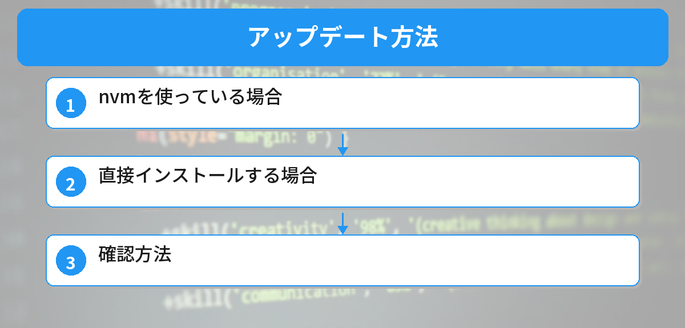
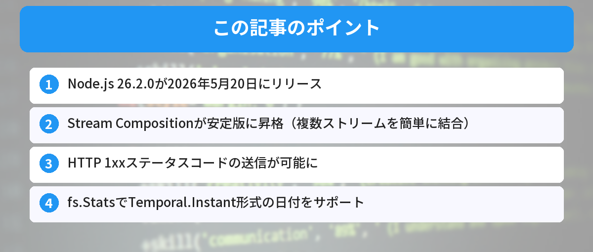

## この記事で分かること


Node.js 26.2.0が出たって聞いたけど、何が変わったの？アップデートした方がいい？



Stream Compositionが安定版になったのが一番大きいよ。あとHTTPの1xxステータスコードやTemporal日付のサポートも追加された。実務で使える変更が多いから解説するね。


「Node.js 26.2.0で何が変わったの？」「アップデートしても大丈夫？」という方へ。

この記事では、2026年5月20日にリリースされたNode.js 26.2.0の主要な変更点を、初心者にも分かりやすく解説します。



## Node.js 26.2.0の概要

| 項目 | 内容 |
|------|------|
| バージョン | 26.2.0 (Current) |
| リリース日 | 2026年5月20日 |
| ステータス | Current（安定版ではなく最新版） |
| 前バージョン | 26.1.0（5月7日リリース） |

Node.js 26系は2026年5月5日にメジャーリリースされた最新のCurrentリリースです。LTS（長期サポート版）になるのは2026年10月以降の予定です。

## 主要な変更点

### 1. Stream Compositionが安定版に


Stream Compositionって何…？ストリームは聞いたことあるけど。



複数のストリームを簡単につなげる仕組みだよ。今まではpipe()で手動でつないでたけど、compositionを使えばもっとシンプルに書けるんだ。


Stream Compositionは、複数のストリーム（読み取り・変換・書き込み）を1つのパイプラインとして組み合わせるAPIです。

これまで実験的（experimental）だった機能が、26.2.0で安定版（stable）に昇格しました。

```javascript
// Stream Compositionの例
import { compose } from 'node:stream';

const transformPipeline = compose(
  decompressStream,
  parseJsonStream,
  filterStream
);

// 1つのストリームとして扱える
sourceStream.pipe(transformPipeline).pipe(destinationStream);
```

**何が嬉しいのか：**
- 複数の変換処理を1つにまとめられる
- エラーハンドリングが簡潔になる
- テストしやすくなる（パイプライン単位でテスト可能）

### 2. HTTP情報ステータスコード（1xx）のサポート

`http` モジュールに `writeInformation()` メソッドが追加されました。これにより、任意の1xxステータスコードをレスポンスとして送信できます。

```javascript
import http from 'node:http';

const server = http.createServer((req, res) => {
  // 処理中であることをクライアントに通知
  res.writeInformation(102, { 'X-Progress': 'processing' });
  
  // 実際の処理...
  
  res.writeHead(200);
  res.end('完了');
});
```

**1xxステータスコードとは：**
- `100 Continue` — リクエストの続行を許可
- `102 Processing` — 処理中であることを通知
- `103 Early Hints` — 事前にリソースのヒントを送信

大きなファイルのアップロードや、時間のかかる処理で「まだ処理中だよ」とクライアントに伝えたい場面で使えます。

### 3. fs.StatsでTemporal日付をサポート


Temporalって前のバージョンで入ったやつだよね？ファイルの日付にも使えるようになったの？



そう！Node.js 26.0.0でTemporal APIがデフォルト有効になったけど、26.2.0ではファイルシステムのStats（ファイル情報）でもTemporal.Instantが使えるようになったんだ。


`fs.stat()` や `fs.lstat()` で取得できるファイル情報（Stats）に、Temporal.Instant形式の日付が追加されました。

```javascript
import fs from 'node:fs';

const stats = fs.statSync('package.json');

// 従来のDate形式（引き続き使える）
console.log(stats.mtime); // Date オブジェクト

// 新しいTemporal.Instant形式
console.log(stats.mtimeNs); // Temporal.Instant（ナノ秒精度）
```

**メリット：**
- ナノ秒精度でファイルの更新日時を取得できる
- タイムゾーンの扱いが明確になる
- 従来の `Date` オブジェクトの問題（ミリ秒精度、タイムゾーン曖昧）を解消

Node.js 26.0.0で追加されたTemporal APIについては[Node.js 26 Temporal API入門](/posts/nodejs26-temporal-api/)で詳しく解説しています。

### 4. セキュリティ強化（crypto モジュール）

暗号化関連のモジュールにもいくつかの改善が入っています。

- ML-DSA / ML-KEM（ポスト量子暗号）のBoringSSL対応
- ChaCha20-Poly1305のWeb Cryptography対応
- CryptoKeyの内部スロットの堅牢化
- 不正なraw keyインポートの拒否

これらは直接コードを書き換える必要はありませんが、セキュリティが自動的に強化されます。

## アップデート方法



### nvmを使っている場合

```bash
nvm install 26.2.0
nvm use 26.2.0
```

### 直接インストールする場合

[Node.js公式サイト](https://nodejs.org/)からダウンロードしてインストールします。

### 確認方法

```bash
node --version
# v26.2.0 と表示されればOK
```

## アップデートすべきか？

| 状況 | 推奨 |
|------|------|
| 個人開発・学習用 | ✅ アップデート推奨 |
| 新規プロジェクト | ✅ 26.2.0で始めてOK |
| 本番環境（既存） | ⚠️ LTS（24系）を使い続ける方が安全 |
| CI/CD環境 | ⚠️ テストが通ることを確認してから |

Node.js 26系はまだ「Current」ステータスです。本番環境では引き続きLTS版（24系）を使うのが安全です。

## Node.js 26系のこれまでの流れ

| バージョン | リリース日 | 主な変更 |
|-----------|-----------|---------|
| 26.0.0 | 5月5日 | Temporal API有効化、V8 14.6、Undici 8.0 |
| 26.1.0 | 5月7日 | 実験的 node:ffi モジュール追加 |
| **26.2.0** | **5月20日** | **Stream Composition安定化、HTTP 1xx、Temporal fs対応** |

## よくある質問（FAQ）



### Q: Node.js 26.2.0は安定版ですか？

A: 「Current」リリースです。最新機能が使えますが、LTS（長期サポート）ではありません。本番環境にはLTS版（24系）を推奨します。

### Q: 既存のプロジェクトが動かなくなることはありますか？

A: 26.0.0で削除されたレガシーAPIを使っていなければ、基本的に互換性があります。念のためテストを実行してから移行してください。

### Q: Stream Compositionは今すぐ使えますか？

A: はい。26.2.0以降であれば安定版として使えます。`node:stream` からインポートできます。

### Q: Temporal APIって必須ですか？

A: 必須ではありません。従来の `Date` オブジェクトも引き続き使えます。新しいプロジェクトではTemporalを使うのがおすすめですが、既存コードを書き換える必要はありません。


本番環境はまだLTSのままでいいんだね。個人開発では試してみよう！



そうだね。Stream Compositionは便利だから、個人プロジェクトで試してみるといいよ。LTSに入るのは10月以降だから、それまでに慣れておこう。


## まとめ

- Node.js 26.2.0が2026年5月20日にリリース
- Stream Compositionが安定版に昇格（複数ストリームを簡単に結合）
- HTTP 1xxステータスコードの送信が可能に
- fs.StatsでTemporal.Instant形式の日付をサポート
- セキュリティ関連の強化（ポスト量子暗号対応など）
- 本番環境はLTS（24系）を継続推奨、個人開発なら26.2.0を試してOK

---
### あわせて読みたい
- [Node.js 26 Temporal API入門](/posts/nodejs26-temporal-api/)
- [Node.js 20 EOL対応ガイド](/posts/nodejs20-end-of-life/)
