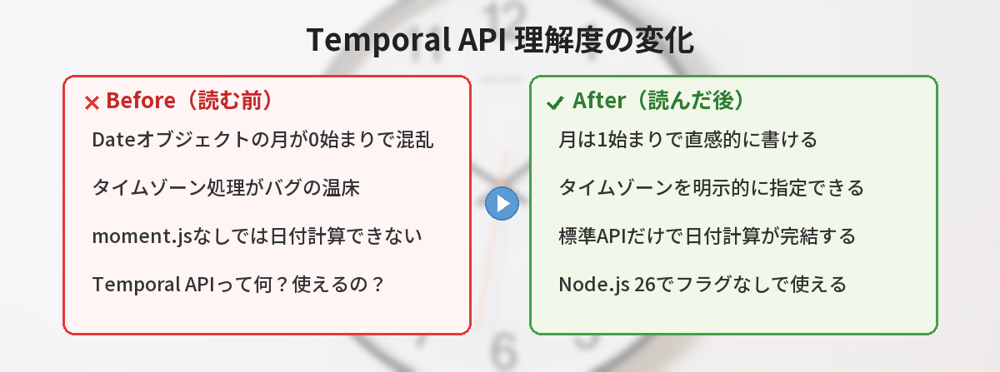
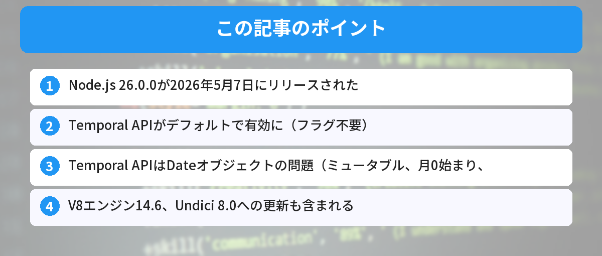

## この記事で分かること


Node.js 26でTemporal APIが使えるようになったって本当？Dateオブジェクトとはおさらば？



まだ実験的機能だけど使えるようになったよ。Dateの「タイムゾーン地獄」から解放される日が近いんだ。




「Temporal APIって何？Dateオブジェクトと何が違うの？」

2026年5月7日、Node.js 26.0.0がリリースされました。最大の目玉はTemporal APIがデフォルトで有効になったことです。この記事では、Temporal APIの基本と従来のDateオブジェクトとの違いを解説していきます。



## Node.js 26の主な変更点

Node.js 26.0.0は2026年5月7日にリリースされたメジャーバージョンです。Current版としてリリースされ、今後LTS（長期サポート版）への昇格が予定されています。

### アップデートの概要

主な変更点をまとめます。

| 項目 | 内容 |
|---|---|
| Temporal API | デフォルトで有効（フラグ不要） |
| V8エンジン | 14.6に更新 |
| Undici | 8.0に更新 |
| レガシーコード | 大幅に削除（破壊的変更あり） |

Node.js 20からの移行を検討している方は[Node.js 20のサポート終了と移行手順](/posts/nodejs20-end-of-life/)もあわせて確認してください。

### V8エンジン14.6の恩恵

V8エンジンが14.6に更新されたことで、JavaScriptの実行パフォーマンスが向上しています。Temporal APIのネイティブサポートもこのV8更新によるものです。

## Temporal APIとは

Temporal APIは、JavaScriptの新しい日付・時刻APIです。ES2026仕様に正式採用されました（2026年3月にStage 4到達）。従来のDateオブジェクトが抱えていた問題を根本から解決するために設計されています。

### Dateオブジェクトの問題点

従来のDateオブジェクトには、初心者がつまずきやすい問題がいくつもあります。

```javascript
// Dateオブジェクトの問題点

// 問題1: 月が0始まり（1月が0、12月が11）
const date = new Date(2026, 0, 1); // これは1月1日
console.log(date.getMonth()); // 0 ← 直感的でない

// 問題2: ミュータブル（元のオブジェクトが変わってしまう）
const original = new Date(2026, 4, 7);
const copy = original;
copy.setDate(10);
console.log(original.getDate()); // 10 ← originalも変わってしまう！

// 問題3: タイムゾーンの扱いが曖昧
const now = new Date();
// ローカルタイムゾーンに依存し、明示的な指定が難しい
```

これらの問題は、バグの原因になりやすいものでした。

### Temporal APIの特徴

Temporal APIは以下の3つの特徴で、Dateの問題を解決します。

- **イミュータブル**（不変）: 一度作った値は変更されない。新しい値を返す
- **明示的なタイムゾーン**: タイムゾーンを必ず指定する設計
- **直感的なAPI**: 月は1始まり、メソッド名が分かりやすい

## Temporal APIの基本的な使い方

Node.js 26では、フラグなしでTemporal APIを使えます。以前のバージョンでは `--experimental-temporal` フラグが必要でしたが、もう不要です。

### 今日の日付を取得する

```javascript
// 今日の日付を取得（ローカルタイムゾーン）
const today = Temporal.Now.plainDateISO();
console.log(today.toString()); // "2026-05-08"

// 年・月・日を個別に取得
console.log(today.year);  // 2026
console.log(today.month); // 5 ← 直感的！（Dateだと4になる）
console.log(today.day);   // 8
```

Dateオブジェクトと違い、月が1始まりです。5月なら `5` が返ります。

### 特定の日付を作成する

```javascript
// 文字列から日付を作成
const releaseDate = Temporal.PlainDate.from("2026-05-07");
console.log(releaseDate.toString()); // "2026-05-07"

// オブジェクトから日付を作成
const newYear = Temporal.PlainDate.from({
  year: 2027,
  month: 1,
  day: 1
});
console.log(newYear.toString()); // "2027-01-01"

// イミュータブルなので、元の値は変わらない
const nextDay = releaseDate.add({ days: 1 });
console.log(releaseDate.toString()); // "2026-05-07" ← 変わらない
console.log(nextDay.toString());     // "2026-05-08"
```

### 日付の差分（Duration）を計算する

```javascript
// 2つの日付の差分を計算
const start = Temporal.PlainDate.from("2026-01-01");
const end = Temporal.PlainDate.from("2026-05-07");

const duration = start.until(end);
console.log(duration.toString()); // "P126D"（126日間）
console.log(duration.days);       // 126

// 月単位で差分を取得
const durationInMonths = start.until(end, { largestUnit: "month" });
console.log(durationInMonths.months); // 4
console.log(durationInMonths.days);   // 6
// → 4ヶ月と6日

// 日付に期間を加算
const deadline = Temporal.PlainDate.from("2026-05-08");
const extended = deadline.add({ weeks: 2, days: 3 });
console.log(extended.toString()); // "2026-05-25"
```

非同期処理と組み合わせてAPIからデータを取得する場面も多いでしょう。[JavaScriptのasync/awaitの解説記事](/posts/javascript-async-await/)も参考になります。

### タイムゾーンを扱う

```javascript
// タイムゾーン付きの日時を作成
const tokyoNow = Temporal.Now.zonedDateTimeISO("Asia/Tokyo");
console.log(tokyoNow.toString());
// "2026-05-08T15:30:00+09:00[Asia/Tokyo]"

// ニューヨーク時間に変換
const nyTime = tokyoNow.withTimeZone("America/New_York");
console.log(nyTime.toString());
// "2026-05-08T02:30:00-04:00[America/New_York]"

// タイムゾーンの差を明示的に確認できる
console.log(tokyoNow.hoursInDay); // 24（通常の日）
```

タイムゾーンが明示的に指定されるため、「ローカル時間なのかUTCなのか分からない」という問題が起きません。

## 実践例：Temporal APIの活用シーン

### 1. イベントのカウントダウン

```javascript
// イベントまでの残り日数を計算
const today = Temporal.Now.plainDateISO();
const event = Temporal.PlainDate.from("2026-12-25");

const remaining = today.until(event);
console.log(`クリスマスまであと${remaining.days}日`);
```

### 2. 営業日の計算

```javascript
// 5営業日後を計算する関数
function addBusinessDays(startDate, days) {
  let current = startDate;
  let added = 0;

  while (added < days) {
    current = current.add({ days: 1 });
    // 土日を除外（6=土曜、7=日曜）
    if (current.dayOfWeek <= 5) {
      added++;
    }
  }
  return current;
}

const today = Temporal.PlainDate.from("2026-05-08");
const deliveryDate = addBusinessDays(today, 5);
console.log(deliveryDate.toString()); // "2026-05-15"（土日を除いた5日後）
```

### 3. 複数タイムゾーンの会議時間表示

```javascript
// 会議時間を複数タイムゾーンで表示
const meetingTime = Temporal.ZonedDateTime.from({
  year: 2026,
  month: 5,
  day: 10,
  hour: 10,
  minute: 0,
  timeZone: "America/New_York"
});

const zones = ["Asia/Tokyo", "Europe/London", "America/Los_Angeles"];

zones.forEach(zone => {
  const local = meetingTime.withTimeZone(zone);
  console.log(`${zone}: ${local.hour}:${String(local.minute).padStart(2, "0")}`);
});
// Asia/Tokyo: 23:00
// Europe/London: 15:00
// America/Los_Angeles: 7:00
```

環境変数でタイムゾーンを管理する場合は[環境変数の基本と設定方法](/posts/env-variables-beginner/)を参考にしてください。

## 注意点・破壊的変更

Node.js 26にはいくつかの破壊的変更があります。アップデート前に確認しておきましょう。

### レガシーコードパスの削除

Node.js 26では、非推奨だったレガシーコードパスが大幅に削除されています。古いAPIを使っているプロジェクトでは、エラーが発生する可能性があります。

```javascript
// 削除された古いAPIの例（Node.js 26では動かない）
// util.pump() → stream.pipeline() を使う
// sys モジュール → util モジュールを使う
```

### Undici 8.0の影響

HTTP クライアントライブラリのUndiciが8.0にメジャーアップデートされました。`fetch()` の内部実装に影響するため、一部のHTTPリクエストの挙動が変わる可能性があります。

### 移行時のチェックリスト

1. `node -v` でバージョンを確認
2. `npm install` で依存パッケージを再インストール
3. テストを実行して動作確認
4. 非推奨APIの警告が出ていないか確認
5. CI/CDのNode.jsバージョンを更新

パッケージ管理の基本は[npm/yarnの違いと使い方](/posts/npm-yarn-beginner/)で解説しています。

## DateオブジェクトからTemporalへの移行

既存のコードをすぐにすべて書き換える必要はありません。新しいコードからTemporalを使い始めるのがおすすめです。

### 移行の目安

| 場面 | 推奨 |
|---|---|
| 新規プロジェクト | Temporal APIを使う |
| 既存プロジェクト（小規模） | 段階的にTemporalへ移行 |
| 既存プロジェクト（大規模） | 新機能からTemporalを使う |
| ライブラリ開発 | 当面はDateとの互換性を維持 |

### DateとTemporalの相互変換

```javascript
// Date → Temporal
const legacyDate = new Date("2026-05-07T00:00:00Z");
const instant = Temporal.Instant.fromEpochMilliseconds(legacyDate.getTime());
const zonedDateTime = instant.toZonedDateTimeISO("Asia/Tokyo");
console.log(zonedDateTime.toString());

// Temporal → Date
const temporal = Temporal.Now.instant();
const dateObj = new Date(temporal.epochMilliseconds);
console.log(dateObj.toISOString());
```

## 筆者がハマったポイント

Temporal APIは直感的ですが、Dateオブジェクトに慣れていると逆に混乱するポイントがあります。

### ハマり1: Temporal.PlainDateに時刻を入れようとした

最初にTemporal APIを触ったとき、`Temporal.PlainDate.from("2026-05-07T10:00:00")` と書いてエラーになりました。`PlainDate` は「日付だけ」を扱う型で、時刻情報は受け付けません。時刻も含めたい場合は `PlainDateTime` を使う必要があります。

```javascript
// NG: PlainDateに時刻を入れようとする
Temporal.PlainDate.from("2026-05-07T10:00:00"); // エラー

// OK: 日付だけならPlainDate
Temporal.PlainDate.from("2026-05-07");

// OK: 日付+時刻ならPlainDateTime
Temporal.PlainDateTime.from("2026-05-07T10:00:00");
```

**気づき:** Temporalは「日付」「時刻」「日時」「タイムゾーン付き日時」が明確に分かれている。最初に型の使い分けを理解するのが大事。

### ハマり2: Dateの感覚で直接比較した

`if (dateA > dateB)` のように比較演算子を使おうとしたら、期待通りに動きませんでした。Temporal APIのオブジェクトは `Temporal.PlainDate.compare()` を使って比較する設計です。

```javascript
// NG: 比較演算子は使えない
const a = Temporal.PlainDate.from("2026-05-07");
const b = Temporal.PlainDate.from("2026-05-08");
console.log(a < b); // 期待通りに動かない

// OK: compare()を使う
const result = Temporal.PlainDate.compare(a, b);
// -1（aがbより前）、0（同じ）、1（aがbより後）
```

**改善:** Temporalでは比較は `compare()`、差分は `until()` / `since()` と覚えた。Dateの癖を引きずらないように意識している。

### ハマり3: ポリフィルとネイティブ実装の挙動差

Node.js 26にアップデートする前に `@js-temporal/polyfill` で開発していたコードを、ネイティブ実装に切り替えたら一部の挙動が変わりました。特に `toString()` のフォーマットや、エッジケース（うるう秒の扱いなど）で微妙な差がありました。

**気づき:** ポリフィルからネイティブに移行するときは、テストを全部通してから切り替える。「同じAPIだから大丈夫」と油断しない。


PlainDateとPlainDateTimeの使い分け、最初は混乱しそうだけど慣れれば逆に分かりやすいかも。



Dateオブジェクトが「何でも1つの型に詰め込む」設計だったのに対して、Temporalは「用途ごとに型を分ける」設計。最初だけ覚えれば後がラクだよ。


## よくある質問（FAQ）



### Q: Temporal APIはNode.js 26以外でも使えますか？
A: ブラウザではまだ実装が進行中です。ChromeやFirefoxで段階的にサポートが追加されています。Node.js 26が最初にデフォルト有効にした主要ランタイムです。ブラウザで使いたい場合は `@js-temporal/polyfill` パッケージが利用できます。

### Q: moment.jsやday.jsはもう不要ですか？
A: Temporal APIが標準で使えるようになったため、新規プロジェクトではサードパーティライブラリなしで日付操作ができます。ただし、既存プロジェクトで使っているライブラリを急いで置き換える必要はありません。

### Q: Temporal APIの学習コストは高いですか？
A: Dateオブジェクトよりも直感的に設計されているため、むしろ学びやすいです。月が1始まり、イミュータブル、メソッド名が明確など、初心者にも分かりやすい設計になっています。

### Q: Node.js 26はすぐに本番環境で使えますか？
A: Node.js 26はCurrent版（最新版）としてリリースされています。本番環境ではLTS版が推奨されるため、LTSに昇格するまで待つのが安全です。開発環境やサイドプロジェクトで試すのがおすすめです。

### Q: Temporal APIでDate.now()の代わりは何ですか？
A: `Temporal.Now.instant()` が現在時刻のInstant（瞬間）を返します。ミリ秒のタイムスタンプが欲しい場合は `Temporal.Now.instant().epochMilliseconds` を使います。


Temporal.PlainDateでタイムゾーンを気にしなくていいの最高…！



日付計算のバグが激減するよ。ただしまだ実験的機能だから、本番投入は安定版を待った方が安全。


## まとめ

- Node.js 26.0.0が2026年5月7日にリリースされた
- Temporal APIがデフォルトで有効に（フラグ不要）
- Temporal APIはDateオブジェクトの問題（ミュータブル、月0始まり、タイムゾーン曖昧）を解決
- V8エンジン14.6、Undici 8.0への更新も含まれる
- レガシーコードパスの削除による破壊的変更あり
- 新規コードからTemporalを使い始めるのがおすすめ

ターミナル操作を効率化したい方は[ターミナルのエイリアス設定](/posts/terminal-alias-beginner/)も参考にしてください。

---
### あわせて読みたい
- [Node.js 20のサポート終了 ― 確認すべきことと移行手順](/posts/nodejs20-end-of-life/)
- [npm/yarnの違いと使い方 ― パッケージ管理の基本](/posts/npm-yarn-beginner/)

