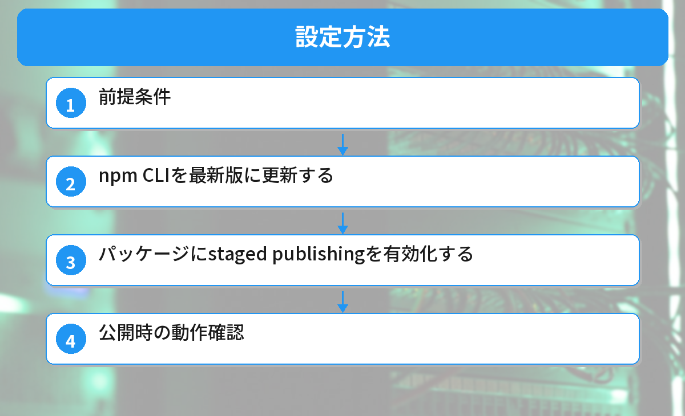
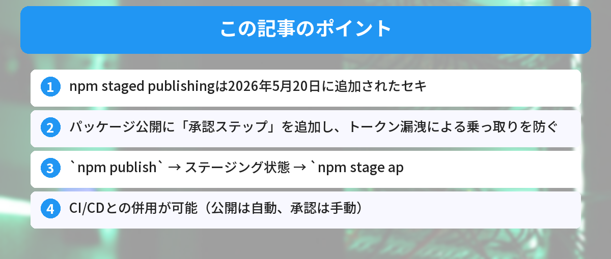

## この記事で分かること


npmのパッケージが乗っ取られるって聞いたことあるんだけど、どういうこと…？



npmパッケージの公開に使う「トークン」が漏洩すると、第三者が悪意のあるコードを含むバージョンを公開できてしまうんだ。2026年5月20日に、それを防ぐ「staged publishing」という新機能が追加されたよ。


「npm installしたパッケージにマルウェアが入っていた」——こんなニュースを見たことはありませんか？

この記事では、2026年5月にnpmに追加された「staged publishing（段階的公開）」機能の仕組みと、開発者が知っておくべきポイントを解説します。



## なぜnpmのセキュリティが問題になっているのか

### サプライチェーン攻撃とは

サプライチェーン攻撃とは、ソフトウェアの「部品」（ライブラリやパッケージ）に悪意のあるコードを混入させる攻撃手法です。

npmには200万以上のパッケージが公開されており、多くのプロジェクトがこれらに依存しています。1つのパッケージが汚染されると、それを使っている何千ものプロジェクトに影響が及びます。

### 過去に起きた事例

- **event-stream事件（2018年）** — 人気パッケージのメンテナ権限が第三者に渡り、暗号通貨を盗むコードが混入
- **ua-parser-js事件（2021年）** — 週間1,200万ダウンロードのパッケージにマルウェアが混入
- **colors/faker事件（2022年）** — メンテナ自身が意図的にパッケージを破壊

これらの多くは「公開用トークンの漏洩」や「アカウント乗っ取り」が原因です。

[GitHubの基本](/posts/github-what-is-it/)を理解していると、この問題の背景がより分かりやすくなります。

## npm staged publishingとは

### 概要

staged publishing（段階的公開）は、npmパッケージの公開プロセスに「承認ステップ」を追加する機能です。

従来の公開フロー：

```
npm publish → 即座に全ユーザーがインストール可能
```

staged publishingを有効にした場合：

```
npm publish → ステージング状態 → メンテナが承認 → 全ユーザーがインストール可能
```

### 何が変わるのか

| 項目 | 従来 | staged publishing |
|------|------|-------------------|
| 公開までのステップ | 1ステップ | 2ステップ（公開＋承認） |
| トークン漏洩時のリスク | 即座に悪意あるバージョンが公開される | ステージングで止まる（承認されない限り公開されない） |
| CI/CDからの公開 | そのまま公開 | ステージングまで。承認は別途必要 |
| ロールバック | 公開後に`npm unpublish`（制限あり） | 承認前なら取り消し可能 |


つまり、トークンが盗まれても「承認」しなければ悪いコードが公開されないってこと？



その通り！攻撃者がトークンを使って`npm publish`しても、ステージング状態で止まるんだ。メンテナが承認しない限り、一般ユーザーはインストールできない。


## 仕組みの詳細

### ステージング状態とは

`npm publish`を実行すると、パッケージは「ステージング」状態になります。この状態では以下の特徴があります。

- 一般ユーザーは`npm install`できない
- npmレジストリには登録されるが、非公開状態
- メンテナはステージング中のパッケージを確認できる
- 承認または却下の操作が可能

### 承認フロー

```bash
# 1. パッケージを公開（ステージング状態になる）
npm publish

# 2. ステージング中のパッケージを確認
npm stage list

# 3. 内容を確認して承認
npm stage approve <package>@<version>

# 4. 承認後、一般ユーザーがインストール可能になる
```

### 却下する場合

```bash
# ステージング中のパッケージを却下（公開されない）
npm stage reject <package>@<version>
```

## 設定方法



### 前提条件

- npm CLI の最新版（`npm stage`コマンドが含まれるバージョン）
- npmアカウントに2FA（二要素認証）が有効であること

npmの基本については[npm/yarn入門記事](/posts/npm-yarn-beginner/)で解説しています。

### ステップ1: npm CLIを最新版に更新する

```bash
npm install -g npm@latest
```

バージョンを確認します。

```bash
npm --version
```

### ステップ2: パッケージにstaged publishingを有効化する

```bash
npm stage enable <package-name>
```

### ステップ3: 公開時の動作確認

```bash
npm publish
```

staged publishingが有効な場合、以下のようなメッセージが表示されます。

```
npm notice Package staged for review.
npm notice Run `npm stage approve <package>@<version>` to publish.
```

### ステップ4: 承認して公開する

```bash
npm stage approve my-package@1.2.3
```

承認には2FA認証が必要です。これにより、トークンだけでは承認操作ができない仕組みになっています。


CI/CDで自動公開してる場合はどうなるの？毎回手動で承認しないといけない？



CI/CDからは`npm publish`でステージングまで自動化できるよ。承認だけ手動にすることで、「自動化の利便性」と「セキュリティ」を両立できるんだ。


## CI/CDとの組み合わせ

### GitHub Actionsでの例

```yaml
# .github/workflows/publish.yml
name: Publish Package
on:
  release:
    types: [published]

jobs:
  publish:
    runs-on: ubuntu-latest
    steps:
      - uses: actions/checkout@v4
      - uses: actions/setup-node@v4
        with:
          node-version: '26'
          registry-url: 'https://registry.npmjs.org'
      - run: npm ci
      - run: npm test
      - run: npm publish
        env:
          NODE_AUTH_TOKEN: ${{ secrets.NPM_TOKEN }}
      # ここでステージング状態になる
      # 承認はメンテナが手動で行う
```

### 運用フロー

1. GitHub Releaseを作成 → CI/CDが`npm publish`を実行
2. パッケージがステージング状態になる
3. メンテナに通知が届く
4. メンテナが内容を確認して`npm stage approve`を実行
5. パッケージが一般公開される

## パッケージ利用者（インストールする側）への影響

### 基本的に影響なし

staged publishingはパッケージの「公開側」の機能です。インストールする側の操作は何も変わりません。

```bash
# 今まで通り使える
npm install some-package
```

### メリット

- 乗っ取られたパッケージが即座に配布されるリスクが減る
- より安全なnpmエコシステムを利用できる

## よくあるエラーと対処法

### エラー: `npm stage` コマンドが見つからない

```
npm ERR! Unknown command: "stage"
```

npm CLIのバージョンが古い可能性があります。最新版に更新してください。

```bash
npm install -g npm@latest
```

### エラー: 2FAが必要

```
npm ERR! This operation requires a one-time password.
```

承認操作には2FAが必須です。npmアカウントの設定で2FAを有効にしてください。

[環境変数の設定方法](/posts/env-variables-beginner/)も合わせて確認しておくと、トークン管理の理解が深まります。

### エラー: 権限不足

```
npm ERR! You do not have permission to approve this package.
```

パッケージのメンテナ権限が必要です。`npm owner`コマンドで権限を確認してください。

## package.jsonの基本を押さえておこう

staged publishingを使う前に、package.jsonの構造を理解しておくとスムーズです。[package.json入門記事](/posts/package-json-beginner/)で基本を確認できます。

## よくある質問（FAQ）



### Q: 全てのパッケージに強制されますか？

A: いいえ。staged publishingはオプトイン（任意有効化）です。メンテナが明示的に有効にしたパッケージのみ適用されます。

### Q: 承認を忘れたらどうなりますか？

A: ステージング状態のまま残ります。一定期間後に自動的に期限切れになる可能性がありますが、詳細な期限はnpmの公式ドキュメントを確認してください。

### Q: 個人開発のパッケージでも使うべきですか？

A: ダウンロード数が多いパッケージや、他のプロジェクトに広く依存されているパッケージでは有効にすることをおすすめします。個人的な小規模パッケージでは必須ではありません。

### Q: `npm unpublish`との違いは？

A: `npm unpublish`は公開済みのパッケージを取り下げる操作です（72時間以内の制限あり）。staged publishingは公開前に承認ステップを挟む仕組みなので、そもそも悪意あるバージョンが公開されること自体を防ぎます。

### Q: scopedパッケージ（@org/package）でも使えますか？

A: はい、scopedパッケージでも利用可能です。Organization単位で全パッケージに一括適用することもできます。


自分がパッケージを公開する予定がなくても、知っておいた方がいいの？



うん。npmを使う全ての開発者に関係する話だよ。自分が使っているパッケージがstaged publishingに対応していれば、それだけ安全性が高いということ。パッケージ選びの判断材料にもなるね。


## まとめ

- npm staged publishingは2026年5月20日に追加されたセキュリティ機能
- パッケージ公開に「承認ステップ」を追加し、トークン漏洩による乗っ取りを防ぐ
- `npm publish` → ステージング状態 → `npm stage approve` → 一般公開の2段階フロー
- CI/CDとの併用が可能（公開は自動、承認は手動）
- インストールする側の操作は変わらない
- ダウンロード数の多いパッケージでは有効化を推奨

---
### あわせて読みたい
- [npm/yarnの違いと使い分け入門](/posts/npm-yarn-beginner/)
- [package.jsonの読み方・書き方入門](/posts/package-json-beginner/)
