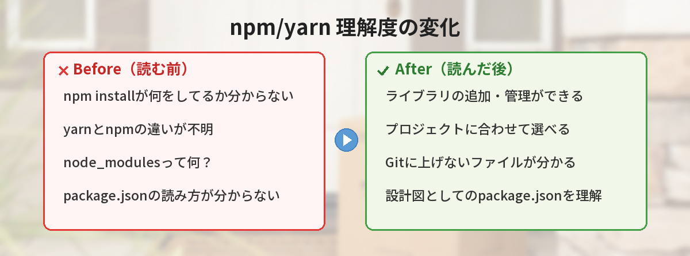
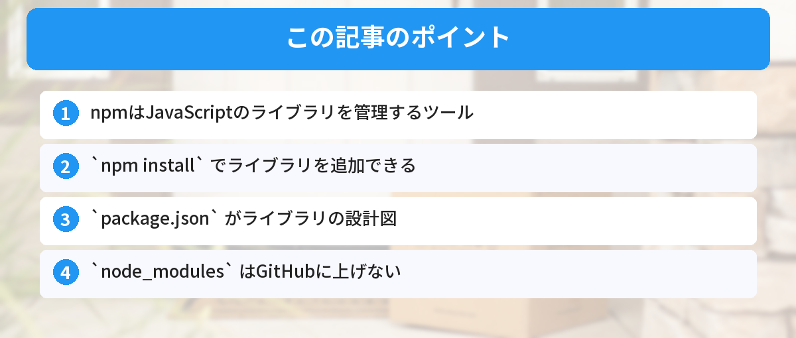

## この記事で分かること


npmとyarnって何が違うの？どっちを使えばいいの？



どっちもパッケージマネージャーで、できることはほぼ同じ。チームで統一されてるならそれに合わせればOKだよ。




「npm install って何をしているの？」「yarnって何？npmと何が違うの？」

JavaScriptの開発を始めると必ず出会う「npm」と「yarn」を、ゼロから解説します。

## npmとは

npmは「Node Package Manager」の略で、JavaScriptのライブラリ（パッケージ）を管理するツールです。

Pythonでいう `pip`、Rubyでいう `gem` と同じ役割です。Pythonの `pip` については[pip installのエラー対処法](/posts/python-pip-install-error/)で詳しく解説しています。

### 何ができるのか

- 他の人が作ったライブラリをインストールする
- プロジェクトで使っているライブラリの一覧を管理する
- ライブラリのバージョンを管理する

### 具体例

Webサイトにアニメーションを追加したいとき、自分でゼロから書く代わりに：

```bash
npm install animate.css
```

これだけで、世界中の開発者が使っている「animate.css」というライブラリがプロジェクトに追加されます。



## package.jsonとは

`npm install` を実行すると、`package.json` というファイルにライブラリの情報が記録されます。

```json
{
  "name": "my-project",
  "dependencies": {
    "animate.css": "^4.1.1",
    "axios": "^1.6.0"
  }
}
```

これは「このプロジェクトはanimate.cssとaxiosを使っています」という設計図です。`package.json` は[JSON形式](/posts/json-what-is-it/)で書かれています。JSONの読み方を知っておくと、このファイルの内容がすぐに理解できます。

チームで開発するとき、`package.json` を共有すれば、他の人も `npm install` するだけで同じ環境が作れます。

## node_modulesフォルダ

`npm install` すると `node_modules` というフォルダが作られます。ここにライブラリの実体が入ります。

このフォルダは非常に大きくなるので、GitHubには上げません。`.gitignore` に追加してください。

```
node_modules/
```

[GitHubの使い方](/posts/github-what-is-it/)を学ぶと、`.gitignore` の役割がより理解できます。同様に、[環境変数の.envファイル](/posts/env-variables-beginner/)もGitHubに上げてはいけないファイルの代表例です。

## yarnとは

yarnはnpmの代替ツールです。Facebookが開発しました。

やることはnpmとほぼ同じですが、以下の違いがあります。

| | npm | yarn |
|---|---|---|
| インストール速度 | 普通 | やや速い |
| コマンド | `npm install` | `yarn add` |
| ロックファイル | `package-lock.json` | `yarn.lock` |
| 標準搭載 | Node.jsに付属 | 別途インストール必要 |

### どっちを使えばいい？

初心者はnpmで十分です。Node.jsをインストールすれば自動で使えます。

プロジェクトに `yarn.lock` があればyarn、`package-lock.json` があればnpmを使ってください。混ぜるとトラブルの原因になります。

## よく使うコマンド

これらのコマンドは[ターミナル（コマンドライン）](/posts/command-line-scary/)で実行します。ターミナル操作に不安がある方は、先に基本操作を確認しておくと安心です。

```bash
# ライブラリをインストール
npm install ライブラリ名

# package.jsonに書かれた全ライブラリをインストール
npm install

# ライブラリを削除
npm uninstall ライブラリ名

# プロジェクトを初期化（package.jsonを作る）
npm init -y
```

## 筆者がハマったポイント

npmは「簡単」と言われがちですが、初心者のころは地味なところでつまずきました。

### ハマり1: npmとyarnを混ぜて使ってしまった

プロジェクトに `package-lock.json` があるのに、ネットの記事を見て `yarn add` でライブラリを追加してしまいました。すると `yarn.lock` も生成されて、ロックファイルが2つ存在する状態に。チームメンバーが `npm install` したら依存関係が壊れて、全員の環境で動かなくなりました。

**気づき:** プロジェクトに `package-lock.json` があればnpm、`yarn.lock` があればyarn。絶対に混ぜない。迷ったらロックファイルを見る。

### ハマり2: node_modulesをGitHubにpushしてしまった

初めてのプロジェクトで `.gitignore` を設定し忘れて、`node_modules` フォルダ（数万ファイル）をそのままGitHubにpushしてしまいました。リポジトリのサイズが500MB超えになり、cloneに10分以上かかる状態に。後から `.gitignore` に追加しても、すでにコミットされたファイルは消えません。

```bash
# 後からnode_modulesをGit管理から外す方法
echo "node_modules/" >> .gitignore
git rm -r --cached node_modules
git commit -m "remove node_modules from tracking"
```

**改善:** プロジェクトを作ったら最初に `.gitignore` を設定する。`npm init` の直後にやるのを習慣にした。

### ハマり3: `npm install` と `npm ci` の違いを知らずにCI/CDが不安定に

GitHub Actionsで `npm install` を使っていたら、ある日突然テストが落ちるようになりました。原因は、`npm install` がロックファイルを更新してしまい、ローカルとCI環境でライブラリのバージョンが微妙にずれていたこと。`npm ci` に変えたら安定しました。

**気づき:** CI/CD環境では必ず `npm ci` を使う。`npm install` はロックファイルを書き換える可能性があるので、再現性が保証されない。


npmとyarn混ぜちゃダメなんだ…。ロックファイルを確認する癖をつけよう。



ロックファイルは「このバージョンで動く」という保証書。混ぜると保証が壊れるから、プロジェクトごとに統一するのが鉄則だよ。


## よくある質問（FAQ）



### Q: npm installとnpm ciの違いは何ですか？
A: `npm install` は `package.json` を元にライブラリをインストールし、`package-lock.json` を更新します。`npm ci` は `package-lock.json` を元に厳密にインストールし、ロックファイルを変更しません。CI/CD環境やチーム開発では `npm ci` を使うのが安全です。

### Q: グローバルインストールとローカルインストールの違いは何ですか？
A: `npm install ライブラリ名` はプロジェクト内（ローカル）にインストールします。`npm install -g ライブラリ名` はPC全体（グローバル）にインストールします。基本的にはローカルインストールを使い、CLIツール（`create-react-app` など）だけグローバルにインストールするのが一般的です。

### Q: package-lock.jsonはGitHubに上げるべきですか？
A: はい、上げてください。`package-lock.json`（yarnなら `yarn.lock`）は、チーム全員が同じバージョンのライブラリを使うために必要なファイルです。`.gitignore` に追加しないでください。

### Q: npm installで「WARN」が大量に出ます。大丈夫ですか？
A: WARNは警告であり、エラーではありません。多くの場合、ライブラリの依存関係に関する軽微な注意です。`npm install` が正常に完了していれば、基本的に無視して問題ありません。「ERR」が出ている場合はエラーなので対処が必要です。

### Q: npxとnpmの違いは何ですか？
A: `npm` はライブラリのインストールや管理を行うツールです。`npx` はライブラリをインストールせずに一時的に実行するツールです。たとえば `npx create-react-app my-app` は、`create-react-app` をインストールせずにその場で実行します。


結局どっちでもいいんだ…！チームに合わせるのが正解なのね。



そう。個人開発ならnpmで十分。大事なのはlock fileをコミットすることだよ。



---

## 実際にnpmとyarnを両方使ってみた！（筆者の体験）

筆者は最初npmだけ使っていましたが、チーム開発でyarnを使うプロジェクトに参加して両方使うようになりました。

正直なところ、2026年時点では**どちらを使っても大差ありません**。速度もほぼ同じ、機能もほぼ同じ。チームが使っている方に合わせるのが正解です。

### 迷ったときの選び方

- チームのプロジェクトに`yarn.lock`がある → yarn
- チームのプロジェクトに`package-lock.json`がある → npm
- 個人プロジェクトで特にこだわりがない → npm（Node.jsに同梱されているので追加インストール不要）
- pnpmという選択肢もある → ディスク容量を節約したい人向け（上級者向けなので最初は気にしなくてOK）

## まとめ

- npmはJavaScriptのライブラリを管理するツール
- `npm install` でライブラリを追加できる
- `package.json` がライブラリの設計図
- `node_modules` はGitHubに上げない
- yarnはnpmの代替。初心者はnpmでOK

---
### あわせて読みたい
- [JSONとは？5分で分かるデータ形式の基本](/posts/json-what-is-it/)
- [環境変数とは？.envファイルの使い方をゼロから解説](/posts/env-variables-beginner/)

