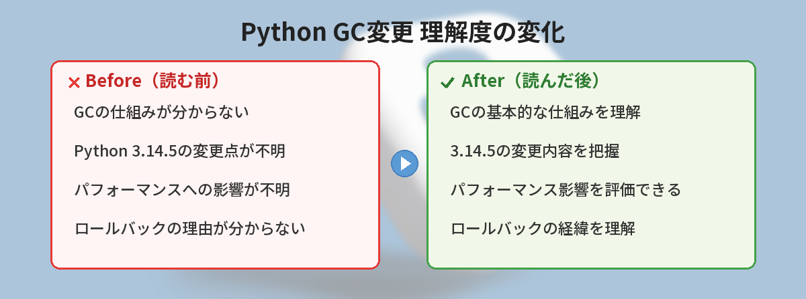
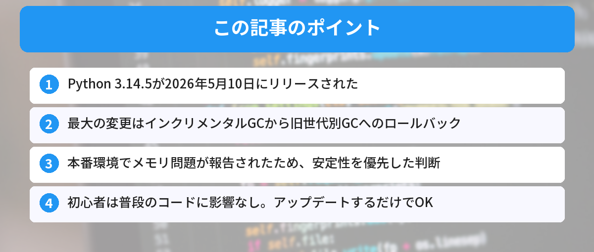

## この記事で分かること


Python 3.14.5でGCの変更がロールバックされたって聞いたけど、何があったの？



新しいGCアルゴリズムが一部のワークロードでメモリリークを起こしたんだ。安全のために元に戻されたよ。





「Python 3.14.5って何が変わったの？」「GCが戻ったって聞いたけど、自分に影響ある？」という方へ。

この記事では、2026年5月10日にリリースされたPython 3.14.5の重要な変更点を、初心者にも分かるように解説します。



## Python 3.14.5のリリース概要

| 項目 | 内容 |
|------|------|
| リリース日 | 2026年5月10日 |
| 種類 | メンテナンスリリース（3.14系の5番目） |
| 変更数 | 約154件のバグ修正・改善 |
| 最大の変更 | ガベージコレクタのロールバック |

一見すると地味なメンテナンスリリースですが、ランタイムの根幹に関わる重要な変更が含まれています。

## ガベージコレクタ（GC）とは何か

ガベージコレクタは、プログラムが使い終わったメモリを自動的に回収する仕組みです。

Pythonでは変数を作ると、裏側でメモリが確保されます。
その変数が不要になったとき、GCが自動的にメモリを解放してくれます。

```python
# 例：リストを作成するとメモリが確保される
data = [1, 2, 3, 4, 5]

# dataを使い終わって参照がなくなると、GCがメモリを回収する
data = None  # ここでGCの対象になる
```

普段のコーディングでGCを意識することはほとんどありません。
しかし、長時間動くサーバーや大量のデータを扱うプログラムでは、GCの動作がパフォーマンスに大きく影響します。

## 何が起きたのか：インクリメンタルGCの問題

### Python 3.14.0〜3.14.4で導入されたもの

Python 3.14.0では、新しい「インクリメンタルGC」が導入されました。

従来の世代別GC（Python 3.13以前）は、メモリ回収時に一時的にプログラムが止まる「ポーズ」が発生していました。
インクリメンタルGCは、このポーズを短くすることを目指した新しい方式です。

### 理論上のメリット
- GCによるポーズ時間が短くなる
- 大きなメモリを使うプログラムでもスムーズに動く

### 実際に起きた問題
- 本番環境でメモリ使用量が想定以上に増加した
- 長時間動くWebサーバーやデータパイプラインで問題が報告された
- ベンチマークでは良くても、実際の負荷では逆効果だった

## Python 3.14.5での対応：旧GCに戻す

Python開発チームは、インクリメンタルGCを撤回し、Python 3.13で使われていた世代別GCに戻す決定をしました。

これはメンテナンスリリースとしては異例の大きな変更です。
「理論的な改善よりも、実際の安定性を優先する」という判断です。

### 影響を受ける人

| 状況 | 影響 |
|------|------|
| Python 3.14.0〜3.14.4を使っている | メモリ問題が解消される可能性あり。アップデート推奨 |
| Python 3.13を使っている | 影響なし。3.14.5に上げても同じGCが動く |
| Python 3.12以前を使っている | 影響なし |

## その他の重要な変更点

### PGP署名の廃止

Python 3.14.5から、リリースファイルのPGP署名が提供されなくなりました。
代わりに**Sigstore**という新しい検証方式が推奨されています。

初心者への影響は少ないですが、CI/CDパイプラインやセキュリティ重視の環境では確認が必要です。

### macOSインストーラの変更

公式macOSインストーラがTcl/Tk 9.0.3を使用するようになりました。
Tkinter（PythonのGUIライブラリ）を使っている方は、表示が変わる可能性があります。

### Windows Python Install Manager

Windowsでは新しい「Python Install Manager」への移行が進んでいます。
従来のインストーラも3.14〜3.15の間は引き続き利用可能です。

## 初心者が今やるべきこと

### Python 3.14を使っている場合

```bash
# 現在のバージョンを確認
python --version

# 3.14.0〜3.14.4なら3.14.5にアップデート
# pipでインストールしたパッケージには影響なし
```

公式サイト（python.org）から最新版をダウンロードしてインストールするだけでOKです。

### Python 3.13以前を使っている場合

急いでアップデートする必要はありません。
3.14に上げる場合は、3.14.5を選べばGC問題を回避できます。

### 仮想環境（venv）を使っている場合

仮想環境はPython本体のバージョンに依存します。
Python本体をアップデートした後、必要に応じて仮想環境を再作成してください。

```bash
# 仮想環境の再作成
python -m venv .venv --clear
```

仮想環境について詳しくは[Python仮想環境（venv）の使い方](/posts/python-venv-beginner/)で解説しています。

## よくある質問（FAQ）



### Q: GCが変わると自分のコードを書き直す必要がありますか？
A: いいえ。GCはPythonが内部で自動的に処理するため、通常のコードに変更は不要です。

### Q: pip installしたライブラリに影響はありますか？
A: 基本的にありません。ただし、C拡張を使うライブラリは再インストールが必要な場合があります。

### Q: Python 3.14.5にアップデートしてデメリットはありますか？
A: メモリ使用量が改善される可能性が高く、デメリットはほぼありません。154件のバグ修正も含まれています。

### Q: Python 3.15はいつ出ますか？
A: Python 3.15は2026年10月にリリース予定です。

### Q: 初心者はどのバージョンのPythonを使うべきですか？
A: 2026年時点で一番安定しているのはPython 3.13系です。3.14系を使う場合は必ず3.14.5以降にしてください。新しい機能が不要であれば、3.13系が安心して使えます。

### Q: 「メモリリーク」って何ですか？
A: プログラムが使い終わったメモリを解放せず、どんどんメモリ使用量が増えていく現象です。長時間動くプログラム（Webサーバーなど）で発生すると、最終的にメモリ不足でプログラムが停止します。今回のGC問題はまさにこれが原因でした。

### Q: 自分のプロジェクトで3.14.0〜3.14.4を使っていた場合、コードの修正は必要？
A: コードの修正は不要です。Python本体をアップデートするだけでOK。`pip install --upgrade`で既存のパッケージを更新しておくとさらに安心です。

---

## 教訓：メンテナンスリリースでも確認すべきこと


メンテナンスリリースって「バグ修正だけ」ってイメージだったけど、こういう大きな変更もあるんだね。



そう。だからリリースノートは一応チェックする習慣をつけておくといいよ。


今回のケースから学べる教訓：

- **メンテナンスリリースでも破壊的な変更が含まれることがある**
- **リリースノートは流し読みでいいから確認する**。タイトルだけでも見ておくと「あれ？」と気づける
- **本番環境にすぐ適用しない**。開発環境でしばらくテストしてから本番に反映する
- **仮想環境を使う**。Python本体のバージョンを気軽に切り替えられるように[venv](/posts/python-venv-beginner/)を使っておく


ロールバックされたなら今は気にしなくていいのかな…？



そう、通常の使い方なら影響なし。ただしメモリ集約的なアプリを作ってる人は、次のリリースノートをチェックしておこう。


## まとめ

- Python 3.14.5が2026年5月10日にリリースされた
- 最大の変更はインクリメンタルGCから旧世代別GCへのロールバック
- 本番環境でメモリ問題が報告されたため、安定性を優先した判断
- 初心者は普段のコードに影響なし。アップデートするだけでOK
- PGP署名の廃止やmacOSインストーラの変更もあり
- 3.14.0〜3.14.4を使っている人は3.14.5へのアップデート推奨
- メンテナンスリリースでもリリースノートは確認する習慣をつけよう
- 迷ったらPython 3.13系が最も安定

---

## アップデート手順（OS別）

### Windows

1. [python.org](https://www.python.org/downloads/) にアクセス
2. Python 3.14.5のインストーラをダウンロード
3. 実行して「Upgrade Now」を選択
4. 完了後、`python --version` で確認

### macOS

```bash
# Homebrewの場合
brew update
brew upgrade python@3.14

# 公式インストーラの場合はpython.orgからダウンロード
```

### Linux (Ubuntu/Debian)

```bash
# deadsnakes PPAを使っている場合
sudo apt update
sudo apt upgrade python3.14
```

アップデート後は仮想環境の再作成も忘れずに。

### 筆者がアップデートしたときの手順メモ

1. `python --version` で現在のバージョンを確認（3.14.3だった）
2. python.orgから3.14.5のインストーラをダウンロード
3. 「Upgrade Now」で上書きインストール（既存のpipパッケージはそのまま維持された）
4. アップデート後に `python --version` で3.14.5を確認
5. 仮想環境を `python -m venv .venv --clear` で再作成
6. `pip install -r requirements.txt` で依存パッケージを再インストール
7. テストを実行して問題がないことを確認

全体で10分程度で完了しました。特にトラブルなし。

### よくあるつまずきポイント

- Windowsで「python」コマンドが見つからない → Microsoft Storeアプリのpython.exeとコンフリクトしている可能性。`py --version`で試してみる
- macOSで`python3`と打たないと動かない → Python 2系と3系が共存している。`alias python=python3`を設定すると便利

---
### あわせて読みたい
- [Python仮想環境（venv）の使い方 ― 初心者向け完全ガイド](/posts/python-venv-beginner/)
- [pip installでエラーが出たときの対処法](/posts/python-pip-install-error/)
- [Pythonのtry-except完全ガイド ― エラー処理の基本](/posts/python-try-except-beginner/)
