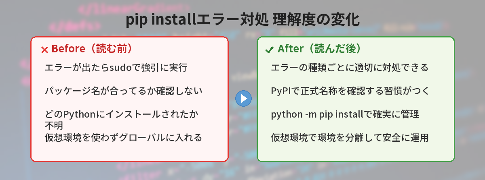
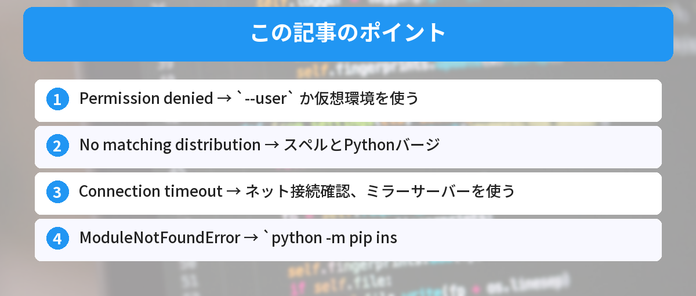

## この記事で分かること


pip installしたらエラーが出た…。何が原因なの？



pip installのエラーは原因が色々あるんだ。よくあるパターンと対処法をまとめたから、自分のエラーに当てはまるか見てみて。




`pip install` したらエラーが出た。何が起きているのか分からない。

この記事では、pip installでよく出るエラーを5つ取り上げて、それぞれの原因と解決方法を説明します。

ターミナル操作に不安がある方は、先に[コマンドラインが怖い人へ ― 覚えるコマンド5つだけ](/posts/command-line-scary/)を読んでおくとスムーズです。



## エラー1: Permission denied（権限エラー）

```
ERROR: Could not install packages due to an EnvironmentError: [Errno 13] Permission denied
```

### 原因

システム全体のPythonにインストールしようとして、権限が足りない状態です。

### 解決方法

`--user` オプションをつけてインストールします。

```bash
pip install --user パッケージ名
```

もしくは、仮想環境を使うのが根本的な解決策です。仮想環境の作り方は[仮想環境（venv）入門](/posts/python-venv-beginner/)で詳しく解説しています。

```bash
python -m venv .venv
.venv\Scripts\activate   # Windowsの場合
pip install パッケージ名
```

仮想環境については別の記事で詳しく解説しています。

👉 [ModuleNotFoundErrorの原因と解決方法](/posts/python-venv-beginner/)

## エラー2: No matching distribution found

```
ERROR: No matching distribution found for パッケージ名
```

### 原因

以下のどれかです。

- パッケージ名のスペルミス
- そのパッケージが自分のPythonバージョンに対応していない
- そのパッケージがOSに対応していない

### 解決方法

まずスペルを確認してください。大文字小文字やハイフンとアンダースコアの違いに注意。

```bash
# NG
pip install Requests
# OK
pip install requests
```

Pythonのバージョンを確認するには：

```bash
python --version
```

パッケージの対応バージョンはPyPI（https://pypi.org）で確認できます。

## エラー3: Connection timeout（接続タイムアウト）

```
WARNING: Retrying (Retry(total=4, connect=None, read=None, redirect=None, status=None))
ERROR: Could not fetch URL https://pypi.org/...
```

### 原因

インターネット接続の問題か、会社のプロキシに阻まれています。

### 解決方法

まずインターネット接続を確認。接続できているなら、ミラーサーバーを使います。

```bash
pip install パッケージ名 --index-url https://pypi.tuna.tsinghua.edu.cn/simple
```

会社のプロキシ環境の場合：

```bash
pip install パッケージ名 --proxy http://プロキシアドレス:ポート番号
```

## エラー4: ModuleNotFoundError（インストールしたのに見つからない）

```
ModuleNotFoundError: No module named 'requests'
```

### 原因

`pip install` したPythonと、`python` コマンドで動くPythonが別物です。PCに複数のPythonが入っている場合に起きます。

### 解決方法

`python -m pip` を使ってインストールします。

```bash
python -m pip install requests
```

これで「今動いているPython」に確実にインストールされます。

なお、プロジェクトごとにPython環境を分けておくと、こうした問題を根本的に防げます。環境変数の仕組みについては[環境変数とは？.envファイルの使い方をゼロから解説](/posts/env-variables-beginner/)も参考になります。

## エラー5: Could not build wheels

```
ERROR: Could not build wheels for パッケージ名
```

### 原因

パッケージのビルドに必要なツール（C言語のコンパイラなど）がPCに入っていません。

### 解決方法

まず pip と setuptools を最新にします。npmの世界でも似たようなパッケージ管理の仕組みがあります。興味がある方は[npmとyarnの違い](/posts/npm-yarn-beginner/)も読んでみてください。

```bash
python -m pip install --upgrade pip setuptools wheel
```

それでもダメな場合は、ビルド済みのバージョンを指定してインストールします。

```bash
pip install パッケージ名==バージョン番号
```

## 筆者がハマったポイント

ここからは、僕自身がpip installで実際にハマった経験を共有します。同じ状況になったとき、参考にしてみてください。

### 失敗談1: sudoで強引にインストールして環境が壊れた

初心者の頃、Permission deniedが出るたびに `sudo pip install` で無理やりインストールしていました。結果、システムのPythonライブラリが上書きされて、OSのツール（apt等）が動かなくなりました。復旧に丸一日かかりました。

**気づき:** sudoでpip installは絶対にやらない。仮想環境を使うか、`--user`オプションで対処する。

### 失敗談2: パッケージ名のハイフンとアンダースコアで30分悩んだ

`pip install python-dotenv` が正しいのに、`pip install python_dotenv` と打ってしまい「No matching distribution found」が出続けました。PyPIで検索すれば一瞬で分かることなのに、スペルミスを疑わず環境のせいだと思い込んで時間を浪費しました。

**気づき:** エラーが出たらまずPyPI（https://pypi.org）で正式なパッケージ名を確認する。

### 失敗談3: グローバルにインストールしたのに「モジュールが見つからない」

VS Codeのターミナルで `pip install requests` したのに、スクリプトを実行すると `ModuleNotFoundError` が出る。原因は、VS Codeが使っているPythonと、pipが紐づいているPythonが別物だったこと。`python -m pip install` に変えたら一発で解決しました。

**改善:** 常に `python -m pip install` を使う癖をつけた。どのPythonにインストールしているか明確になる。


sudoで無理やりインストールするのはダメなんだ…。仮想環境って本当に大事なんだね。



一度環境を壊すと復旧が大変だからね。最初から仮想環境を使う習慣をつけておけば、こういうトラブルとは無縁になるよ。


## よくある質問（FAQ）



### Q: `pip` と `pip3` はどう違いますか？

A: `pip` はPython 2系、`pip3` はPython 3系に紐づいていることが多いです。ただし環境によって異なるため、`python -m pip install` を使うのが最も確実です。どのPythonに対してインストールしているかが明確になります。

### Q: 仮想環境の中で `pip install` すれば `--user` は不要ですか？

A: はい、不要です。仮想環境内では、その環境専用のディレクトリにインストールされるため、権限の問題は起きません。仮想環境の使い方は[仮想環境（venv）入門](/posts/python-venv-beginner/)で解説しています。

### Q: `pip install` したパッケージの一覧を確認するには？

A: `pip list` コマンドで、現在インストールされているパッケージとバージョンの一覧が表示されます。特定のパッケージの詳細を見たい場合は `pip show パッケージ名` を使います。

### Q: プロキシ環境で毎回 `--proxy` を指定するのが面倒です。

A: `pip.conf`（Windowsでは `pip.ini`）にプロキシ設定を書いておけば、毎回指定する必要がなくなります。設定ファイルの場所は `pip config list` で確認できます。

### Q: `pip install` と `conda install` はどう違いますか？

A: `pip` はPython公式のパッケージマネージャで、PyPIからパッケージをインストールします。`conda` はAnaconda/Minicondaに付属するパッケージマネージャで、Python以外のライブラリ（C言語のライブラリなど）も一緒に管理できます。データサイエンス系のパッケージを多く使う場合はcondaが便利です。


仮想環境を使ってなかったのが原因だった…。venvって大事なんだね。



Pythonのパッケージ管理は仮想環境が基本だよ。最初に覚えておくと、後々のトラブルが激減する。



---

## 実際にpip installエラーで半日潰した！（筆者の体験）

筆者がpip installで最もハマったのは、`Microsoft Visual C++ 14.0 or greater is required`エラーでした。

Windows環境でC拡張を使うライブラリ（numpy等）をインストールしようとすると出るこのエラー。Visual Studio Build Toolsをインストールすれば解決しますが、ダウンロードに30分、インストールに20分かかり、半日の大半をビルドツールの導入に費やしました。

**教訓**: Windowsでは`pip install`前にVisual Studio Build Tools（C++ビルドツール）を入れておく。または`conda`を使えばコンパイル済みバイナリが入るので、このエラーを回避できます。

## まとめ

- Permission denied → `--user` か仮想環境を使う
- No matching distribution → スペルとPythonバージョンを確認
- Connection timeout → ネット接続確認、ミラーサーバーを使う
- ModuleNotFoundError → `python -m pip install` を使う
- Could not build wheels → pip/setuptools を更新

---
### あわせて読みたい
- [ModuleNotFoundErrorの原因と解決方法 ― 仮想環境入門](/posts/python-venv-beginner/)
- [環境変数とは？.envファイルの使い方をゼロから解説](/posts/env-variables-beginner/)

