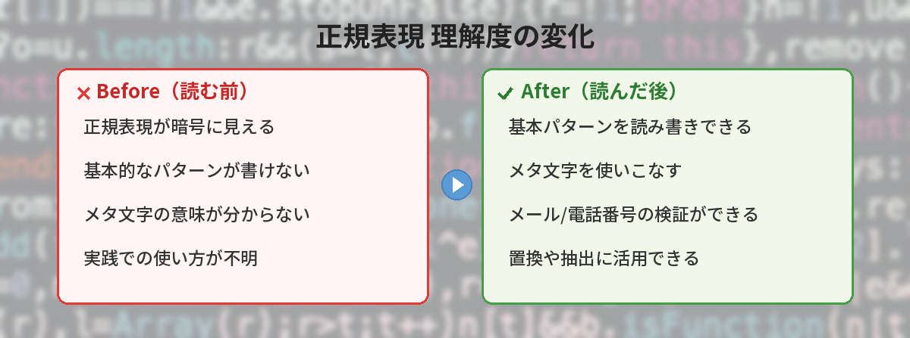
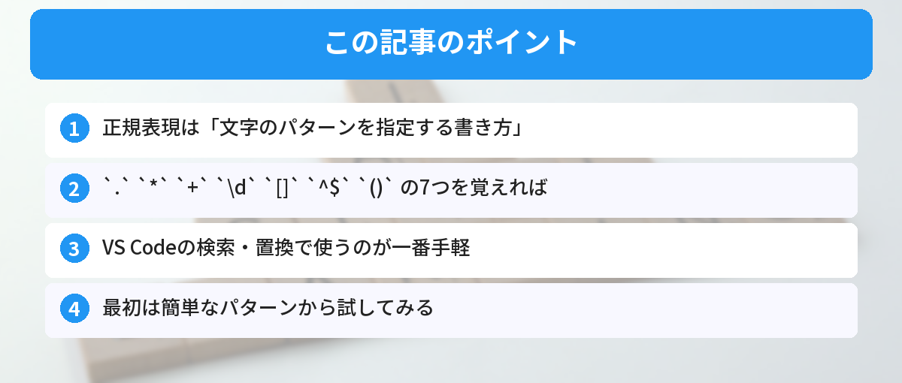

## この記事で分かること


正規表現って暗号みたい…。\d+とか.*とか、何が何だか分からない。



最初はみんなそう思うよ。でも基本パターンは5つくらいしかないんだ。それだけ覚えれば大体読めるようになるよ。




「正規表現って何？難しそう…」

正規表現は「文字のパターンを指定する書き方」です。よく使う7パターンだけ覚えれば、検索や置換が劇的に楽になります。

筆者も最初は「暗号にしか見えない」と思っていましたが、基本パターンを覚えてからは「100個のファイルから特定の形式のデータだけ抽出」みたいな作業が5分で終わるようになりました。あの苦手意識を乗り越えた先にある便利さをお伝えします。

## 正規表現とは

正規表現（Regular Expression、略してregex）は、「こういうパターンの文字列を探して」と指定するための書き方です。

例えば「メールアドレスっぽい文字列を全部探して」「電話番号の形式になっているものだけ抽出して」といったことができます。

プログラミングだけでなく、[VS Codeの検索・置換](/posts/vscode-shortcuts-beginner/)やターミナルの `grep` コマンドなど、日常的な開発作業でも活躍します。

### 正規表現を覚えると何が変わるか

- ファイル内の特定パターンを**一括検索・一括置換**できる
- ログファイルから**エラー行だけ抽出**できる
- フォームの**入力バリデーション**が書ける
- CSVやテキストデータから**必要な部分だけ切り出し**できる

これらを手作業でやると何十分もかかる作業が、正規表現なら一瞬で終わります。



## よく使うパターン7選

### 1. `.`（任意の1文字）

```
a.c → abc, adc, a1c, a c にマッチ
```

`.` はどんな文字でも1文字にマッチします。「ここには何か1文字が入るけど、何でもいい」というときに使います。

**使う場面**: ファイル名の一部が分からないとき。`error.log`を探したいけど、`error1.log`なのか`errorA.log`なのか分からない場合に`error..log`と書けます。

### 2. `*`（0回以上の繰り返し）

```
ab*c → ac, abc, abbc, abbbc にマッチ
```

直前の文字が0回以上繰り返されるパターンにマッチします。「あってもなくてもいい」という緩い条件です。

**使う場面**: スペースの有無を気にせず検索したいとき。`colou*r`と書けば`color`も`colour`もマッチします。

### 3. `+`（1回以上の繰り返し）

```
ab+c → abc, abbc, abbbc にマッチ（acにはマッチしない）
```

`*` と似ていますが、最低1回は必要です。「必ず1つ以上ある」という条件です。

**使う場面**: 数字が1桁以上続く部分を探したいとき。`\d+`と書けば「1」も「123」も「99999」もマッチします。

### 4. `\d`（数字1文字）

```
\d\d\d → 123, 456, 789 にマッチ
```

`\d` は0〜9の数字1文字にマッチします。`\d+` で「1桁以上の数字」、`\d{3}` で「ちょうど3桁の数字」を指定できます。

**関連パターン**:
- `\w` → 英数字とアンダースコア（`[a-zA-Z0-9_]` と同じ）
- `\s` → 空白文字（スペース、タブ、改行）

### 5. `[]`（文字クラス）

```
[abc] → a, b, c のどれか1文字にマッチ
[0-9] → 0〜9の数字にマッチ（\dと同じ）
[a-z] → 小文字のアルファベットにマッチ
[^abc] → a, b, c 以外の1文字にマッチ
```

「この中のどれか」を指定するときに使います。`^`を入れると「これ以外」という否定になります。

**使う場面**: 特定の文字だけ許可する入力チェック。`[0-9a-fA-F]`で「16進数に使える文字」を指定できます。

### 6. `^` と `$`（行頭と行末）

```
^Hello → 行頭が「Hello」で始まる行にマッチ
world$ → 行末が「world」で終わる行にマッチ
^$ → 空行にマッチ
```

**使う場面**: ログの特定行だけ抽出したいとき。`^ERROR`で「ERRORで始まる行」だけ拾えます。コードの不要なコメント行を削除するときにも便利。

### 7. `()`（グループ化）

```
(abc)+ → abc, abcabc, abcabcabc にマッチ
(red|blue) → red または blue にマッチ
```

複数の文字をまとめて繰り返しの対象にしたり、`|`（or）と組み合わせて選択肢を作れます。

**使う場面**: URLの末尾が`.html`か`.htm`のどちらかを探すとき→ `\.htm(l)?$`


7つだけ覚えればいいならなんとかなりそう…。でも組み合わせると複雑にならない？



最初はシンプルなパターンから試してみて。慣れたら少しずつ組み合わせていけばOK。regex101.comで試しながらやると理解が早いよ。


---

## 実践例

### メールアドレスを探す

```
[a-zA-Z0-9._%+-]+@[a-zA-Z0-9.-]+\.[a-zA-Z]{2,}
```

複雑に見えますが、分解すると：
- `[a-zA-Z0-9._%+-]+` → @の前の部分（英数字やドットなどが1文字以上）
- `@` → @マーク
- `[a-zA-Z0-9.-]+` → ドメイン名
- `\.[a-zA-Z]{2,}` → .com や .jp の部分（ドット+英字2文字以上）

### 電話番号を探す

```
0\d{1,4}-\d{1,4}-\d{4}
```

- `0` → 最初の0
- `\d{1,4}` → 1〜4桁の数字
- `-` → ハイフン

これで「03-1234-5678」や「090-1234-5678」のような形式にマッチします。

### 空白行を削除する（VS Codeの置換）

検索：`^\s*$\n`
置換：（空欄）

[Markdownファイル](/posts/markdown-beginner/)の整形にも正規表現は便利です。不要な空行をまとめて削除したり、見出しの形式を一括で変更したりできます。

### 日付形式を統一する

検索：`(\d{4})/(\d{2})/(\d{2})`
置換：`$1-$2-$3`

これで「2026/04/22」を「2026-04-22」に一括変換できます。`()`で囲んだ部分は`$1`、`$2`のように参照できるのがポイントです。

### HTMLタグを除去する

```
<[^>]+>
```

`<`で始まり、`>`以外の文字が1つ以上あり、`>`で終わるパターン。テキストからHTMLタグだけ除去したいときに使えます。

---

## 筆者がハマったポイント

正規表現を覚え始めた頃に、何度もハマった失敗を共有します。

### ハマり1：`.`がなんでもマッチしすぎる

URL内のドット（`.`）にマッチさせたかったのに、`example.com` のパターンで `exampleXcom` にもマッチしてしまった経験があります。ドットそのものにマッチさせたい場合は `\.` とエスケープが必要です。

**教訓**: 正規表現の特殊文字（`. * + ? [ ] { } ( ) ^ $ | \`）をそのまま検索したい場合は、前に `\` をつける。

### ハマり2：貪欲マッチと最小マッチ

`<.+>` でHTMLタグを取りたかったのに、`<p>テキスト</p>` 全体にマッチしてしまったことがあります。

- `<.+>` → `<p>テキスト</p>` 全体にマッチ（貪欲）
- `<.+?>` → `<p>` だけにマッチ（最小）

`?` をつけると最小マッチになります。これを知らないと「思った通りに動かない」と悩みます。

### ハマり3：改行をまたいだマッチ

デフォルトでは `.` は改行にマッチしません。複数行にまたがるパターンを検索したい場合は、ツールによってフラグ（`s`フラグや`DOTALL`モード）の設定が必要です。

---

## どこで使えるか

- **VS Code** → `Ctrl + H` で置換、正規表現ボタン（`.*`アイコン）をオン
- **Excel** → VBAの`Like`演算子や、関数の`SUBSTITUTE`と組み合わせて使用
- **Python** → `re` モジュール（`re.search()`, `re.findall()`, `re.sub()`）
- **JavaScript** → `RegExp` オブジェクトや `/パターン/` リテラル。[JavaScriptの配列メソッド](/posts/javascript-array-methods/)と組み合わせると、データのフィルタリングにも使えます
- **grep** → ターミナルでのファイル検索。[コマンドラインの基本](/posts/command-line-scary/)を覚えておくと活用しやすいです
- **sed / awk** → テキスト処理のコマンドラインツール

### 言語別の書き方の違い

| 言語/ツール | 数字の指定 | グループ参照 | 注意点 |
|---|---|---|---|
| Python | `\d` | `\1` または `group(1)` | raw文字列 `r""` を使う |
| JavaScript | `\d` | `$1` | `/パターン/g` でグローバルマッチ |
| grep (基本) | `[0-9]` | `\1` | `\d`は使えない場合がある |
| grep -E (拡張) | `[0-9]` | `\1` | `+`や`{}`が使える |
| VS Code | `\d` | `$1` | 置換で使うことが多い |

---

## 学習のステップ（おすすめ順序）

### ステップ1：VS Codeで試す（最初の1日）

VS Codeの検索（`Ctrl + F` → 正規表現ボタンON）で、自分のコードに対して正規表現を試してみましょう。リアルタイムでハイライトされるので、マッチしているかすぐ分かります。

### ステップ2：regex101.comで練習（1週間）

[regex101.com](https://regex101.com/) はパターンの意味を解説してくれるので、学習に最適です。自分でパターンを書いて、テスト文字列で試してみましょう。

### ステップ3：実務で使う（2週間目〜）

ログ解析、テキスト置換、入力バリデーションなど、実際の作業で使ってみましょう。「手作業で30分かかっていたことが5秒で終わった」という体験を一度すると、正規表現が手放せなくなります。

---

## よくある質問（FAQ）



### Q: 正規表現はどの言語でも同じ書き方ですか？

A: 基本的なパターン（`.` `*` `+` `\d` など）はほとんどの言語で共通です。ただし、細かい部分で違いがあります。例えばJavaScriptでは `\d` が使えますが、POSIX系（grepなど）では `[0-9]` と書く必要がある場合があります。

### Q: 正規表現のテストはどうやってやりますか？

A: オンラインツールの「regex101.com」が便利です。パターンを入力するとリアルタイムでマッチ結果が表示され、各部分の意味も解説してくれます。VS Codeの検索（`Ctrl + H`）でも正規表現ボタンをオンにすれば試せます。

### Q: `*` と `+` の違いがよく分かりません。

A: `*` は「0回以上」、`+` は「1回以上」の繰り返しです。例えば `ab*c` は `ac`（bが0回）にもマッチしますが、`ab+c` は `ac` にはマッチしません。最低1回は `b` が必要です。覚え方は「*はゼロOK、+は1以上必須」です。

### Q: 正規表現で日本語も扱えますか？

A: はい、扱えます。`[あ-ん]` でひらがな、`[ア-ン]` でカタカナにマッチします。ただし、Unicode対応は言語やツールによって異なるため、使う前にテストすることをおすすめします。Pythonなら `re.UNICODE` フラグで確実に動作します。

### Q: 正規表現が複雑になりすぎて読めません。どうすればいいですか？

A: 長い正規表現は分割して考えるのがコツです。Pythonなら `re.VERBOSE` フラグを使うと、正規表現の中にコメントや改行を入れられます。また、名前付きグループ `(?P<name>...)` を使うと、各部分の意味が分かりやすくなります。

### Q: 正規表現を覚えるのにどのくらい時間がかかりますか？

A: 基本の7パターンを覚えるだけなら1〜2日で十分です。実務で使いこなすには2〜3週間の練習が必要ですが、一度身につけば一生使えるスキルです。プログラミング言語が変わっても正規表現の知識はそのまま使えます。

---


\d が数字、\w が英数字、. が何でも…。パーツで覚えればいいんだね！



そう、レゴブロックみたいに組み合わせるだけ。regex101.comで試しながら覚えるのがおすすめだよ。最初は「VS Codeの置換で空行を消す」くらいから始めてみて！


## まとめ

- 正規表現は「文字のパターンを指定する書き方」
- `.` `*` `+` `\d` `[]` `^$` `()` の7つを覚えれば十分
- VS Codeの検索・置換で使うのが一番手軽な練習方法
- regex101.comでリアルタイムにテストしながら学べる
- 特殊文字をそのまま検索したいときは `\` でエスケープする
- 最初は簡単なパターンから試して、徐々に組み合わせる
- 一度身につけば言語が変わっても使える一生もののスキル

---

### あわせて読みたい
- [VS Codeの最初に覚えるべき設定とショートカット10選](/posts/vscode-shortcuts-beginner/)
- [Markdownとは？よく使う書き方10選](/posts/markdown-beginner/)
