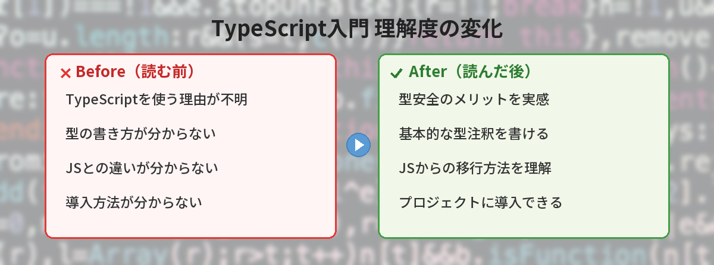
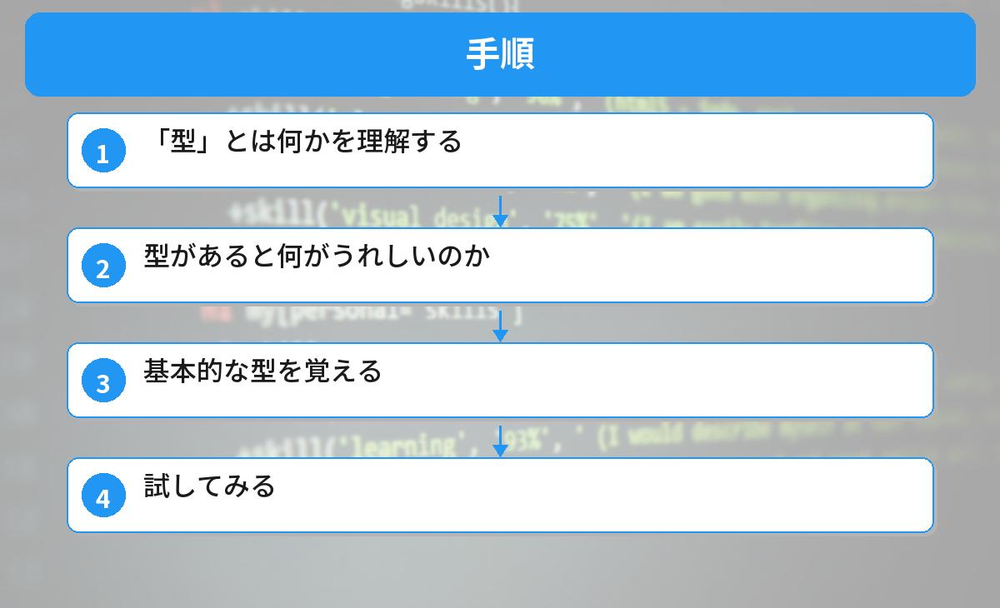
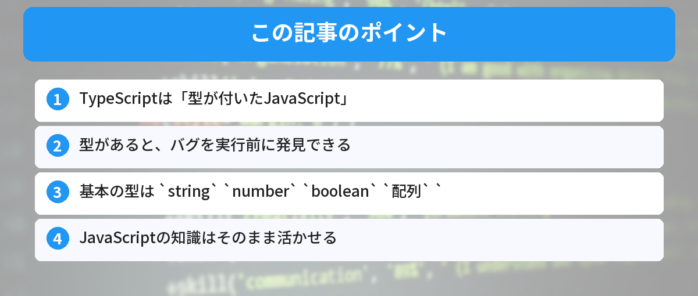

## この記事で分かること


TypeScriptって何？JavaScriptと何が違うの？わざわざ覚える必要ある？



JavaScriptに「型」を追加した言語だよ。バグを事前に防げるから、チーム開発では必須になりつつあるんだ。





「TypeScriptって何？JavaScriptと何が違うの？」

プログラミングを学び始めると、TypeScriptという名前をよく見かけます。この記事では、TypeScriptがなぜ必要なのかを具体例で説明します。

## 必要なもの

- JavaScriptの基本的な知識（変数、関数が分かる程度）
- Node.js（インストール済みであれば）

## TypeScriptを一言で説明すると

TypeScriptは **「型（かた）が付いたJavaScript」** です。

Microsoftが開発した言語で、JavaScriptに「型」という仕組みを追加したものです。TypeScriptで書いたコードは、最終的にJavaScriptに変換されてブラウザやNode.jsで動きます。

JavaScriptの非同期処理については[async/awaitの使い方入門](/posts/javascript-async-await/)で解説しています。TypeScriptでも同じ構文が使えます。



## 手順



### ステップ1: 「型」とは何かを理解する

JavaScriptでは、変数にどんな値でも入れられます。

```javascript
let name = "田中";
name = 42; // エラーにならない
```

TypeScriptでは、変数に「この変数には文字列しか入れない」と宣言できます。

```typescript
let name: string = "田中";
name = 42; // エラーになる！
```

この `: string` の部分が「型」です。

### ステップ2: 型があると何がうれしいのか

型がないJavaScriptでは、こんなバグが起きます。

```javascript
function greet(user) {
  return "こんにちは、" + user.name + "さん";
}

// 間違えてnameではなくnameeeと書いてしまった
const result = greet({ nameee: "田中" });
console.log(result); // "こんにちは、undefinedさん"
```

このコードはエラーにならず、`undefined` が表示されます。バグに気づきにくいです。

TypeScriptなら、コードを書いた時点でエラーが出ます。

```typescript
type User = {
  name: string;
};

function greet(user: User): string {
  return "こんにちは、" + user.name + "さん";
}

const result = greet({ nameee: "田中" }); // エラー！nameeeはUserに存在しない
```

**実行する前に** 間違いを教えてくれるので、バグを未然に防げます。

### ステップ3: 基本的な型を覚える

よく使う型は5つです。

```typescript
// 文字列
let name: string = "田中";

// 数値
let age: number = 25;

// 真偽値
let isStudent: boolean = true;

// 配列
let scores: number[] = [80, 90, 70];
```

配列の操作方法については[JavaScriptの配列メソッド ― 初心者が最初に覚えるべき5つ](/posts/javascript-array-methods/)で詳しく解説しています。TypeScriptでも同じメソッドがそのまま使えます。

```typescript
// オブジェクト
type User = {
  name: string;
  age: number;
};
let user: User = { name: "田中", age: 25 };
```

### ステップ4: 試してみる

TypeScriptを試す方法はいくつかあります。

**ブラウザで試す（インストール不要）：**

TypeScript Playground（https://www.typescriptlang.org/play）にアクセスすれば、ブラウザ上でTypeScriptを書いて実行できます。

**ローカルで試す：**

```bash
# TypeScriptをインストール
npm install -g typescript
```

npmの使い方に不安がある方は、[npmとyarnの違い ― どっちを使えばいい？](/posts/npm-yarn-beginner/)を先に読んでおくとスムーズです。

```bash
# ファイルを作成
echo 'let message: string = "Hello TypeScript"; console.log(message);' > hello.ts

# コンパイル（JavaScriptに変換）
tsc hello.ts

# 実行
node hello.js
```

## 実際にJavaScriptからTypeScriptに移行してみた！（筆者の体験）

筆者が個人プロジェクト（Express製のAPIサーバー、約2000行）をJavaScriptからTypeScriptに移行した体験をお伝えします。

### 移行にかかった時間

- **ファイルのリネーム（.js → .ts）**: 5分
- **tsconfig.jsonの作成**: 10分（npx tsc --initで雛形を生成）
- **型エラーの修正**: 約2時間（50ファイルで30箇所ほど）
- **動作確認**: 30分

合計で約3時間。2000行のプロジェクトなら半日あれば余裕で完了します。

### 移行して良かったこと

- **隠れバグが3つ見つかった**: 移行しただけで「この変数undefinedになる可能性あるよ」とエディタが教えてくれた。実行して初めて気づくはずだったバグが事前に分かった
- **コード補完が劇的に賢くなった**: オブジェクトのプロパティ名が自動で候補に出る。タイプミスが激減
- **リファクタリングが怖くなくなった**: 関数名を変えたら、呼び出し元も全部エラーで教えてくれる

### 移行で困ったこと

- **外部ライブラリの型定義がないものがあった**: `@types/○○`で型定義が提供されていないマイナーなライブラリは`any`で逃げるしかなかった
- **strict: trueにした瞬間、エラーが大量に出た**: 最初は`strict: false`で始めて、少しずつ厳しくしていくのがおすすめ

---

TypeScriptはJavaScriptの「上位互換」です。

- JavaScriptのコードはそのままTypeScriptとして動く
- TypeScriptのコードはコンパイルするとJavaScriptになる
- ブラウザやNode.jsが直接実行するのはJavaScript

つまり、JavaScriptの知識は無駄になりません。TypeScriptはJavaScriptに「安全装置」を付けたものと考えてください。

VS Codeを使っている場合、TypeScriptの型チェックはエディタ上でリアルタイムに表示されます。[VS Codeの設定とショートカット](/posts/vscode-shortcuts-beginner/)を参考に環境を整えておくと、開発体験がさらに良くなります。

## よくある質問（FAQ）



### Q: TypeScriptを使うにはJavaScriptを先に覚える必要がありますか？

A: はい、基本的なJavaScriptの知識（変数、関数、配列、オブジェクト）は必要です。TypeScriptはJavaScriptに型を追加したものなので、JavaScriptの基礎が分かっていれば、TypeScriptの学習はスムーズに進みます。

### Q: TypeScriptはフロントエンドだけで使うものですか？

A: いいえ。Node.jsを使ったバックエンド開発でもTypeScriptは広く使われています。APIサーバーやCLIツールなど、JavaScriptが動く場所ならどこでもTypeScriptを使えます。

### Q: `any` 型を使えば型エラーを回避できますが、使ってもいいですか？

A: `any` はTypeScriptの型チェックを無効にする型です。一時的な回避策としては使えますが、多用するとTypeScriptを使う意味がなくなります。まずは `string` や `number` など具体的な型を使い、どうしても型が分からない場合に限って `unknown` を検討してください。

### Q: TypeScriptのコンパイルが面倒です。もっと手軽に実行する方法はありますか？

A: `ts-node` というツールを使うと、コンパイルなしで直接TypeScriptを実行できます。`npx ts-node hello.ts` で試せます。開発中の動作確認に便利です。

### Q: 既存のJavaScriptプロジェクトをTypeScriptに移行するのは大変ですか？

A: 一度に全部変える必要はありません。`.js` ファイルを `.ts` にリネームして、少しずつ型を追加していく方法が一般的です。`tsconfig.json` で `allowJs: true` を設定すれば、JSファイルとTSファイルを混在させることもできます。

### Q: TypeScriptの型定義ファイル（.d.ts）って何ですか？

A: JavaScriptで書かれたライブラリにTypeScriptの型情報を提供するファイルです。多くの有名ライブラリは `@types/ライブラリ名` というパッケージで型定義が配布されています。`npm install -D @types/express` のようにインストールすると、VS Codeの補完がライブラリに対しても効くようになります。

### Q: TypeScriptの学習にどのくらい時間がかかりますか？

A: JavaScriptの基礎がある人なら、基本的な型（string, number, boolean, 配列, オブジェクト）は1〜2日で覚えられます。ジェネリクスやユーティリティ型など応用的な型は、実務で使いながら1〜2ヶ月かけて徐々に覚えていくイメージです。最初から全部覚えようとせず、「必要になったら調べる」スタンスでOKです。


型をつけるだけでエディタの補完がこんなに賢くなるんだ…！



開発体験が全然違うよね。最初は面倒に感じるけど、慣れると型なしには戻れなくなるよ。


## まとめと次のステップ

- TypeScriptは「型が付いたJavaScript」
- 型があると、バグを実行前に発見できる
- 基本の型は `string` `number` `boolean` `配列` `オブジェクト` の5つ
- JavaScriptの知識はそのまま活かせる

まずはTypeScript Playgroundで、自分のJavaScriptコードに型を付けてみてください。

---
### あわせて読みたい
- [JavaScriptの配列メソッド ― 初心者が最初に覚えるべき5つ](/posts/javascript-array-methods/)
- [npmとyarnの違い ― どっちを使えばいい？](/posts/npm-yarn-beginner/)

