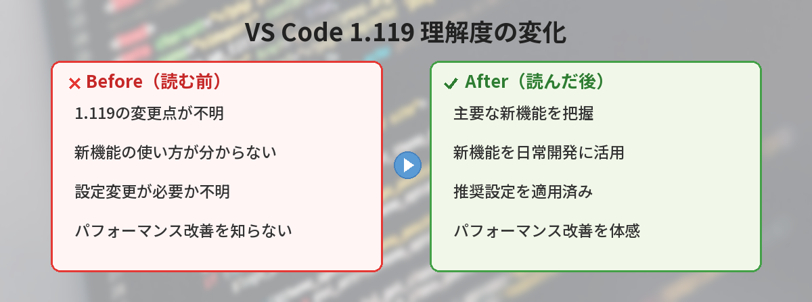

## この記事で分かること


VS Code 1.119アップデート！AIエージェントにブラウザを共有できる新機能って何？初心者でも分かるように教えて…！



もちろん！VS Code 1.119アップデート！AIエージェントにブラウザを共有できる新機能について、初心者でも分かるように解説するよ。一緒に見ていこう。





「VS Code 1.119が出たけど、何が変わったの？」

2026年5月にリリースされたVS Code 1.119は、AIエージェントとブラウザの連携が大きく進化しました。この記事では、初心者にも分かるように新機能と設定方法を解説します。



## VS Code 1.119の概要

VS Code 1.119は、前回の1.118からわずか1週間でリリースされました。

今回のテーマは「AIエージェントをもっと実用的に」です。ブラウザとの連携、トークン（AIが処理するテキストの単位）の使用量追跡、セキュリティ強化が中心です。

## AIエージェントにブラウザタブを共有できるようになった

### 何ができるようになったのか

VS Code内のAIエージェント（CopilotやClaudeなど）に、開いているブラウザタブの内容を共有できるようになりました。

例えば、ドキュメントサイトを開いた状態で「このページの内容を参考にコードを書いて」と指示できます。

### なぜ便利なのか

従来は、Webページの内容をコピペしてチャットに貼り付ける必要がありました。1.119では、タブを共有するだけでAIがページの内容を読み取れます。

活用例:
- APIドキュメントを見ながらコードを書いてもらう
- エラーメッセージのページを共有して解決策を聞く
- デザインモックのページを見せてCSSを生成してもらう

### セキュリティへの配慮

「AIが勝手にブラウザを見るのは怖い」と思うかもしれません。安心してください。

1.119では、タブの共有は**明示的な操作が必要**です。

- コンテキストピッカーからタブを選択する
- ドラッグ＆ドロップでタブを共有する
- エージェントがアクセスを要求すると確認プロンプトが表示される

勝手に読まれることはありません。同じドメインのタブがすでに開いている場合は、新しいウィンドウを開かずに既存タブを再利用する提案もしてくれます。

### 設定方法

特別な設定は不要です。VS Code 1.119にアップデートすれば自動的に使えます。

ネットワークアクセスが必要だけどファイルシステムは保護したい場合は、以下の設定が便利です。

```json
{
  "chat.agent.sandbox.enabled": "allowNetwork"
}
```

この設定にすると、パッケージのインストールや開発サーバーの起動時に毎回承認プロンプトが出なくなります。ローカルファイルへの書き込みは引き続き保護されます。

## トークン使用量が見えるようになった

### 問題: トークンがどこで消費されているか分からない

AIエージェントに長いタスクを任せると、途中で止まったり、なぜか遅くなったりすることがあります。原因は「トークンの使いすぎ」であることが多いのですが、従来はどのステップで消費されたか分かりませんでした。

### 解決策: OpenTelemetryトレーシング

1.119では、Copilot CLI、Claudeエージェント、ローカルエージェントのすべてのアクティビティがOpenTelemetryトレースとして記録されます。

OpenTelemetryとは、アプリケーションの動作を追跡するための標準規格です。各ツール呼び出しやモデルとのやり取りが1つのタイムラインで可視化されます。

### 設定方法

`settings.json`に以下を追加します。

```json
{
  "otel.otlpEndpoint": "http://localhost:4317"
}
```

Aspire Dashboardなどの対応コレクターを起動しておけば、レイテンシ（応答時間）やキャッシュの状況をリアルタイムで確認できます。

「どのステップでトークンを使いすぎているか」が一目で分かるので、プロンプトの改善に役立ちます。

## バックグラウンドエージェントでトークン節約

### 問題: タスク管理にトークンを浪費する

AIエージェントに複雑なタスクを任せると、進捗リストの更新だけでトークンを大量に消費することがあります。本来はコード生成に使いたいトークンが、「TODOリストの書き換え」に使われてしまう問題です。

### 解決策: 軽量モデルに委任

1.119では、実験的機能として「バックグラウンドエージェント」が追加されました。タスクリストの更新を軽量なモデルに任せて、メインの推論エンジンはコード生成に集中できます。

この機能はデフォルトで無効です。試したい場合は設定から有効にできますが、まだ実験段階なので本番作業では注意してください。

## Markdownプレビューの切り替えが簡単に

### 従来の問題

Markdownファイルを編集するとき、ソースコードとプレビューの切り替えがメニューの奥に隠れていました。ショートカットキーを覚えていないと不便でした。

### 改善点

ツールバーに専用ボタンが追加されました。ワンクリックでソースとプレビューを切り替えられます。

設定パネルでも、Markdownの言語機能が「Preview」サブセクションにまとめられて見つけやすくなりました。

READMEやドキュメントを書く機会が多い方には地味に嬉しい改善です。

## WebViewのパフォーマンス改善

### 何が変わったか

VS Code内のWebView（埋め込みブラウザ表示）が、JavaScriptベースの位置計算からCSSアンカーポジショニングに移行しました。

### 体感できる変化

- パネルのドラッグ時のカクつきが解消
- ウィンドウリサイズ時のレイアウト崩れが修正
- Web版VS Codeでの表示ズレが改善

拡張機能のUIパネルを多用する方は、操作感が滑らかになったことを実感できるはずです。

## TypeScript 7への移行

VS Codeの内部コードベースがTypeScript 7に完全移行しました。

ユーザーへの直接的な影響は少ないですが、型チェックの時間が大幅に短縮されています。Copilot拡張機能では、型チェック時間が22秒から4秒に短縮されたとのことです。

エラー表示が速くなる、拡張機能の起動が速くなるなど、間接的な恩恵があります。

## Edit Modeの廃止予定

VS Code 1.10から実験的に提供されていた「Edit Mode」が、バージョン1.25で完全に削除される予定です。

現在Edit Modeを使っている方は、標準のチャットコマンドへの移行を検討してください。1.25までは引き続き使えるので、急ぐ必要はありません。

## よくある質問（FAQ）

### Q: ブラウザタブの共有は安全ですか？

A: はい。明示的に共有操作をしない限り、AIエージェントがブラウザの内容を読むことはありません。共有時には確認プロンプトも表示されます。

### Q: 無料版のVS Codeでも使えますか？

A: VS Code自体は無料です。ただし、AIエージェント機能（Copilot）を使うにはGitHub Copilotのサブスクリプションが必要です。無料枠もあります。

### Q: アップデート方法は？

A: VS Codeは自動アップデートが有効になっていれば自動で更新されます。手動の場合は「ヘルプ」→「更新の確認」から実行できます。

### Q: TypeScript 7への移行で自分のプロジェクトに影響はありますか？

A: VS Code内部の話なので、あなたのプロジェクトのTypeScriptバージョンには影響しません。プロジェクトで使うTypeScriptのバージョンは別途管理されます。

### Q: 1.118から1.119へのアップデートで設定が壊れることはありますか？

A: 基本的にありません。ただしEdit Modeを使っている場合は、将来的に移行が必要になります。


なるほど…！分かりやすかった。ありがとう！



どういたしまして。分からないことがあったらいつでも聞いてね。


## まとめ

- ブラウザタブをAIエージェントに共有できるようになった（明示的操作が必要で安全）
- OpenTelemetryでトークン使用量を可視化できる
- バックグラウンドエージェントでトークン節約（実験的機能）
- Markdownプレビューの切り替えがワンクリックに
- WebViewのパフォーマンスが改善（CSSアンカーポジショニング）
- TypeScript 7移行で内部処理が高速化

特にブラウザタブ共有は、ドキュメントを見ながらコードを書く場面で大きな時短になります。アップデートして試してみてください。

---
### あわせて読みたい
- [VS Code 1.118アップデート！Copilotエージェント機能が大幅強化](/posts/vscode-118-update/)
- [GitHub Copilot無料版でできること・できないこと](/posts/github-copilot-free/)
