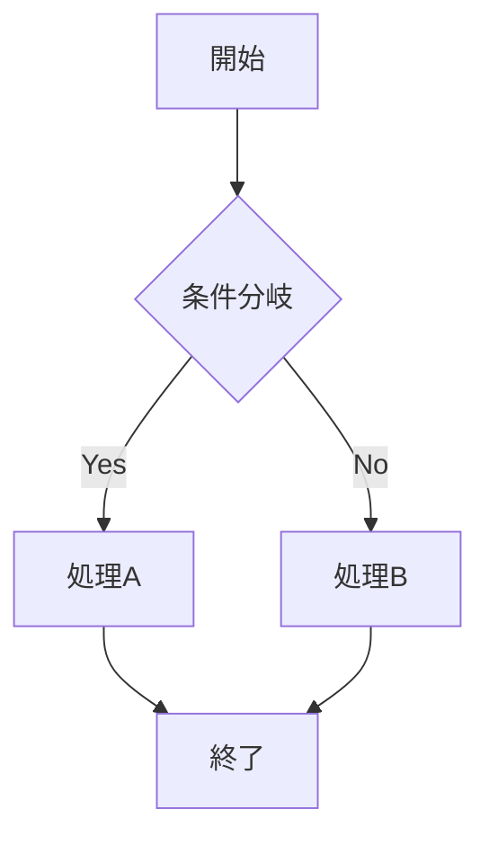

## この記事で分かること


VS Code 1.121アップデート！Mermaid図が標準対応＆エージェント大幅改善って何？初心者でも分かるように教えて…！



もちろん！VS Code 1.121アップデート！Mermaid図が標準対応＆エージェント大幅改善について、初心者でも分かるように解説するよ。一緒に見ていこう。



「VS Code 1.121が出たけど、何が変わったの？入れたほうがいい？」

2026年5月20日にリリースされたVS Code 1.121は、Mermaid図のネイティブ対応やエージェント機能の大幅改善が目玉です。この記事では、初心者にも分かるように新機能と設定方法を解説します。



## VS Code 1.121の概要

VS Code 1.121のテーマは「ノイズを減らして、本当に必要な機能を標準搭載する」です。

主な変更点を一覧にします。

- Mermaid図がMarkdownプレビューで標準レンダリング
- HTMLファイルのプレビューが拡張機能なしで可能に
- ターミナル出力の圧縮（トークン節約）
- バックグラウンドターミナルの自動クリーンアップ
- リモートエージェント（SSH/Dev Tunnels対応）
- モデル設定の細分化（軽量タスク用モデルの指定）

前回の[VS Code 1.119のアップデート](/posts/vscode-shortcuts-beginner/)からさらに進化しています。

## Mermaid図がMarkdownプレビューで標準対応

### 何が変わったのか

これまでMermaid図（テキストでフローチャートや図を描ける記法）をVS Codeでプレビューするには、拡張機能のインストールが必要でした。

1.121からは**拡張機能なしで**Mermaid図がMarkdownプレビューに表示されます。

### 使い方

Markdownファイルに以下のように書くだけです。

````markdown

````

`Ctrl + Shift + V`（Macは`Cmd + Shift + V`）でプレビューを開くと、図が描画されます。

### 便利な操作

- **パン＆ズーム**: 大きな図をドラッグで移動、スクロールで拡大縮小できる
- **ソースコードのコピー**: 図を右クリックすると、Mermaidのソースコードをコピーできる
- **ノートブックでも対応**: Jupyter Notebookのセルでも同様に表示される

今まで「Markdown Preview Mermaid Support」などの拡張機能を入れていた人は、アンインストールしても大丈夫です。

## HTMLファイルのプレビューが内蔵された

### 何が変わったのか

HTMLファイルをVS Code内でプレビューするのに、以前は「Live Server」や「Browser Preview」などの拡張機能が必要でした。

1.121では**統合ブラウザ（Integrated Browser）**が搭載され、HTMLファイルを右クリックするだけでプレビューできます。

### 使い方

1. HTMLファイルをエクスプローラーで右クリック
2. 「Open Preview」を選択
3. エディタ内にブラウザプレビューが表示される

タブを右クリックしても同じ操作ができます。

CSSやJavaScriptの変更もリアルタイムで反映されるので、簡単なWebページの確認にはLive Serverが不要になります。

## ターミナル出力の圧縮

### 何が変わったのか

AIエージェント（GitHub Copilot等）がターミナルでコマンドを実行すると、テストランナーやビルドツールの出力が大量にチャットに流れ込んでいました。これがトークン（AIが処理するテキストの単位）を無駄に消費する原因でした。

1.121では`chat.tools.compressOutput.enabled`設定により、冗長な出力を自動的に圧縮してからAIに送信します。

### 対応ツール

以下のツールの出力が圧縮対象です。

- テストランナー: `pytest`、`jest`、`cargo test`
- ビルドツール: `tsc`、`cargo build`、`make`
- リンター: `eslint`、`pylint`
- Docker関連コマンド
- パッケージマネージャー: `npm`、`pip`

### 設定方法

`settings.json`に以下を追加します。

```json
{
  "chat.tools.compressOutput.enabled": true
}
```

デフォルトで有効になっているので、特に設定を変更する必要はありません。

## バックグラウンドターミナルの自動クリーンアップ

エージェントが実行したコマンドが完了すると、そのターミナルが自動的に閉じられるようになりました。

以前は使い終わったターミナルがどんどん溜まっていく問題がありましたが、これで解消されます。

手動で残しておきたい場合は、ターミナルのロックアイコンをクリックすれば自動削除を防げます。

## パスワードなどの機密情報がチャットに漏れない

ターミナルでパスワード入力を求められた場合、その内容がAIチャットのコンテキストに送信されないようになりました。

`VSCODE_AGENT`環境変数も新設され、スクリプト側で「今エージェントから実行されている」ことを検知できます。これにより、対話的なプロンプトをスキップする処理を書けます。

```bash
if [ -n "$VSCODE_AGENT" ]; then
  # エージェント実行時はプロンプトをスキップ
  echo "自動実行モード"
fi
```

## リモートエージェント（実験的機能）

### 何ができるようになったのか

エージェントセッションをSSHやDev Tunnels経由でリモートマシン上で実行できるようになりました。

メリットは以下の通りです。

- ローカルPCを閉じても、リモートでタスクが継続する
- 高スペックなサーバーでビルドやテストを実行できる
- チームで共有のエージェント環境を構築できる

### 注意点

この機能はまだ実験的（Experimental）です。安定版に入っていますが、今後仕様が変わる可能性があります。

## モデル設定の細分化

### 何が変わったのか

AIエージェントが使うモデルを、タスクの種類ごとに切り替えられるようになりました。

- `chat.utilityModel`: コミットメッセージ生成やタイトル作成など軽量タスク用
- `chat.utilitySmallModel`: さらに軽い処理用

### 設定例

```json
{
  "chat.utilityModel": "gpt-4o-mini",
  "chat.utilitySmallModel": "gpt-3.5-turbo"
}
```

これにより、重要な作業には高性能モデル、軽い作業には安価なモデルを使い分けてコストを抑えられます。

[GitHub Copilotの料金と使用量の管理](/posts/github-copilot-usage-billing/)も参考にしてください。

## YAMLフロントマターの表示設定

Markdownファイルの先頭にあるYAMLフロントマター（`---`で囲まれたメタデータ部分）の表示方法を選べるようになりました。

`settings.json`で設定します。

```json
{
  "markdown.preview.frontMatter": "table"
}
```

選択肢は3つです。

- `"table"`: テーブル形式で表示
- `"code"`: コードブロックとして表示
- `"hide"`: 非表示

ブログを書いている人には地味に嬉しい機能です。

## アップデート方法

VS Codeは通常、自動でアップデートされます。手動で確認する場合は以下の手順です。

1. `Ctrl + Shift + P`でコマンドパレットを開く
2. 「Check for Updates」と入力して実行
3. アップデートがあればインストールされる

または、[公式サイト](https://code.visualstudio.com/)から最新版をダウンロードしてインストールしても大丈夫です。

## よくある質問（FAQ）

### Q: Mermaid拡張機能はアンインストールしていい？

A: はい。1.121以降は標準機能として含まれているので、「Markdown Preview Mermaid Support」などの拡張機能は不要です。

### Q: Live Serverはもう要らない？

A: 簡単なHTMLプレビューなら不要です。ただし、Live Serverにはホットリロードやポート指定など追加機能があるので、本格的なWeb開発では引き続き便利です。

### Q: ターミナル出力の圧縮を無効にしたい場合は？

A: `settings.json`で `"chat.tools.compressOutput.enabled": false` に設定してください。

### Q: リモートエージェントを使うにはどうすればいい？

A: SSH接続先またはDev Tunnelsの設定が必要です。Agents Windowから「Remote」タブを選択して接続先を設定します。現時点では実験的機能のため、設定がやや複雑です。

### Q: 前のバージョンに戻したい場合は？

A: コマンドパレットで「Revert to Previous Version」を実行するか、[公式のアーカイブページ](https://code.visualstudio.com/updates/archive)から過去バージョンをダウンロードできます。


なるほど…！分かりやすかった。ありがとう！



どういたしまして。分からないことがあったらいつでも聞いてね。


## まとめ

- VS Code 1.121は2026年5月20日リリース
- Mermaid図が拡張機能なしでMarkdownプレビューに表示される
- HTMLファイルのプレビューが標準搭載された
- ターミナル出力の圧縮でAIのトークン消費を削減
- バックグラウンドターミナルの自動クリーンアップで画面がすっきり
- リモートエージェントで長時間タスクをサーバーに任せられる（実験的）
- モデル設定の細分化でコスト管理がしやすくなった

---

### あわせて読みたい

- [VS Code 1.119アップデート！AIエージェントにブラウザを共有できる新機能](/posts/vscode-shortcuts-beginner/)
- [GitHub Copilotの料金と使用量を管理する方法](/posts/github-copilot-usage-billing/)
