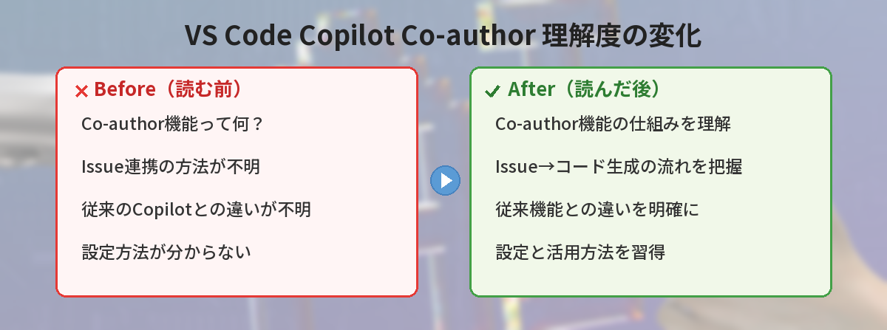
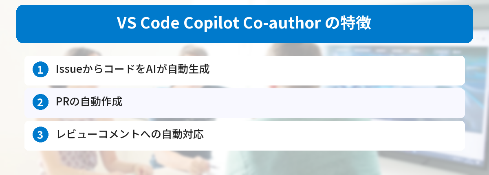

## この記事で分かること


Copilotが勝手にコミットの共著者になる問題が発覚→修正へって何？初心者でも分かるように教えて…！



もちろん！Copilotが勝手にコミットの共著者になる問題が発覚→修正へについて、初心者でも分かるように解説するよ。一緒に見ていこう。





「自分で書いたコードなのに、コミット履歴にCopilotが共著者として入っている…」「Copilotを使っていないのに勝手にクレジットが追加される」

この記事では、2026年5月に発覚したVS CodeのGit拡張機能の問題と、確認方法・対処法を解説します。



## 何が起きたのか

2026年4月16日、VS Codeのバージョン1.110で、Gitコミットメッセージに「Co-authored-by: Copilot」という行が**デフォルトで自動追加される**変更が入りました。

問題は以下の点です。

- Copilotを使っていなくてもクレジットが追加される
- チャット機能を無効にしていても追加される
- コミットメッセージを手動で編集した後にも追加される
- リリースノートに記載されず、ユーザーに告知されなかった

つまり、**自分が100%書いたコードでも「AIと共著」として記録されてしまう**状態でした。

## なぜ問題なのか

### 1. コミット履歴の正確性が損なわれる

Gitのコミット履歴は「誰が何を書いたか」の記録です。実際にはAIを使っていないのに共著者として記録されると、履歴の信頼性が失われます。

### 2. 著作権・知的財産の問題

AIが生成したコードは著作権保護の対象にならない可能性があります。「Co-authored-by: Copilot」が付いていると、そのコードが人間の著作物なのかAI生成物なのか曖昧になります。

商用プロジェクトでは、この曖昧さが法的リスクになり得ます。

### 3. 保険・契約上のリスク

一部の保険会社はAIが関与したソフトウェアに対する保険適用を制限する動きがあります。AI共著のクレジットが付いていると、保険適用の判断に影響する可能性があります。

### 4. プロジェクトのポリシー違反

LinuxカーネルプロジェクトではAI利用の明示的な記録を求めていますが、Zigプロジェクトのように**AI支援コードの提出を禁止**しているプロジェクトもあります。

意図せずAIクレジットが付くと、こうしたプロジェクトへの貢献が拒否される可能性があります。

## 開発者の反応

GitHubのコミュニティディスカッションで多くの開発者が問題を報告しました。

ある開発者は「コミット前にメッセージを確認し、Copilotが生成した英語のメッセージを削除して自分で書き直した。しかしコミット後のGit履歴にはCopilotの共著者行が残っていた」と報告しています。

「レビューした内容と実際にコミットされた内容が異なるのは、プロの開発ワークフローとして受け入れられない」という指摘です。

## Microsoftの対応

2026年5月3日、変更を承認したVS Codeのレビュアーが謝罪し、修正を実施しました。

修正内容:
- `git.addAICoAuthor` 設定のデフォルト値を `"all"` から `"off"` に戻す
- AI機能が無効の場合はクレジットを追加しない
- VS Code 1.119（5月6日リリース）に修正が含まれる

## 自分のコミットを確認する方法

過去のコミットにCopilotクレジットが付いていないか確認するには、ターミナルで以下を実行します。

```bash
git log --all --grep="Co-authored-by: Copilot"
```

該当するコミットが表示された場合、意図せずクレジットが追加されている可能性があります。

## 対処法

### VS Code 1.119以降にアップデートする

最も簡単な対処法です。1.119ではデフォルトが `"off"` に戻っているので、アップデートするだけで解決します。

### 設定を手動で確認する

`settings.json` を開いて、以下の設定を確認します。

```json
{
  "git.addAICoAuthor": "off"
}
```

この設定が `"all"` になっていたら `"off"` に変更してください。

### 過去のコミットを修正する（必要な場合）

直近のコミットであれば、以下で修正できます。

```bash
git commit --amend
```

エディタが開くので、`Co-authored-by: Copilot` の行を削除して保存します。

ただし、すでにpush済みのコミットを修正する場合はforce pushが必要になるため、チームで作業している場合は注意してください。

## 他のAIツールの状況

この問題はVS Code固有ではなく、AI開発ツール全体の課題です。

| ツール | デフォルト動作 | 無効化方法 |
|--------|---------------|-----------|
| VS Code + Copilot | オプトイン（修正後） | `git.addAICoAuthor: "off"` |
| Claude Code | オプトアウト（デフォルトON） | 設定で無効化可能 |
| OpenAI Codex | オプトアウト（デフォルトON） | `config.toml` の `commit_attribution` |

Claude CodeやOpenAI Codexでは、現在もデフォルトでAI共著者クレジットが追加されます。気になる方は各ツールの設定を確認してください。

## よくある質問（FAQ）

### Q: 自分のVS Codeが影響を受けているか確認するには？

A: VS Codeのバージョンが1.110〜1.118で、`git.addAICoAuthor` 設定を変更していない場合は影響を受けている可能性があります。`git log --all --grep="Co-authored-by: Copilot"` で確認できます。

### Q: Copilotを使っていないのにクレジットが付くのはバグですか？

A: はい。意図した動作ではなく、実装上の問題でした。1.119で修正されています。

### Q: 過去のコミットは全部修正すべきですか？

A: 個人プロジェクトであれば、そのままでも実害は少ないです。商用プロジェクトや著作権が重要なプロジェクトでは、チームと相談して対応を決めてください。

### Q: AIクレジットを付けたい場合はどうすればいいですか？

A: `git.addAICoAuthor` を `"all"`（すべてのAI支援コードに付与）または適切な値に設定すれば、意図的にクレジットを追加できます。

### Q: この問題はGitHub上のコミット履歴にも影響しますか？

A: はい。ローカルでコミットした内容がそのままpushされるので、GitHub上の履歴にも `Co-authored-by: Copilot` が表示されます。


なるほど…！分かりやすかった。ありがとう！



どういたしまして。分からないことがあったらいつでも聞いてね。




## まとめ

- VS Code 1.110〜1.118で、Copilotの共著者クレジットがデフォルトで自動追加されていた
- Copilotを使っていなくてもクレジットが付く問題があった
- 2026年5月3日に修正され、1.119でデフォルトがオプトインに戻った
- `git log --all --grep="Co-authored-by: Copilot"` で影響を確認できる
- 設定で `"git.addAICoAuthor": "off"` にすれば無効化できる
- 他のAIツール（Claude Code、Codex）でも同様の機能があるので確認推奨

VS Codeを使っている方は、1.119へのアップデートと過去コミットの確認をおすすめします。

---
### あわせて読みたい
- [VS Code 1.119アップデート！AIエージェントにブラウザを共有できる新機能](/posts/vscode-119-update/)
- [GitHub Copilot無料版でできること・できないこと](/posts/github-copilot-free/)
