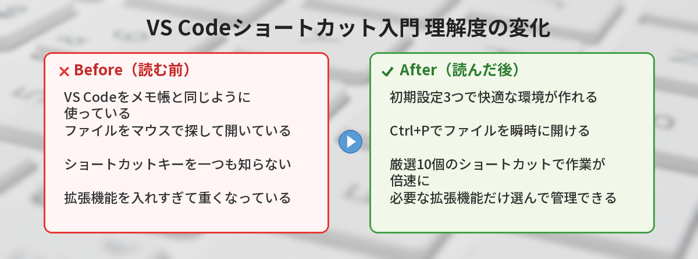
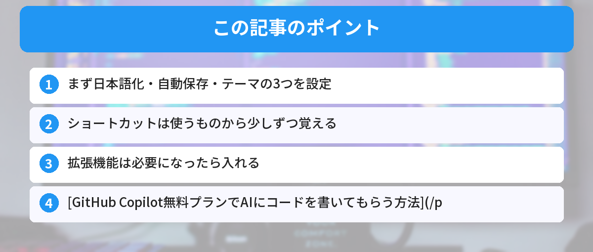

## この記事で分かること


VS Codeのショートカットキーって多すぎて覚えられない…。最低限これだけってある？



全部覚える必要はないよ。毎日使う10個だけ覚えれば、作業速度が2倍になるんだ。


「VS Codeをインストールしたけど、メモ帳と何が違うの？」

そう思っている人向けに、最初にやるべき設定と覚えるべき操作を10個だけに絞りました。全部覚えなくていいです。使いながら少しずつ身につければOK。

VS Code（Visual Studio Code）は、Microsoftが作った無料のコードエディタです。プログラミングをする人のほとんどが使っています。



## 最初にやる設定（3つ）

### 1. 日本語化

VS Codeは初期状態だと英語です。

1. `Ctrl + Shift + X` を押す（拡張機能の画面が開く）
2. 検索欄に `Japanese` と入力
3. 「Japanese Language Pack for Visual Studio Code」をインストール
4. VS Codeを再起動

### 2. 自動保存をオンにする

ファイル → ユーザー設定 → 設定 を開いて、検索欄に `auto save` と入力。

「Files: Auto Save」を `afterDelay` に変更。

これで、編集するたびに自動で保存されます。保存し忘れて「変更が反映されない」と悩むことがなくなります。

### 3. テーマを変える（お好みで）

`Ctrl + K` → `Ctrl + T` でテーマ選択画面が開きます。

好きな見た目を選んでください。暗い画面（ダークテーマ）が目に優しくて人気です。

## 覚えるショートカット（7つ）

全部Windowsのキーです。Macの人は `Ctrl` を `Cmd` に読み替えてください。

### 4. ファイルを開く: `Ctrl + P`

フォルダ内のファイルをファイル名で検索して開けます。マウスでフォルダを辿るより圧倒的に速い。

### 5. 全体検索: `Ctrl + Shift + F`

プロジェクト内の全ファイルからテキストを検索します。「この変数どこで使ってたっけ？」というときに使います。[正規表現](/posts/regex-beginner/)を使えば、パターンで検索することもできます。

### 6. 行の複製: `Shift + Alt + ↓`

カーソルがある行をそのまま下にコピーします。似たコードを何行も書くときに便利。

### 7. 行の移動: `Alt + ↑` / `Alt + ↓`

カーソルがある行を上下に移動します。コードの順番を入れ替えたいときに、コピペより楽。

### 8. 複数カーソル: `Alt + クリック`

複数の場所に同時にカーソルを置いて、同時に編集できます。同じ変更を何箇所もするときに使います。

### 9. コメントアウト: `Ctrl + /`

選択した行をコメント（無効化）にします。もう一度押すと元に戻ります。

コメントアウトとは、コードを削除せずに一時的に無効にすることです。

### 10. ターミナルを開く: `` Ctrl + ` ``

VS Codeの中でターミナル（コマンドプロンプト）を開けます。別ウィンドウを行き来しなくて済みます。ターミナル操作に慣れていない方は、[コマンドラインが怖い人へ ― 覚えるコマンド5つだけ](/posts/command-line-scary/)を読んでおくと安心です。

`` ` `` はバッククォートと呼ばれるキーで、キーボード左上の `半角/全角` キーの隣にあります。

よく使うコマンドを短縮したい場合は、[エイリアスの設定方法](/posts/terminal-alias-beginner/)も覚えておくと便利です。

## おすすめ拡張機能（入れておくと便利）

最初から全部入れる必要はないです。必要になったときに入れればOK。

| 拡張機能 | 用途 |
|---|---|
| Prettier | コードを自動で整形してくれる |
| Live Server | HTMLファイルをブラウザでリアルタイムプレビュー |
| indent-rainbow | インデント（字下げ）に色がついて見やすくなる |

拡張機能は `Ctrl + Shift + X` で検索してインストールできます。

AIにコードを書いてもらえる拡張機能もあります。[GitHub Copilot無料プランでAIにコードを書いてもらう方法](/posts/github-copilot-free/)で詳しく紹介しています。

HTMLの基本構造を学びたい方は[HTMLの基本構造を理解する](/posts/html-basic-structure/)も参考にしてください。Live Serverと組み合わせると、HTMLの変更がリアルタイムで確認できます。

## 筆者がハマったポイント

VS Codeは最初から完璧に使いこなす必要はないですが、僕が初心者の頃にやらかした失敗を共有します。

### 失敗談1: 拡張機能を30個以上入れて起動に20秒かかるようになった

「便利そう」と思った拡張機能を片っ端からインストールしていたら、VS Codeの起動が異常に遅くなりました。どの拡張機能が重いのか分からず、結局全部アンインストールして必要なものだけ入れ直すハメに。

**気づき:** 拡張機能は「今すぐ必要なもの」だけ入れる。使わなくなったら無効化かアンインストール。`Ctrl+Shift+P` → 「Show Running Extensions」で重い拡張機能を特定できる。

### 失敗談2: 自動保存をオンにせず「変更が反映されない」と1時間悩んだ

HTMLファイルを編集してブラウザで確認しても変わらない。「Live Serverが壊れた？」と思ってアンインストール→再インストールを繰り返しましたが、原因は単にファイルを保存していなかっただけ。自動保存をオンにしてからこの問題は二度と起きていません。

**改善:** VS Codeを入れたら最初に自動保存（Files: Auto Save → afterDelay）を設定する。これだけで初心者のトラブルの半分は防げる。

### 失敗談3: Ctrl+Zを連打しすぎてコードが消えた

大量の変更を取り消そうとして `Ctrl+Z` を連打したら、戻しすぎて必要なコードまで消えてしまいました。`Ctrl+Y`（やり直し）で戻せることを知らず、Gitのコミット履歴から復元する羽目に。

**気づき:** `Ctrl+Z`（元に戻す）と `Ctrl+Y`（やり直し）はセットで覚える。大きな変更をする前はこまめにコミットしておく。


自動保存オンにしてなかったら私も絶対ハマってた…。最初に設定しておくの大事だね。



VS Codeは初期設定のままだと不便なところがあるからね。この記事の「最初にやる設定3つ」をやっておけば安心だよ。


## よくある質問（FAQ）

### Q: VS Codeは完全に無料ですか？

A: はい、完全に無料です。Microsoftがオープンソースで開発しており、個人利用でも商用利用でも無料で使えます。拡張機能も基本的に無料のものがほとんどです。

### Q: VS Codeと Visual Studio は同じものですか？

A: 別のソフトウェアです。Visual Studio（無印）はMicrosoftの統合開発環境（IDE）で、主にC#やC++の開発に使われます。VS Codeは軽量なコードエディタで、拡張機能を入れることでさまざまな言語に対応します。

### Q: 拡張機能を入れすぎると重くなりますか？

A: 入れすぎると起動が遅くなることがあります。使っていない拡張機能は無効化するか、アンインストールしておくのがおすすめです。`Ctrl + Shift + X` の拡張機能一覧から管理できます。

### Q: 設定を別のPCに移行するにはどうすればいいですか？

A: VS Codeの「Settings Sync」機能を使えば、GitHubアカウントまたはMicrosoftアカウントで設定を同期できます。左下の歯車アイコン → 「設定の同期をオンにする」から設定できます。

### Q: ショートカットキーをカスタマイズできますか？

A: はい。`Ctrl + K` → `Ctrl + S` でキーボードショートカットの設定画面が開きます。既存のショートカットを変更したり、新しいショートカットを追加したりできます。


Ctrl+Shift+Pのコマンドパレットだけでも覚えてよかった…！何でもここから探せるんだね。



コマンドパレットは最強のショートカットだよ。迷ったらとりあえずCtrl+Shift+Pを押す癖をつけよう。


## まとめと次のステップ

- まず日本語化・自動保存・テーマの3つを設定
- ショートカットは使うものから少しずつ覚える
- 拡張機能は必要になったら入れる

全部一度に覚えようとしなくて大丈夫です。毎日コードを書いていれば、自然と手が覚えます。

---
### あわせて読みたい
- [GitHub Copilot無料プランでAIにコードを書いてもらう方法](/posts/github-copilot-free/)
- [コマンドラインが怖い人へ ― 覚えるコマンド5つだけ](/posts/command-line-scary/)

